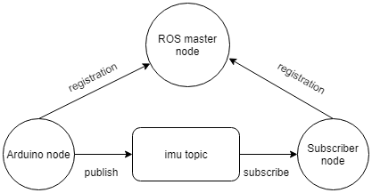
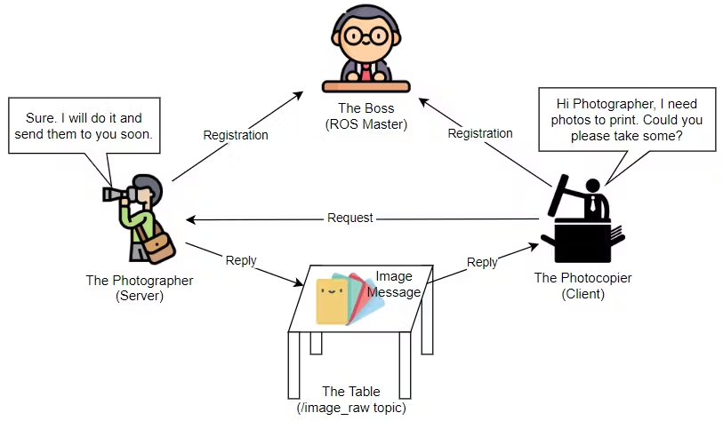

<h1>Introducción a ROS</h1>

En esta clase se presenta un introducción a ROS

<h2>Instalación de Ubuntu 20.04</h2>

Descargar ubuntu 20.04 y Virtual Box

Crear la máquina virtual con Ubuntu 20.04 de formato .iso en el Virtual Box

<h2>Instalación de ROS Noetic</h2>

https://wiki.ros.org/noetic/Installation/Ubuntu

Abrir una terminal en Ubuntu y conceder permisos de super usuario (administrador)

```
su root
```

Inicialmente se debe configurar el computador para que acepte software de packages.ros.org, por tanto, en un terminal en Ubuntu correr los siguientes comandos:

```
sudo sh -c 'echo "deb http://packages.ros.org/ros/ubuntu $(lsb_release -sc) main" > /etc/apt/sources.list.d/ros-latest.list'

sudo apt install curl

curl -s https://raw.githubusercontent.com/ros/rosdistro/master/ros.asc | sudo apt-key add -

sudo apt update

sudo apt install ros-noetic-desktop-full

source /opt/ros/noetic/setup.bash

echo "source /opt/ros/noetic/setup.bash" >> ~/.bashrc

source ~/.bashrc

sudo apt install python3-rosdep python3-rosinstall python3-rosinstall-generator python3-wstool build-essential

sudo apt install python3-rosdep

sudo rosdep init

rosdep update
```

Para validar la instalación de ROS, ejecutar los siguientes comandos en terminales independientes, para correr ROS maestro y para correr el nodo `talker` del paquete `roscpp_tutorials`, el cual es un nodo publicador.

```
roscore
```

```
rosrun roscpp_tutorials talker
```

Así mismo, si se quiere conocer la versión instala de ROS, ejecutar el siguiente comando:

```
rosversion -d
```

<h2>ROS</h2>

ROS es un sistema operativo de robots. Actualmente, es una colección de frameworks, herramientas (visualizar datos, guardar datos sensores, depurar y simular) y librerías. Una de las principales justificaciones de ROS es crear proyectos complejos de robótica con alta compatibilidad con hardware (Raspberry, PC(Ubuntu), Intel NUC, entre otros) y que sean reutilizables entre diferentes robots, independizando la programación por subsistemas (visión, navegación (movimiento), sensores) y que a su vez se interconecten entre ellos.

otra de las ventajas de ROS es que los subsistemas están interconectados como grafos (nodos) a través de flechas (mensajes), es decir, es posible ejecutar diferentes programas de manera simultanea (paralelo)



Fuente: https://atadiat.com/en/e-ros-imu-and-arduino-how-to-send-to-ros/

<h3>Catkin</h3>

`catkin` es el nuevo sistema compilado para las versiones de ROS más recientes (ej: Noetic).

<h3>Packages</h3>

Los paquetes pueden contener ejecutables, librerías, códigos (scripts) y mucha más información. Para instalar los paquetes de tutoriales ejecutar el siguiente comando: 

```
sudo apt-get install ros-noetic-ros-tutorials
```

Si se desea ver la lista de los paquetes instalados se debe ejecutar la siguiente línea de comando:

```
rosls <TAB>
```

Para encontrar la ruta de un paquete se debe ejecutar el siguiente comando:

```
rospack find roscpp
```

<h3>Nodes</h3>

Son programas ejecutables que envían o reciben información a un topic, hay dos principales tipos de nodos, publicador y suscriptor.

<h3>Topics</h3>

Son el punto intermedio entre el nodo publicador y el nodo suscriptor.


Fuente: https://robodev.blog/ros-basic-concepts


Fuente: https://robodev.blog/ros-basic-concepts




Fuente: https://robodev.blog/ros-basic-concepts


<h2>Comandos ROS</h2>

ROS master

```
roscore
```