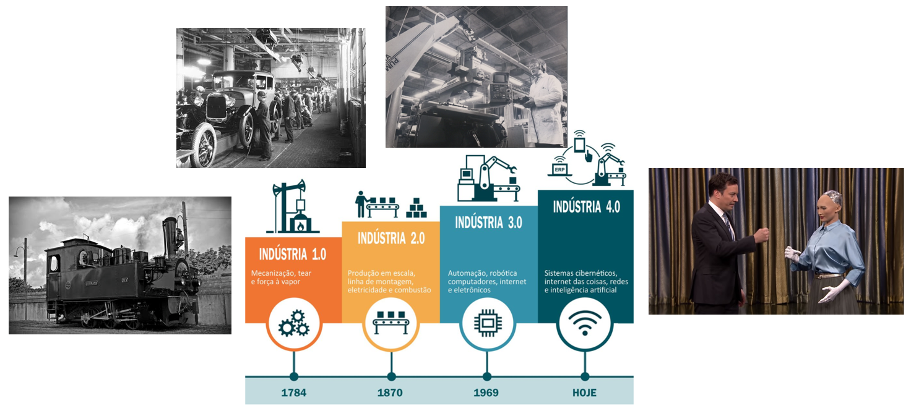
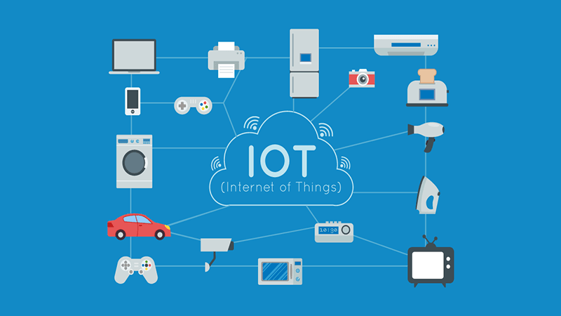
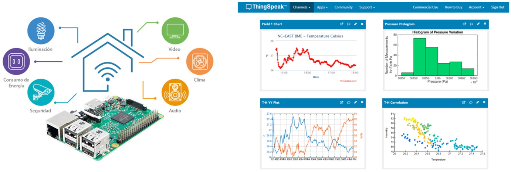

<h1>Aula 11</h1>

Esta clase consiste en conectar la Raspberry Pi con Thinkspeak para monitorear datos en la nube.

<h2>Industria 4.0</h2>

 
<figcaption>Fuente: https://wertambiental.com.br/2019/01/15/industria_4-0/</figcaption>

 
<figcaption>Fuente: https://www.thesmartcityjournal.com/es/tecnologia/impacto-industria-4-0-fabricas</figcaption>

<h2>IoT</h2>

Es la interconexión de sensores, actuadores, software y otras tecnologías a través de internet con el objetivo de interaccionar con estos sin necesidad de intervención humana

 
<figcaption>Fuente: https://tecrea.com.co/iot-y-las-empresas-que-generan-desarrollo-en-colombia-y-el-mundo/</figcaption>

<h3>Thinkspeak</h3>

 
<figcaption>Fuente: https://www.thesmartcityjournal.com/es/tecnologia/impacto-industria-4-0-fabricas</figcaption>

