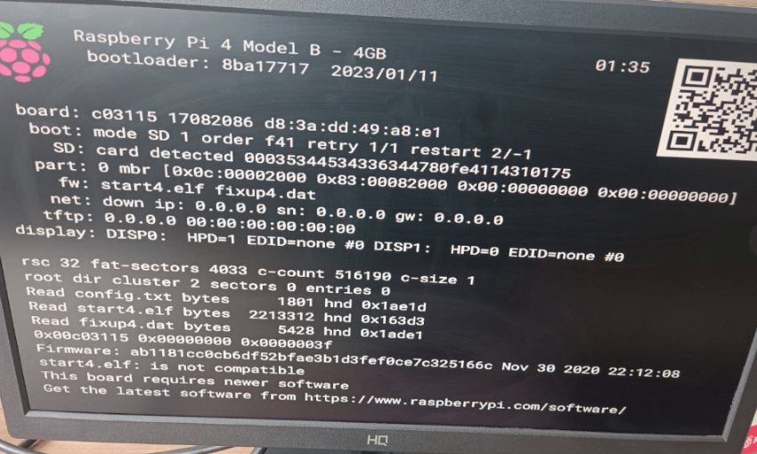
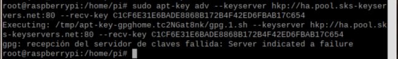
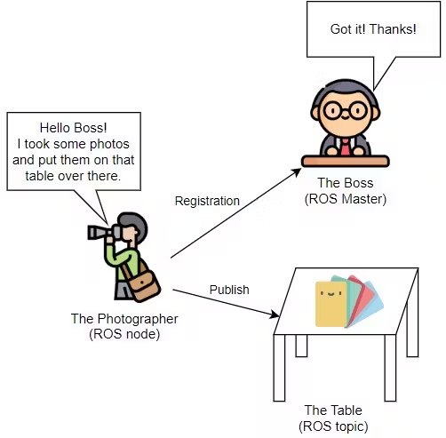
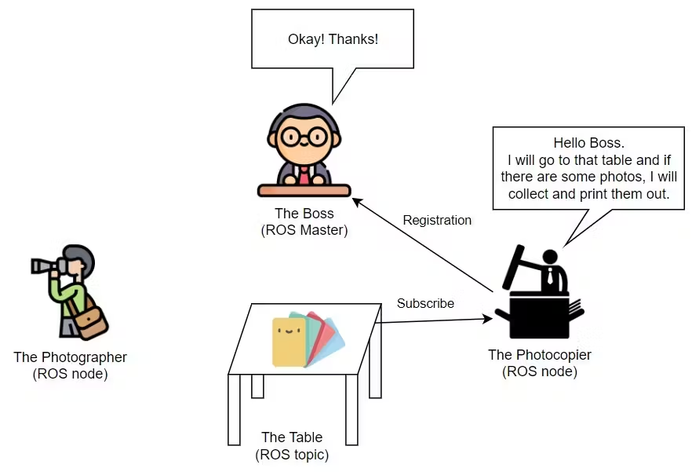
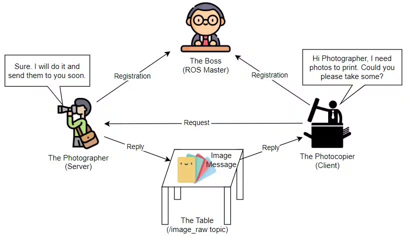
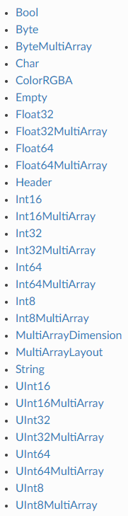
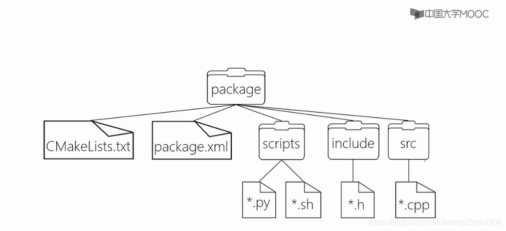
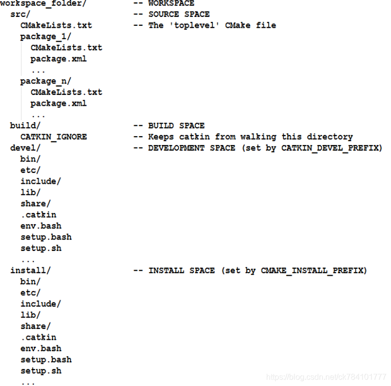
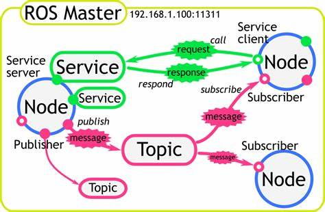

<h1>Aula 12</h1>

En esta clase se presenta una introducción a ROS

<h2>Introducción a ROS</h2>

ROS es un Sistema Operativo de Robots, click <a href="https://wiki.ros.org/Distributions">aquí</a> para ver las diferentes versiones de ROS.

<div align="center">

<br>
<figcaption>Fuente: https://wiki.ros.org/Distributions</figcaption>
</div>

<h3>Instalación de Raspbian buster</h3>

Para instalar ROS en la RPi se debe instalar Raspbian Buster, el cual se puede descargar <a href="https://downloads.raspberrypi.org/raspios_full_armhf/images/raspios_full_armhf-2021-01-12/">aquí</a>

>[!WARNING]
>En algunas versiones de Raspbian (ej:buster) se presenta el siguiente error posteriormente a la instalación del Raspbian Buster en la Raspberry Pi 4

<div align="center">

<br>
<figcaption>Fuente: https://embarcados.com.br/raspberry-pi-corrigindo-problemas-com-o-start4-elf-e-fixup4-dat/</figcaption>
</div>

Para solucionar ese error, se deben tener en cuenta los siguientes pasos:

I. Descargar <a href="https://github.com/raspberrypi/firmware/tree/master/boot">aquí</a> los archivos desactualizados: fixup4.dat y start4.elf

II. Reemplazar los dos archivos (fixup4.dat y start4.elf) descargados anteriormente en la carpeta /boot de la SD Card

III. Después de inicializar el sistema operativo, actualizar el sistema operativo a través de los siguientes comandos:
```
sudo apt update
sudo apt full-upgrade
```

<h3>ROS en Raspberry Pi :atom:</h3>

La instalación de ROS Melodic en RPi (Raspbian Buster) se encuentra <a href="https://wiki.ros.org/ROSberryPi/Installing%20ROS%20Melodic%20on%20the%20Raspberry%20Pi">aquí</a>

Abrir una terminal en RPi y conceder permisos de super usuario (usuario de administrador)

```
sudo su
```

Posteriormente, en un terminal ejecutar los siguientes comandos, uno a uno:

```
sudo sh -c 'echo "deb http://packages.ros.org/ros/ubuntu $(lsb_release -sc) main" > /etc/apt/sources.list.d/ros-latest.list'

sudo apt-key adv --keyserver hkp://ha.pool.sks-keyservers.net:80 --recv-key C1CF6E31E6BADE8868B172B4F42ED6FBAB17C654

sudo apt-get update

sudo apt-get upgrade

sudo apt install -y python-rosdep python-rosinstall-generator python-wstool python-rosinstall build-essential cmake

sudo rosdep init

rosdep update

mkdir -p ~/ros_catkin_ws

cd ~/ros_catkin_ws

rosinstall_generator desktop --rosdistro melodic --deps --wet-only --tar > melodic-desktop-wet.rosinstall

wstool init src melodic-desktop-wet.rosinstall

rosdep install -y --from-paths src --ignore-src --rosdistro melodic -r --os=debian:buster

sudo ./src/catkin/bin/catkin_make_isolated --install -DCMAKE_BUILD_TYPE=Release --install-space /opt/ros/melodic -j4

source /opt/ros/melodic/setup.bash

echo "source /opt/ros/melodic/setup.bash" >> ~/.bashrc

```

>[!WARNING]
>En la ejecución del segundo comando de la instalación de ROS en Raspbian Buster se presenta el siguiente error:

<div align="center">

<br>
<figcaption>Fuente: Autor</figcaption>
</div>

Para solucionar ese error, se debe ejecutar el siguiente comando:

```
sudo apt-key adv --keyserver keyserver.ubuntu.com --recv-keys F42ED6FBAB17C654
```
Fuente: https://vprivalov.medium.com/ubuntu-tips-fix-error-with-security-keys-in-apt-update-e958616e0650

<h3>Instalación de Ubuntu 20.04</h3>

Descargar ubuntu 20.04 y Virtual Box y crear la máquina virtual con Ubuntu 20.04 de formato .iso en el Virtual Box

<h3>ROS en Ubuntu 20.04 :electron:</h3>

La instalación de ROS Noetic en Ubuntu 20.04 se encuentra <a href="https://wiki.ros.org/noetic/Installation/Ubuntu">aquí</a>

Abrir una terminal en Ubuntu y conceder permisos de super usuario (administrador)

```
su root
```

Posteriormente, en un terminal correr los siguientes comandos:

```
sudo sh -c 'echo "deb http://packages.ros.org/ros/ubuntu $(lsb_release -sc) main" > /etc/apt/sources.list.d/ros-latest.list'

sudo apt install curl

curl -s https://raw.githubusercontent.com/ros/rosdistro/master/ros.asc | sudo apt-key add -

sudo apt update

sudo apt install ros-noetic-desktop-full

source /opt/ros/noetic/setup.bash

echo "source /opt/ros/noetic/setup.bash" >> ~/.bashrc

source ~/.bashrc

sudo apt install python3-rosdep python3-rosinstall python3-rosinstall-generator python3-wstool build-essential

sudo apt install python3-rosdep

sudo rosdep init

rosdep update
```

Para validar la instalación de ROS, ejecutar el siguiente comando en una terminal, el cual es para correr ROS maestro:

```
roscore
```

Así mismo, si se quiere conocer la versión instala de ROS, ejecutar el siguiente comando:

```
rosversion -d
```

<h2>ROS</h2>

ROS es un sistema operativo de robots. Actualmente, es una colección de frameworks, herramientas (visualizar datos, guardar datos sensores, depurar y simular) y librerías. Una de las principales justificaciones de ROS es crear proyectos complejos de robótica con alta compatibilidad con hardware (Raspberry, PC(Ubuntu), Intel NUC, entre otros) y que sean reutilizables entre diferentes robots, independizando la programación por subsistemas (visión, navegación, comunicación, sensores, actuadores, entre otros) y que a su vez se interconecten entre ellos.

<div align="center">

<br>
<figcaption>Fuente: https://robodev.blog/ros-basic-concepts</figcaption>
</div>

<div align="center">

<br>
<figcaption>Fuente: https://robodev.blog/ros-basic-concepts</figcaption>
</div>

<div align="center">

<br>
<figcaption>Fuente: https://robodev.blog/ros-basic-concepts</figcaption>
</div>

Otra de las ventajas de ROS es que los subsistemas (<i>packages</i>) están interconectados como grafos (nodos) a través de flechas (mensajes), es decir, es posible ejecutar diferentes programas de manera simultanea (paralelo).

<div align="center">

<br>
<figcaption>Fuente: https://atadiat.com/en/e-ros-imu-and-arduino-how-to-send-to-ros/</figcaption>
</div>

Los mensajes en ROS pueden ser consultados <a href="https://index.ros.org/p/std_msgs/">aquí</a> y deben ser de alguno de los siguientes tipos de datos, siendo "data", el atributo (variable) en el que se guarda dicho mensaje:

<div align="center">

<br>
<figcaption>Fuente: https://atadiat.com/en/e-ros-imu-and-arduino-how-to-send-to-ros/</figcaption>
</div>

<h3>catkin</h3>

`catkin` es el compilador para las versiones de ROS más recientes (ej: Noetic, Melodic, entre otras), así mismo, crea ejecutables de programas. Para utilizar este compilador hay que crear un área de trabajo, en donde estará todo el proyecto (paquetes y nodos). Se recomienda tener un área de trabajo por proyecto.

<div align="center">

<br>
<figcaption>Fuente: https://blog.csdn.net/JeremyZhao1998/article/details/104470039</figcaption>
</div>

<h3>Packages</h3>

Los paquetes pueden contener ejecutables, librerías, códigos (scripts) y mucha más información de los subsistemas de un proyecto. Es importante tener en cuenta que un paquete debe contener su propia carpeta, en la cual se deben tener dos archivos (package.xml y CMakeLists.txt), los cuales brindan información sobre el paquete con respecto al propietario, objetivo, dependencias y librerías del paquete. Los paquetes deben estar dentro del área de trabajo.

<div align="center">

<br>
<figcaption>Fuente: https://blog.csdn.net/JeremyZhao1998/article/details/104470039</figcaption>
</div>

<!--
Para instalar los paquetes de tutoriales ejecutar el siguiente comando: 

```
sudo apt-get install ros-noetic-ros-tutorials
```
-->

Si se desea ver la lista de los paquetes instalados se debe ejecutar el siguiente comando:

```
rosls <TAB>
```

Si se desea encontrar la ruta de un paquete se debe ejecutar el siguiente comando:

```
rospack find roscpp
```

<h3>Nodes</h3>

Son programas ejecutables que envían o reciben información a un <i>topic</i>, hay dos principales tipos de nodos: <i>publisher</i> y <i>suscriber</i>. Los nodos deben estar dentro de los paquetes.

<h3>Topics</h3>

Son el punto intermedio entre el nodo <i>publisher</i> y el nodo <i>suscriber</i>.

<h3>Estructura de directorios</h3>

<div align="center">

<br>
<figcaption>Fuente: https://blog.csdn.net/JeremyZhao1998/article/details/104470039</figcaption>
</div>

<div align="center">

<br>
<figcaption>Fuente: https://blog.csdn.net/ck784101777/article/details/106297924</figcaption>
</div>

<h2>Conexiones nodos y topics en ROS</h2>

La comunicación entre nodos es realizada a través de un topic, el cual es un canal de información de un dato de dato específico, el cual es conformado principalmente por el nombre del topic y el mensaje que recibirá (string, int, image, combinación, etc).

Un nodo puede ser publicador y suscriptor, así mismo, un nodo puede publicar y/o suscribirse a diferentes topics

<div align="center">

<br>
<figcaption>Fuente: </figcaption>
</div>

<h3>Ejemplo "Hola mundo" (Talker - Listener)</h3>

<div align="center">

<br>
<figcaption>Fuente: https://www.oreilly.com/library/view/ros-robotics-projects/9781838649326/0375b997-95dc-48c6-9738-49a4eb1a9f62.xhtml</figcaption>
</div>

En terminales independientes correr los siguientes comandos:

Nodo maestro

```
roscore
```

Nodo <i>publisher</i>

```
rosrun roscpp_tutorials talker
```

Nodo <i>suscriber</i>

```
rosrun roscpp_tutorials listener
```

Si se desea depurar la comunicación entre dos nodos (<i>publisher</i> y <i>suscriber</i>) se debe conocer el <i>topic</i> que está intermedio de los dos nodos, para esto se debe desplegar la lista de topics activos a través del siguiente comando:

```
rostopic list
```

Si se desea mostrar la información de un <i>topic</i> espcífico, en relación al tipo de mensaje, los nodos <i>publishers</i> y los nodos <i>subscribers</i> activos a dicho <i>topic</i>, se debe ejecutar el siguiente comando:

```
rostopic info /chatter
```

Si se desea visualizar el mensaje que está llegando a un <i>topic</i> específico, es decir, emulando el nodo <i>subscriber</i>, se debe ejecutar el siguiente comando:

```
rostopic echo /chatter
```

Si se desea visualizar el mensaje que está saliendo de un <i>topic</i> específico, es decir, emulando el nodo <i>publisher</i>, se debe ejecutar el siguiente comando:

```
rostopic pub /chatter std_msgs/String "data: 'Bom dia, tudo bem?'"
```