<h1>Aula 12</h1>

En esta clase se presenta una introducción a Robotic Operative Systema (ROS1 y ROS2) para la RPi 4B (Raspbian Buster y Ubuntu 22.04).

<h2>Introducción a ROS</h2>

ROS es un Sistema Operativo de Robots de código abierto enfocado para proyectos de robótica, que integra frameworks y librerías para el desarrollo de software en paralelo de robots mediante diagrama de grafos. ROS es ejecutable principalmente en distribuciones de Linux (ej: Raspbian y Ubuntu).

- `ROS1`

<div align="center">
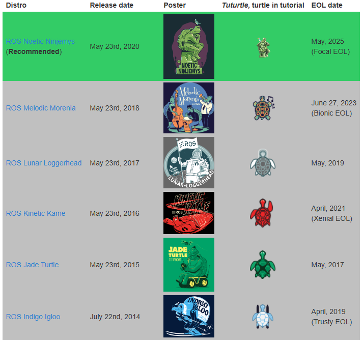
<br>
<figcaption>Fuente: https://wiki.ros.org/Distributions</figcaption>
</div>

- `ROS2`

<div align="center">
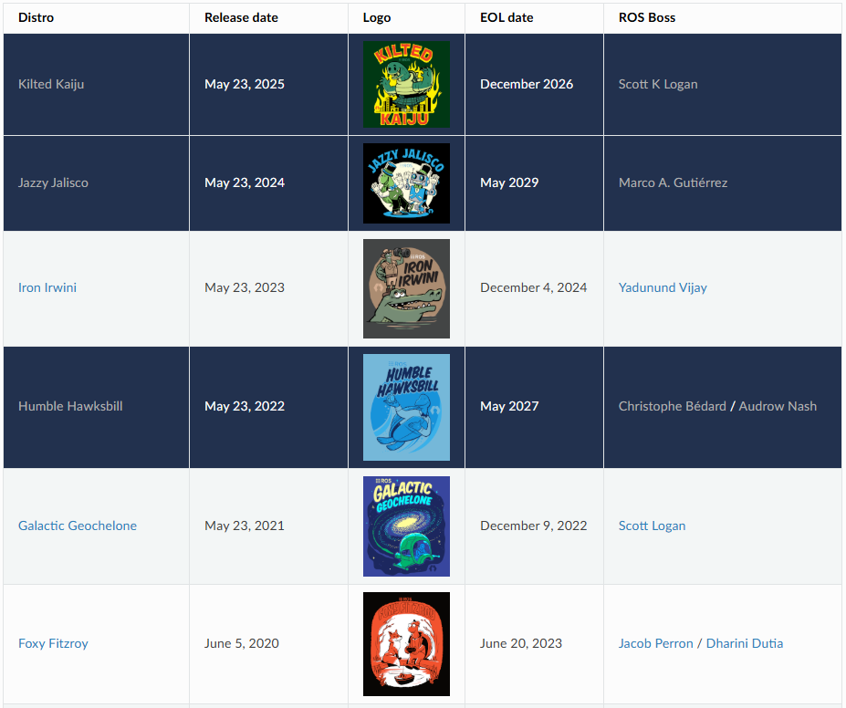
<br>
<figcaption>Fuente: https://docs.ros.org/en/jazzy/Releases.html</figcaption>
</div>

<h3>Comparación entre ROS1 y ROS2</h3>

ROS1 fue creado para la investigación y el desarrollo de prototipos robóticos, mientras que ROS2 fue creado con middleware DDS para mejorar la sincronización en tiempo real, la compatibilidad entre plataformas (ej: Linux, Windows, macOS, RTOS, etc.) y la seguridad de desarrollos de robótica industrial.

<div align="center">
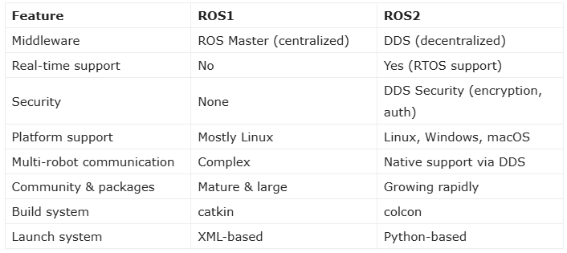
<br>
<figcaption>Fuente: https://roboticsbiz.com/ros1-vs-ros2-key-differences-benefits-and-why-the-future-belongs-to-ros2/</figcaption>
</div>

Con respecto al desempeño, `ROS2` es más eficiente que `ROS1`.

<div align="center">
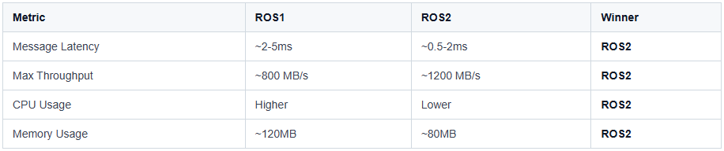
<br>
<figcaption>Fuente: https://www.robosmiths.com/blog/ros2-vs-ros1-2025</figcaption>
</div>

Algunos comandos que cambiaron de `ROS1` a `ROS2` son los siguientes:

```
rospy.init_node() → rclpy.init() + Node class
rospy.Publisher() → node.create_publisher()
rospy.Subscriber() → node.create_subscription()
rospy.Service() → node.create_service()
rospy.Rate() → node.create_timer()
```

<h3>Instalación de Raspbian buster para ROS 1 en RPi 4</h3>

Para instalar ROS en la RPi se debe instalar Raspbian Buster, el cual se puede descargar <a href="https://downloads.raspberrypi.org/raspios_full_armhf/images/raspios_full_armhf-2021-01-12/">aquí</a>

>[!WARNING]
>En algunas versiones de Raspbian (ej:buster) se presenta el siguiente error posteriormente a la instalación del Raspbian Buster en la Raspberry Pi 4

<div align="center">
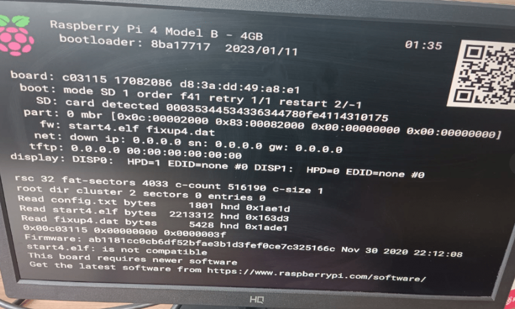
<br>
<figcaption>Fuente: https://embarcados.com.br/raspberry-pi-corrigindo-problemas-com-o-start4-elf-e-fixup4-dat/</figcaption>
</div>

Para solucionar ese error, se deben tener en cuenta los siguientes pasos:

I. Descargar <a href="https://github.com/raspberrypi/firmware/tree/master/boot">aquí</a> los archivos desactualizados: fixup4.dat y start4.elf

II. Reemplazar los dos archivos (fixup4.dat y start4.elf) descargados anteriormente en la carpeta /boot de la SD Card

III. Después de inicializar el sistema operativo, actualizar el sistema operativo a través de los siguientes comandos:
```
sudo apt update
sudo apt full-upgrade
```

Si se desea conocer la versión de Raspbian instalada en la Raspberry Pi, en una terminal se debe ejecutar el siguiente comando:

```
cat /etc/os-release
```

<h3>ROS en Raspberry Pi :atom:</h3>

La instalación de ROS Melodic en RPi (Raspbian Buster) se encuentra <a href="https://wiki.ros.org/ROSberryPi/Installing%20ROS%20Melodic%20on%20the%20Raspberry%20Pi">aquí</a>

Abrir una terminal en RPi y conceder permisos de super usuario (usuario de administrador)

```
sudo su
```

Posteriormente, en el terminal anterior (usuario de administrador) ejecutar los siguientes comandos, uno a uno:

```
sudo sh -c 'echo "deb http://packages.ros.org/ros/ubuntu $(lsb_release -sc) main" > /etc/apt/sources.list.d/ros-latest.list'

sudo apt-key adv --keyserver hkp://ha.pool.sks-keyservers.net:80 --recv-key C1CF6E31E6BADE8868B172B4F42ED6FBAB17C654

sudo apt-get update

sudo apt-get upgrade

sudo apt install -y python-rosdep python-rosinstall-generator python-wstool python-rosinstall build-essential cmake

sudo rosdep init

rosdep update

mkdir -p ~/ros_catkin_ws

cd ~/ros_catkin_ws

rosinstall_generator desktop --rosdistro melodic --deps --wet-only --tar > melodic-desktop-wet.rosinstall

wstool init src melodic-desktop-wet.rosinstall

rosdep install -y --from-paths src --ignore-src --rosdistro melodic -r --os=debian:buster

sudo ./src/catkin/bin/catkin_make_isolated --install -DCMAKE_BUILD_TYPE=Release --install-space /opt/ros/melodic -j4

source /opt/ros/melodic/setup.bash

echo "source /opt/ros/melodic/setup.bash" >> ~/.bashrc

```

>[!WARNING]
>En la ejecución del segundo comando de la instalación de ROS en Raspbian Buster se presenta el siguiente error:

<div align="center">
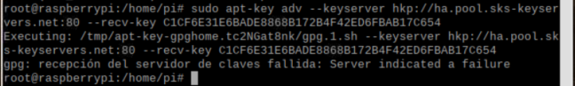
<br>
<figcaption>Fuente: Autor</figcaption>
</div>

Para solucionar ese error, se debe ejecutar el siguiente comando:

```
sudo apt-key adv --keyserver keyserver.ubuntu.com --recv-keys F42ED6FBAB17C654
```
Fuente: https://vprivalov.medium.com/ubuntu-tips-fix-error-with-security-keys-in-apt-update-e958616e0650

Para validar la instalación de ROS, ejecutar el siguiente comando en una terminal, el cual es para correr ROS maestro:

```
roscore
```

Así mismo, si se quiere conocer la versión instala de ROS, ejecutar el siguiente comando:

```
rosversion -d
```

<h3>Instalación de ROS 2 en Ubuntu 22.04 para RPi 4</h3>

```
sudo apt update
sudo apt upgrade
sudo apt install locales
sudo locale-gen en_US en_US.UTF-8
sudo update-locale LC_ALL=en_US.UTF-8 LANG=en_US.UTF-8
export LANG=en_US.UTF-8
```
Posteriormente, verificar que el lenguaje `en_US.UTF-8` quede asignado a través del siguiente comando:

```
en_US.UTF-8
```

Habilitar el repositorio de ROS2 

```
sudo apt install software-properties-common
sudo add-apt-repository universe
```

```
sudo apt update && sudo apt install curl -y
export ROS_APT_SOURCE_VERSION=$(curl -s https://api.github.com/repos/ros-infrastructure/ros-apt-source/releases/latest | grep -F "tag_name" | awk -F\" '{print $4}')
curl -L -o /tmp/ros2-apt-source.deb "https://github.com/ros-infrastructure/ros-apt-source/releases/download/${ROS_APT_SOURCE_VERSION}/ros2-apt-source_${ROS_APT_SOURCE_VERSION}.$(. /etc/os-release && echo ${UBUNTU_CODENAME:-${VERSION_CODENAME}})_all.deb"
sudo dpkg -i /tmp/ros2-apt-source.deb
```

Antes de instalar ROS2, se deben realizar actualizaciones 

```
sudo apt update
sudo apt upgrade
```

Instalar ROS2 Humble version desktop (recomendado), debido a que contiene: ROS, RViz, demos, tutorials.

```
sudo apt install ros-humble-desktop
```

Configurar el entorno para ROS2 y ejecutar el contenido de un archivo en la sesión actual a través de la instrucción `source`.

```
ros2
source /opt/ros/humble/setup.bash
ros2
exit
ros2
```
Se ejecuta automáticamente cada vez que abre una nueva terminal, es decir, cada vez que abra la terminal, carga ROS automáticament

```
echo "source /opt/ros/humble/setup.bash" >> ~/.bashrc
```
Imprimir el archivo .bashrc y verificar que haya quedado grabado el comando `source /opt/ros/humble/setup.bash`

```
cat .bashrc
ros2
source .bashrc
ros2
```

Finalmente, instalar el sistema de compilación:

```
sudo apt update
sudo apt install python3-colcon-common-extensions
```

Ejemplo

```
ros2 run demo_nodes_cpp talker
ros2 run demo_nodes_cpp listener
```

<h2>ROS</h2>

ROS es un sistema operativo de robots. Actualmente, es una colección de frameworks, herramientas (visualizar datos, guardar datos sensores, depurar y simular) y librerías. Una de las principales justificaciones de ROS es crear proyectos complejos de robótica con alta compatibilidad con hardware (Raspberry, PC(Ubuntu), Intel NUC, entre otros) y que sean reutilizables entre diferentes robots, independizando la programación por subsistemas (visión, navegación, comunicación, sensores, actuadores, entre otros) y que a su vez se interconecten entre ellos.

<div align="center">
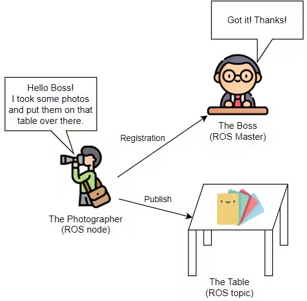
<br>
<figcaption>Fuente: https://robodev.blog/ros-basic-concepts</figcaption>
</div>

<div align="center">
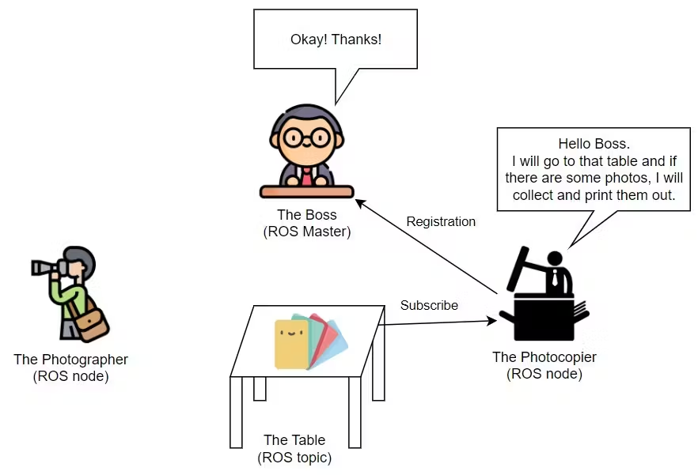
<br>
<figcaption>Fuente: https://robodev.blog/ros-basic-concepts</figcaption>
</div>

<div align="center">
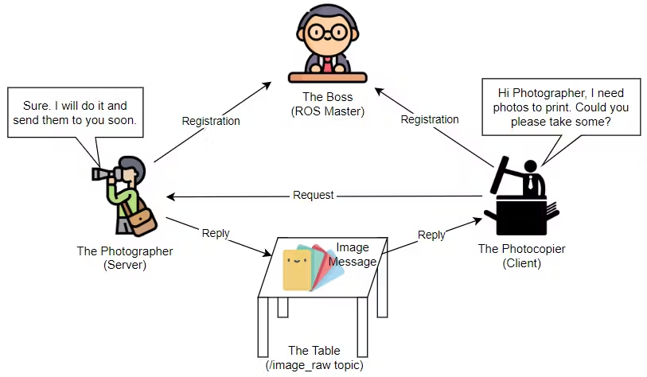
<br>
<figcaption>Fuente: https://robodev.blog/ros-basic-concepts</figcaption>
</div>

<h3>Comandos de ROS</h3>

- doctor -> Configuración de red, versiones de paquetes, información de la plataforma (ej: Linux, aarch64), información de ROS2 (ej: humble, ros2, active), lista de topics
- launch -> Ejecuta multiples nodos de ROS definidos en un archivo de lanzamiento (.launch), facilitando la ejecución de proyectos complejos con varios nodos
- run -> Ejecuta un nodo de un paquete específico
- pkg -> Crea paquetes en ROS
- node -> Muestra información de los nodos que están corriendo en ROS
- topic -> Interactúa con los topics de comunicación entre nodos. Permite publicar, suscribirse, inspeccionar el flujo de mensajes y depurar la comunicación entre nodos.

<h3>Interconexión en ROS</h3>

Otra de las ventajas de ROS es que los subsistemas (<i>packages</i>) están interconectados como grafos (nodos) a través de flechas (mensajes), es decir, es posible ejecutar diferentes programas de manera simultanea (paralelo).

<div align="center">
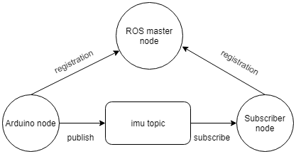
<br>
<figcaption>Fuente: https://atadiat.com/en/e-ros-imu-and-arduino-how-to-send-to-ros/</figcaption>
</div>

<h3>Tipos de mensajes en ROS</h3>

Los mensajes en ROS pueden ser consultados <a href="https://index.ros.org/p/std_msgs/">aquí</a> y deben ser de alguno de los siguientes tipos de datos, siendo "data", el atributo (variable) en el que se guarda dicho mensaje:

<div align="center">
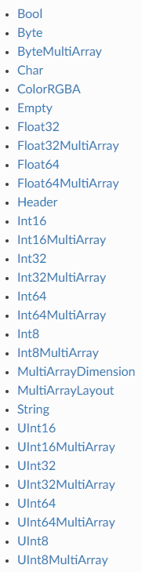
<br>
<figcaption>Fuente: https://docs.ros.org/en/ros2_packages/rolling/api/std_msgs/interfaces/message_definitions.html</figcaption>
</div>

<h3>Compilador del <i>Workspace</i></h3>

El compilador crea ejecutables de programas. Para utilizar este compilador hay que crear un <i>Workspace</i> (espacio de trabajo), en donde estará todo el proyecto (paquetes y nodos). Se recomienda tener un <i>Workspace</i> por proyecto.

- `ROS1`

`catkin` es el compilador para las versiones de ROS1 más recientes (ej: Noetic, Melodic, entre otras).

<div align="center">
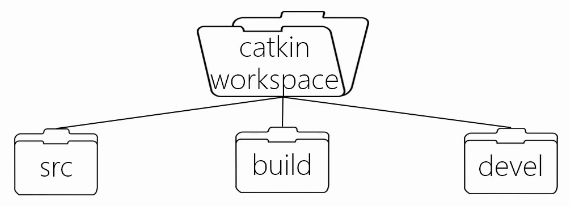
<br>
<figcaption>Fuente: https://blog.csdn.net/JeremyZhao1998/article/details/104470039</figcaption>
</div>

- `ROS2`

`colcon` es el compilador para las versiones de ROS2 más recientes (ej: Kilted, Jazzy, Iron, Humble, entre otras). 

<div align="center">
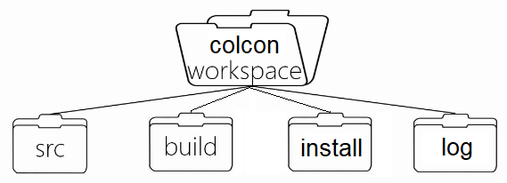
<br>
<figcaption>Fuente: https://blog.csdn.net/JeremyZhao1998/article/details/104470039</figcaption>
</div>

<h3>Packages</h3>

Los paquetes deben estar dentro del área de trabajo y contienen ejecutables, librerías, códigos (scripts) y mucha más información de los subsistemas de un proyecto. Es importante tener en cuenta que un paquete debe contener su propia carpeta. En el paquete está el archivo package.xml que es el que tiene

- `ROS1`

En la carpeta del paquete se debe tener el archivo CMakeLists.txt, el cual brinda información sobre el paquete con respecto al propietario, objetivo, dependencias y nodos ejecutables del paquete. 

<div align="center">
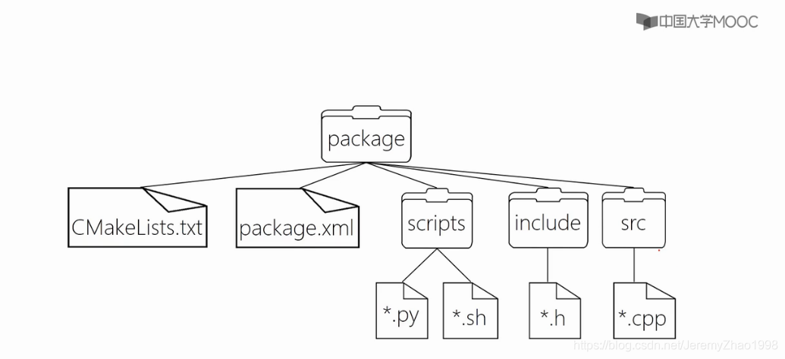
<br>
<figcaption>Fuente: https://blog.csdn.net/JeremyZhao1998/article/details/104470039</figcaption>
</div>

- `ROS2`

En la carpeta del paquete se deben tener una carpeta con el mismo nombre del paquete en donde se guardarán los códigos de los nodos en Python, además, se debe tener un archivo setup.py que es el que tendrá la información 

<div align="center">
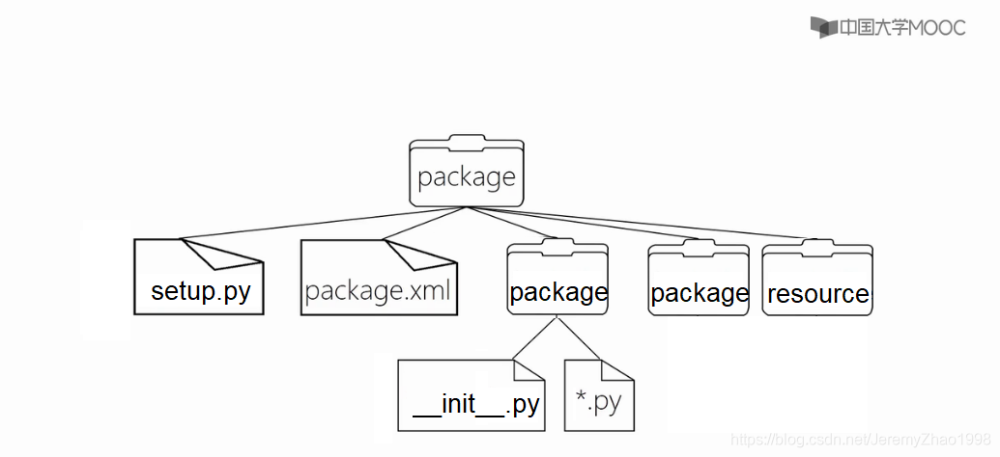
<br>
<figcaption>Fuente: https://blog.csdn.net/JeremyZhao1998/article/details/104470039</figcaption>
</div>


<!--
Para instalar los paquetes de tutoriales ejecutar el siguiente comando: 

```
sudo apt-get install ros-noetic-ros-tutorials
```
-->

Si se desea ver la lista de los paquetes instalados se debe ejecutar el siguiente comando:

- `ROS1`

```
rosls <TAB>
```

- `ROS2`

```
ros2 ls <TAB>
```

Si se desea encontrar la ruta de un paquete específico se debe ejecutar el siguiente comando:

- `ROS1`

```
rospack find rospy
```

- `ROS2`

```
ros2 pack find rclpy
```

<h3>Nodes</h3>

Son programas ejecutables que envían o reciben información a un <i>topic</i>, hay dos principales tipos de nodos: <i>publisher</i> y <i>suscriber</i>. Los nodos deben estar dentro de los paquetes.

<h3>Topics</h3>

Son el punto intermedio entre el nodo <i>publisher</i> y el nodo <i>suscriber</i>, los cuales permiten depurar la comunicación entre los dos nodos.

<h3>Estructura de directorios</h3>

- `ROS1`

<div align="center">
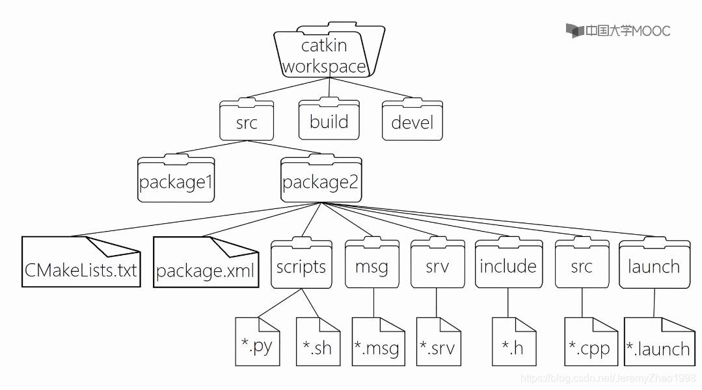
<br>
<figcaption>Fuente: https://blog.csdn.net/JeremyZhao1998/article/details/104470039</figcaption>
</div>

<div align="center">
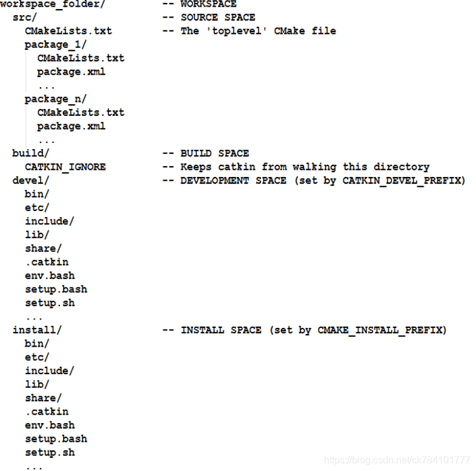
<br>
<figcaption>Fuente: https://blog.csdn.net/ck784101777/article/details/106297924</figcaption>
</div>

- `ROS2`

<div align="center">
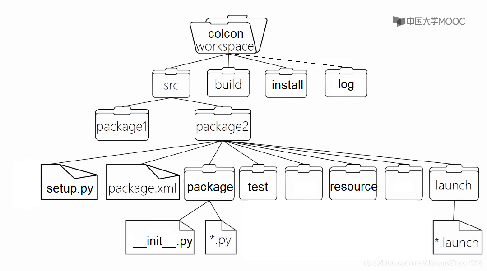
<br>
<figcaption>Fuente: https://blog.csdn.net/JeremyZhao1998/article/details/104470039</figcaption>
</div>

<h2>Conexiones nodos y topics en ROS</h2>

La comunicación entre nodos es realizada a través de un topic, el cual es un canal de información de un dato de dato específico, el cual es conformado principalmente por el nombre del topic y el mensaje que recibirá (string, int, image, combinación, etc). Un nodo puede ser publicador y suscriptor, así mismo, un nodo puede publicar y/o suscribirse a diferentes topics.

<div align="center">
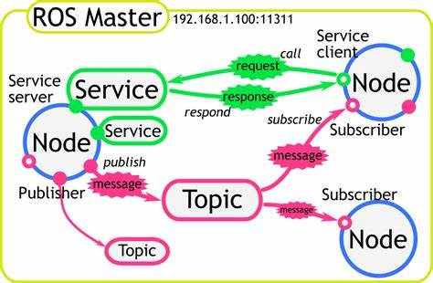
<br>
<figcaption>Fuente: </figcaption>
</div>

<h3>Ejemplo "Hola mundo" (Talker - Listener)</h3>

<div align="center">
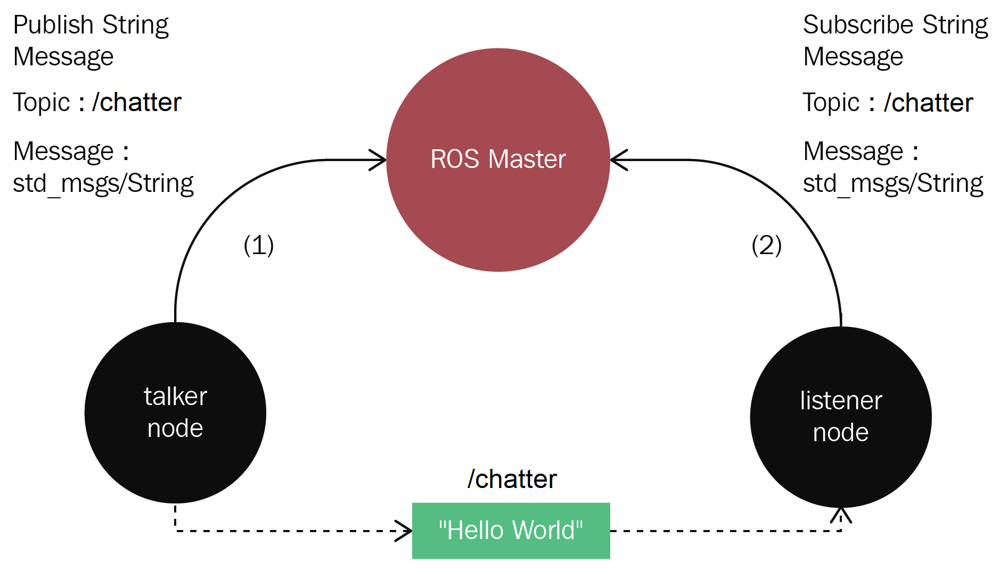
<br>
<figcaption>Fuente: https://www.oreilly.com/library/view/ros-robotics-projects/9781838649326/0375b997-95dc-48c6-9738-49a4eb1a9f62.xhtml</figcaption>
</div>

En terminales independientes correr los siguientes comandos:

- `ROS1`

Nodo maestro

```
roscore
```

Nodo <i>publisher</i>

- `ROS1`

```
rosrun roscpp_tutorials talker
```

- `ROS2`

```
ros2 run demo_nodes_cpp talker
```

Nodo <i>suscriber</i>

- `ROS1`

```
rosrun roscpp_tutorials listener
```

- `ROS2`

```
ros2 run demo_nodes_cpp listener
```

Si se desea depurar la comunicación entre dos nodos (<i>publisher</i> y <i>suscriber</i>) se debe conocer el <i>topic</i> que está intermedio de los dos nodos, para esto se debe desplegar la lista de topics activos a través del siguiente comando:

- `ROS1`

```
rostopic list
```

- `ROS2`

```
ros2 topic list
```

Si se desea mostrar la información de un <i>topic</i> espcífico, en relación al tipo de mensaje, los nodos <i>publishers</i> y los nodos <i>subscribers</i> activos a dicho <i>topic</i>, se debe ejecutar el siguiente comando:

- `ROS1`

```
rostopic info /chatter
```

- `ROS2`

```
ros2 topic info /chatter
```

Si se desea visualizar el mensaje que está llegando a un <i>topic</i> específico, es decir, emulando el nodo <i>subscriber</i>, se debe ejecutar el siguiente comando:

- `ROS1`

```
rostopic echo /chatter
```

- `ROS2`

```
ros2 topic echo /chatter
```

Si se desea visualizar el mensaje que está saliendo de un <i>topic</i> específico, es decir, emulando el nodo <i>publisher</i>, se debe ejecutar el siguiente comando:

- `ROS1`

```
rostopic pub /chatter std_msgs/String "data: 'Bom dia, tudo bem?'"
```

- `ROS2`

```
ros2 topic pub /chatter std_msgs/String "data: 'Bom dia, tudo bem?'"
```

Si se desea observar de manera gráfica la conexión entre nodos y topics, ejecutar el siguiente comando:

- `ROS1`

```
rosrun rqt_graph rqt_graph 
```

- `ROS2`

```
ros2 run rqt_graph rqt_graph 
```

<!--
Para habilitar las estadísticas de frecuencias de publicación de los nodos ejecutar el siguiente comando:

```
rosparam set enable_statistics true
```
-->

<div align="center">

<br>
<figcaption>Fuente: Autor</figcaption>
</div>