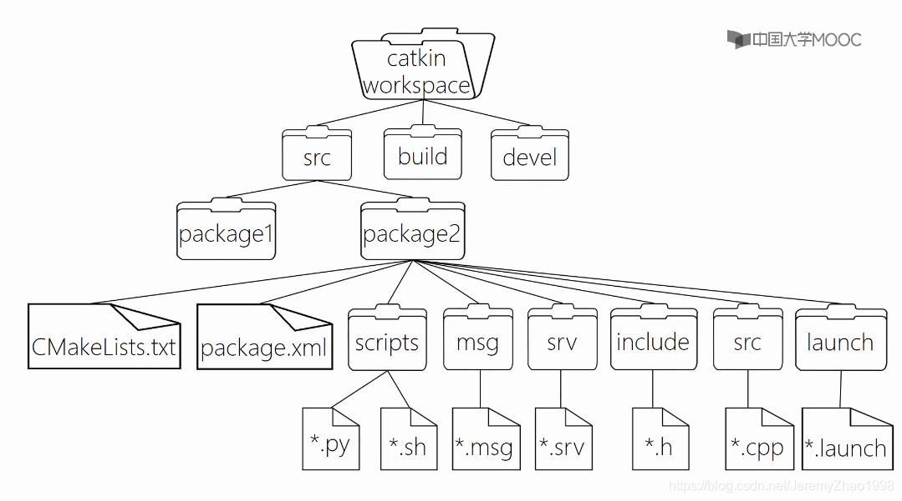

<h1>Aula 11</h1>

En esta clase se presenta un introducción a ROS

<h2>Introducción a ROS</h2>

<h3>Instalación de Ubuntu 20.04</h3>

Descargar ubuntu 20.04 y Virtual Box

Crear la máquina virtual con Ubuntu 20.04 de formato .iso en el Virtual Box

<h3>Instalación de ROS Noetic</h3>

https://wiki.ros.org/noetic/Installation/Ubuntu

Abrir una terminal en Ubuntu y conceder permisos de super usuario (administrador)

```
su root
```

Inicialmente se debe configurar el computador para que acepte software de packages.ros.org, por tanto, en un terminal en Ubuntu correr los siguientes comandos:

```
sudo sh -c 'echo "deb http://packages.ros.org/ros/ubuntu $(lsb_release -sc) main" > /etc/apt/sources.list.d/ros-latest.list'

sudo apt install curl

curl -s https://raw.githubusercontent.com/ros/rosdistro/master/ros.asc | sudo apt-key add -

sudo apt update

sudo apt install ros-noetic-desktop-full

source /opt/ros/noetic/setup.bash

echo "source /opt/ros/noetic/setup.bash" >> ~/.bashrc

source ~/.bashrc

sudo apt install python3-rosdep python3-rosinstall python3-rosinstall-generator python3-wstool build-essential

sudo apt install python3-rosdep

sudo rosdep init

rosdep update
```

Para validar la instalación de ROS, ejecutar los siguientes comandos en terminales independientes, para correr ROS maestro y para correr el nodo `talker` del paquete `roscpp_tutorials`, el cual es un nodo publicador.

```
roscore
```

```
rosrun roscpp_tutorials talker
```

Así mismo, si se quiere conocer la versión instala de ROS, ejecutar el siguiente comando:

```
rosversion -d
```

<h2>ROS</h2>

ROS es un sistema operativo de robots. Actualmente, es una colección de frameworks, herramientas (visualizar datos, guardar datos sensores, depurar y simular) y librerías. Una de las principales justificaciones de ROS es crear proyectos complejos de robótica con alta compatibilidad con hardware (Raspberry, PC(Ubuntu), Intel NUC, entre otros) y que sean reutilizables entre diferentes robots, independizando la programación por subsistemas (visión, navegación (movimiento), comunicación, sensores) y que a su vez se interconecten entre ellos.

otra de las ventajas de ROS es que los subsistemas están interconectados como grafos (nodos) a través de flechas (mensajes), es decir, es posible ejecutar diferentes programas de manera simultanea (paralelo)


Fuente: https://atadiat.com/en/e-ros-imu-and-arduino-how-to-send-to-ros/

<h3>catkin</h3>

`catkin` es el compilador para las versiones de ROS más recientes (ej: Noetic), así mismo, crea ejecutables de programas. Para utilizar este compilador hay que crear un área de trabajo, en donde estarán todo el código (paquetes y nodos). Se recomienda tener un área de trabajo por proyecto.


Fuente: https://blog.csdn.net/JeremyZhao1998/article/details/104470039

<h3>Packages</h3>

Los paquetes pueden contener ejecutables, librerías, códigos (scripts) y mucha más información de los subsistemas de un proyecto. Es importante tener en cuenta que un paquete debe contener su propia carpeta, en la cual se deben tener dos archivos (package.xml y CMakeLists.txt), los cuales brindan información sobre el paquete con respecto al propietario, objetivo, dependencias y librerías del paquete. Los paquetes deben estar dentro del área de trabajo.


Fuente: https://blog.csdn.net/JeremyZhao1998/article/details/104470039

Para instalar los paquetes de tutoriales ejecutar el siguiente comando: 

```
sudo apt-get install ros-noetic-ros-tutorials
```

Si se desea ver la lista de los paquetes instalados se debe ejecutar la siguiente línea de comando:

```
rosls <TAB>
```

Para encontrar la ruta de un paquete se debe ejecutar el siguiente comando:

```
rospack find roscpp
```

<h3>Nodes</h3>

Son programas ejecutables que envían o reciben información a un topic, hay dos principales tipos de nodos, publicador y suscriptor. Los nodos deben estar dentro de los paquetes.

<h3>Topics</h3>

Son el punto intermedio entre el nodo publicador y el nodo suscriptor.

<h3>Estructura de directorios</h3>



Fuente: https://blog.csdn.net/JeremyZhao1998/article/details/104470039


Fuente: https://blog.csdn.net/ck784101777/article/details/106297924


Fuente: https://robodev.blog/ros-basic-concepts


Fuente: https://robodev.blog/ros-basic-concepts


Fuente: https://robodev.blog/ros-basic-concepts


<h2>Comandos ROS</h2>

ROS master

```
roscore
```