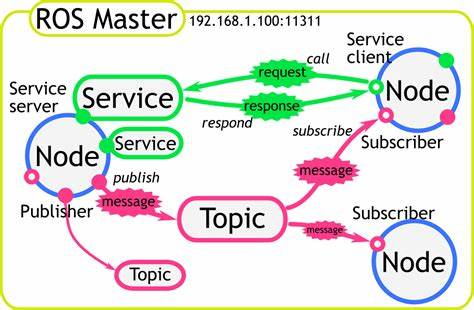

<h1>Aula 13</h1>

En esta clase se presentan los ejemplos de ROS que trae por defecto, además de depurar la ejecución de los nodos.

<h2>Comunicación nodos y topics en ROS</h2>

La comunicación entre nodos es realizada a través de un topic, el cual es un canal de información de un dato de dato específico, el cual es conformado principalmente por el nombre del topic y el mensaje que recibirá (string, int, image, combinación, etc).

Un nodo puede ser publicador y suscriptor, así mismo, un nodo puede publicar y/o suscribirse a diferentes topics



<h3>Talker - Listener</h3>


Fuente: https://www.oreilly.com/library/view/ros-robotics-projects/9781838649326/0375b997-95dc-48c6-9738-49a4eb1a9f62.xhtml

En cada terminal correr los siguientes comandos:

Nodo maestro

```
roscore
```
Nodo publicador
```
rosrun roscpp_tutorials talker
```
Nodo suscriptor
```
rosrun roscpp_tutorials listener
```
Topic

*Para depurar la comunicación entre dos nodos:

Muestra la lista de topics activos
```
rostopic list
```
Muestra la información de un topic espcífico, en relación al tipo de mensaje, los nodos publishers y los nodos subscribers activos a dicho topic.
```
rostopic info /chatter
```
Si se desea recibir el mensaje de un topic específico, es decir, es crear un nodo subscriber de dicho topic; para esto se debe estar ejecutando el nodo publisher.
```
rostopic echo /chatter
```
Si se desea enviar un mensaje a un topic específico, es decir, es crear un nodo publisher de dicho topic; para esto se debe estar ejecutando el nodo subscriber.

```
rostopic pub /chatter std_msgs/String "data: ''Bom dia, tudo bem?'"
```

<h3>Turtle</h3>

