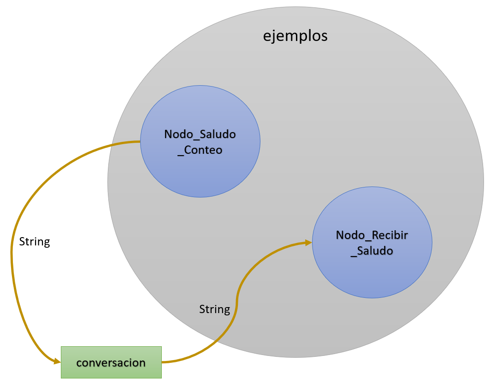

<h1>Aula 13</h1>

En esta clase se crea un proyecto (<i>workspace</i>) en ROS1 melodic y ROS2 Humble en la Raspberry Pi 4 con dos nodos (publisher y subscriber). Por tanto, antes de crear cualquier nodo, se debe tener el <i>workspace</i> y el <i>package</i> ya creados y construidos.

<h2>Ejemplo</h2>

<div align="center">

<br>
<figcaption>Fuente: Autor</figcaption>
</div>

Con la herramienta de ROS "rqtgraph"

<div align="center">

<br>
<figcaption>Fuente: Autor</figcaption>
</div>

<h3>Crear un <i>workspace</i></h3>

Antes de crear el <i>workspace</i> se debe verificar que ROS esté cargado, a través del siguiente comando en la terminal:

```
ros2
```

> [!WARNING]  
> Si aparece el mensaje ros2: command not found, ejecutar los siguientes comandos para cargar ROS en la terminal actual

```
source /opt/ros/humble/setup.bash
```

> [!TIP]  
> Si se desea cargar ROS permanentemente cada vez que se abra un terminal, se debe ejecutar el siguiente comando en la terminal

```
echo "source /opt/ros/humble/setup.bash" >> ~/.bashrc
```

Ingresar en una terminal a la carpeta donde se quiere guardar el <i>workspace</i>:
```
mkdir -p WORKSPACE_FOLDER_NAME/src (ej: mkdir -p ~/EjemplosROS2/aula13_ws/src)

cd WORKSPACE_FOLDER_NAME (ej: cd ~/EjemplosROS2/aula13_ws)
```
Posteriormente, construir el <i>workspace</i>, a través de la siguiente línea de comando:

- `ROS1`

```
catkin_make
```

- `ROS2`

```
colcon build --symlink-install
```

> [!WARNING]  
> Si aparece el mensaje colcon: command not found, ejecutar los siguientes comandos

```
sudo apt update
sudo apt install python3-colcon-common-extensions
```

Finalmente, activar el <i>workspace</i>

```
source install/setup.bash
```

> [!TIP]  
> Si se desea activar el <i>workspace</i> permanentemente cada vez que se abra un terminal, se debe ejecutar el siguiente comando en la terminal

```
echo "source ~/WORKSPACE_NAME/install/setup.bash" >> ~/.bashrc (ej: echo "source ~/EjemplosROS2/aula13_ws/install/setup.bash" >> ~/.bashrc)
```

<h3>Crear un <i>package</i></h3>

Ingresar a la carpeta "src" del <i>workspace</i> previamente creado, posteriormente ejecutar el siguiente comando, teniendo en cuenta como recomendación que el nombre del paquete debe comenzar en minúscula.

- `ROS1`

```
catkin_create_pkg PACKAGE_NAME depend1 depend2 depend2 ... dependN (ej: catkin_create_pkg ejemplos std_msgs rospy roscpp)
```

- `ROS2`

```
ros2 pkg create PACKAGE_NAME --build-type ament_python --dependencies depend1 depend2 depend2 ... dependN (ej: ros2 pkg create ejemplos --build-type ament_python --dependencies rclpy rclcpp)
```

Desde el terminal, retornar a la carpeta del <i>workspace</i> y compilarlo, a través de la siguiente línea de comando, el cual se debe ejecutar cada vez que se crea un nuevo <i>package</i>.

- `ROS1`

```
catkin_make
```

- `ROS2`

```
colcon build --symlink-install
```

<h3>Crear un nodo <i>publisher</i></h3>

- `ROS1`

1. Crear una nueva carpeta con el nombre scripts dentro del <i>package</i> a utilizar
2. Ingresar a dicha carpeta
3. Crear un archivo de tipo python para el nodo <i>publisher</i> (ej: nsc.py)
4. Abrir el archivo con un editor de texto (nano) en una terminal de super usuario para editarlo

<!--
a través del comando subl o gedit, el comando nano también abre el archivo para editarlo pero desde la terminal. Para instalar sublime text se debe ejecutar el siguiente comando:

```
snap install sublime-text --classic
```
-->

```python
#!/usr/bin/env python2
#coding=utf-8

import rospy #Crear nodos con ROS
from std_msgs.msg import String

def Nodo_Saludo_Conteo():
    rospy.init_node('nodo_saludo_conteo')  #Inicializa el nodo con el nombre Nodo_conteo
    pub = rospy.Publisher('conversacion', String, queue_size=1) #Declara el nodo como publisher con los parámetros  del nombre del topic, el tipo de dato del mensaje y 
    rate = rospy.Rate(10) #Iniciaiza la frecuencia en Hertz de ejecución del nodo
    cont = 0

    while not rospy.is_shutdown(): #Mientras el nodo no esté apagado, es decir, mientras esté encendido
        mensaje = "Buen dia %d" %cont
        #rospy.loginfo(mensaje)
        pub.publish(mensaje)
        cont+=1
        rate.sleep() #Delay de 0.1s

if __name__ == '__main__':
    try:
        Nodo_Saludo_Conteo()
    except rospy.ROSInterruptException:
        pass
```

Posteriormente, en la terminal ubicada en la ruta del nodo, convertirlo en ejecutable a través de la siguiente línea de comando:

```
sudo chmod u+x NODE_FILE.py (ej: sudo chmod u+x Nodo_Saludo_Conteo.py)
```

En la misma terminal, ir a la carpeta del workspace y cargar el nodo nuevo (actualizar el package) ejecutando la siguiente línea de comando:

```
source devel/setup.bash
```

Para no tener que actualizar el paquete manualmente cada vez que se ejecute el nodo, agregar la siguiente linea de comando en el archivo ".bashrc", el cual está en la carpeta de instalación de ROS:

```
nano ~/.bashrc
```
```
source /RUTA WORKSPACE/devel/setup.bash (ej: source ~/aula13_ws/devel/setup.bash)
```

<!--
Para aplicar las modificaciones en el archivo .bashrc, se debe abrir una nueva terminal o actualizar a través del siguiente comando:

```
source ~/.bashrc
```
--> 

Posteriormente, abrir una nueva terminal y correr el nodo a través del siguiente comando:
```
rosrun PACKAGE NODE_FILE.py (ej: rosrun ejemplos Nodo_Saludo_Conteo.py)
```

- `ROS2`

1. Al momento de compilar de crear el <i>package</i>, se crea una nueva carpeta con el nombre del <i>package</i> dentro del <i>package</i> a utilizar
2. Ingresar a dicha carpeta
3. Crear un archivo de tipo python para el nodo <i>publisher</i> (ej: nsc.py)
4. Abrir el archivo con un editor de texto (ej: nano, visual studio code, entre otros) para editarlo

```python
#!/usr/bin/env python3
#coding=utf-8

import rclpy #Crear nodos con ROS en Python
from rclpy.node import Node
from std_msgs.msg import String

class NodoPublicador(Node):

    def __init__(self):
        super().__init__('Nodo_Saludo_Conteo') #Inicializa el nodo con el nombre Nodo_Saludo_Conteo
        self.publisher = self.create_publisher(String, 'conversacion', 10) #Declara el nodo como publisher con los parámetros del tipo de dato del mensaje, el nombre del topic y la cantidad de mensajes en cola
        self.timer = self.create_timer(0.1, self.timer_callback) #Inicializa la frecuencia 10 Hz de ejecución del nodo
        self.cont = 0
    
    def timer_callback(self):
        mensaje = String()
        mensaje.data = f'Buen dia {self.cont}'
        self.publisher.publish(mensaje)
        self.get_logger().info(mensaje.data)#self.get_logger().info(f'Publicando: "{msg.data}"')
        self.cont+=1

def main(args=None):
    rclpy.init(args=args)
    nodo = NodoPublicador()
    try:
        rclpy.spin(nodo)
    except KeyboardInterrupt:
        pass
    finally:
        nodo.destroy_node()
        rclpy.shutdown()

if __name__ == '__main__':
    main()
```

Agregar en la opción console_scripts en la sección entry_points en el archivo setup.py

```
'executable_name = package_name.file_name:main', (ej: 'enviar_saludo = ejemplos.nsc:main',)
```

Posteriormente, se debe construir el proyecto al haber actualizado el <i>package</i> (crear un nodo), para lo cual se debe regresar a la ruta del <i>workspace</i> y ejecutar el siguiente comando:

```
colcon build --symlink-install
```

Finalmente, abrir una nueva terminal y ejecutar el nodo a través del siguiente comando:

```
ros2 run ejemplos Nodo_Saludo_Conteo
```

<h3>Crear un nodo <i>subscriber</i></h3>

- `ROS1`

1. Ingresar a la carpeta "scripts" dentro del <i>package</i> a utilizar
2. Crear un archivo Nodo_Recibir_Saludo.py
3. Abrir el archivo con un editor de texto (nano) en una terminal de super usuario para editarlo

```python
#!/usr/bin/env python2

import rospy #Crear nodos con ROS
from std_msgs.msg import String


def callback(mensaje):
    print(mensaje.data)

def Nodo_Recibir_Saludo():
    rospy.init_node('Nodo_Recibir_Saludo')

    sub = rospy.Subscriber('conversacion', String, callback)

    rospy.spin()

if __name__ == '__main__':
    try:
        Nodo_Recibir_Saludo()
    except rospy.ROSInterruptException:
        pass

```
Posteriormente, en la terminal ubicada en la ruta del nodo, convertirlo en ejecutable a través de la siguiente línea de comando:

```
sudo chmod u+x NODE_FILE.py (ej: sudo chmod u+x Nodo_Recibir_Saludo.py)
```

En la misma terminal, ir a la carpeta del workspace y cargar el nodo nuevo (actualizar el package) ejecutando la siguiente línea de comando; sin embargo, si ya se cargó este comando con la ruta en el archivo ".bashrc", no hay necesidad de ejecutarlo.

```
source devel/setup.bash
```

Posteriormente, abrir una nueva terminal y correr el nodo a través del siguiente comando:

```
rosrun PACKAGE NODE_FILE.py (ej: rosrun ejemplos Nodo_Recibir_Saludo.py)
```

- `ROS2`

1. Entrar a la carpeta con el nombre del <i>package</i> dentro del <i>package</i> a utilizar
3. Crear un archivo de tipo python para el nodo <i>publisher</i> (ej: nrs.py)
4. Abrir el archivo con un editor de texto (ej: nano, visual studio code, entre otros) para editarlo

```python
#!/usr/bin/env python3

import rclpy
from rclpy.node import Node
from std_msgs.msg import String

class NodoSuscriptor(Node):

    def __init__(self):
        super().__init__('Nodo_Recibir_Saludo')
        self.subscriber = self.create_subscription(String, 'conversacion', self.callback, 10) #Declara el nodo como subscriber con los parámetros del tipo de dato del mensaje, el nombre del topic, la función de interrupción y la cantidad de mensajes en cola

    def callback(self, mensaje):
        self.get_logger().info(f'Recibido: {mensaje.data}')

def main(args=None):
    rclpy.init(args=args)
    nodo = NodoSuscriptor()
    try:
        rclpy.spin(nodo)
    except KeyboardInterrupt:
        pass
    finally:
        nodo.destroy_node()
        rclpy.shutdown()

if __name__ == '__main__':
    main()
```

Agregar en la opción console_scripts en la sección entry_points en el archivo setup.py

```
'executable_name = package_name.file_name:main', (ej: 'recibir_saludo = ejemplos.nrs:main',)
```

Posteriormente, se debe construir el proyecto al haber actualizado el <i>package</i> (crear un nodo), para lo cual se debe regresar a la ruta del <i>workspace</i> y ejecutar el siguiente comando:

```
colcon build --symlink-install
```

Finalmente, abrir una nueva terminal y ejecutar el nodo a través del siguiente comando:

```
ros2 run ejemplos Nodo_Recibir_Saludo
```

<h3>Ejecutar el proyecto con <i>Launch</i></h3>

Si se desea ejecutar varios nodos de un mismo <i>workspace</i> en `ROS` con solamente una línea de comando `roslaunch` o `ros2 launch`, se deben tener en cuenta los siguientes pasos:

- `ROS 1`

1. Crear la carpeta "launch" en la ruta dentro de uno de los paquetes del proyecto en la terminal
2. Ingresar a la carpeta creada en el paso anterior y crear el archivo "NAME_FILE.launch" (ej: aula13_nodes.launch)
3. Abrir el archivo "NAME_FILE.launch" (ej: aula13_nodes.launch)
4. Agregar las siguientes líneas en el archivo "NAME_FILE.launch" (ej: aula13_nodes.launch) para anidar los nodos de los diferentes <i>packages</i> que se quieren ejecutar con el comando launch

```
<launch>
    <node pkg="ejemplos" type="Nodo_Saludo_Conteo.py" name="Nodo_Saludo_Conteo" output="screen"/>
    <node pkg="ejemplos" type="Nodo_Recibir_Saludo.py" name="Nodo_Recibir_Saludo" output="screen"/>
</launch>
```
5. Guardar el archivo "NAME_FILE.launch" (ej: aula13_nodes.launch)
6. Ejecutar el archivo "NAME_FILE.launch" (ej: aula13_nodes.launch) a través del siguiente comando en cualquier terminal:

```
 roslaunch NAME_PACKAGE NAME_FILE.launch (ej: roslaunch ejemplos aula13_nodes.launch)
```

 - `ROS 2`

 1. Crear la carpeta "launch" en la ruta dentro de uno de los paquetes del proyecto en la terminal, pero como buena practica se recomienda crear un paquete (ej: <i>bringup</i>) solo para ejecutar el launch
 2. Ingresar a la carpeta creada en el paso anterior y crear el archivo "NAME_FILE.launch.py" (ej: aula13_nodes.launch.py)
 3. Abrir el archivo "NAME_FILE.launch.py" (ej: aula13_nodes.launch.py)
 4. Agregar las siguientes líneas en el archivo "NAME_FILE.launch.py" (ej: aula13_nodes.launch.py) para anidar los nodos de los diferentes <i>packages</i> que se quieren ejecutar con el comando launch. Para esto es importante tener en cuenta la estructura para cada nodo:

```python
Node(
    package='PACKAGE_NAME',
    executable='EXECUTABLE_NAME', 
    name='NODE_NAME',
    output='screen'
),
```

 > [!TIP]
 > Los nodos ejecutables de un paquete específico están registrados en el archivo setup.py y se pueden conocer a través del siguiente comando: ros2 pkg executables ejemplos

```python
from launch import LaunchDescription
from launch_ros.actions import Node

def generate_launch_description():

    return LaunchDescription([

        Node(
            package='ejemplos',
            executable='enviar_saludo',
            name='Nodo_Saludo_Conteo',
            output='screen'
        ),

        Node(
            package='ejemplos',
            executable='recibir_saludo',
            name='Nodo_Recibir_Saludo',
            output='screen'
        ),
    ])
 ```

5. Guardar el archivo "NAME_FILE.launch.py" (ej: aula13_nodes.launch.py)
6. Agregar las librerías en el encabezado del archivo setup.py

```python
import os
from glob import glob
```

7. Agregar en la sección data_files en el archivo setup.py

```
(os.path.join('share', package_name, 'launch'),
        glob('launch/*.launch.py'))
```

8. Compilar el proyecto desde la carpeta del <i>workspace</i>, a través del siguiente comando en cualquier terminal:

```
colcon build --symlink-install
```

9. Ejecutar el archivo "NAME_FILE.launch.py" (ej: aula13_nodes.launch.py), a través del siguiente comando en cualquier terminal:

```
ros2 launch ejemplos aula13_nodes.launch.py
```