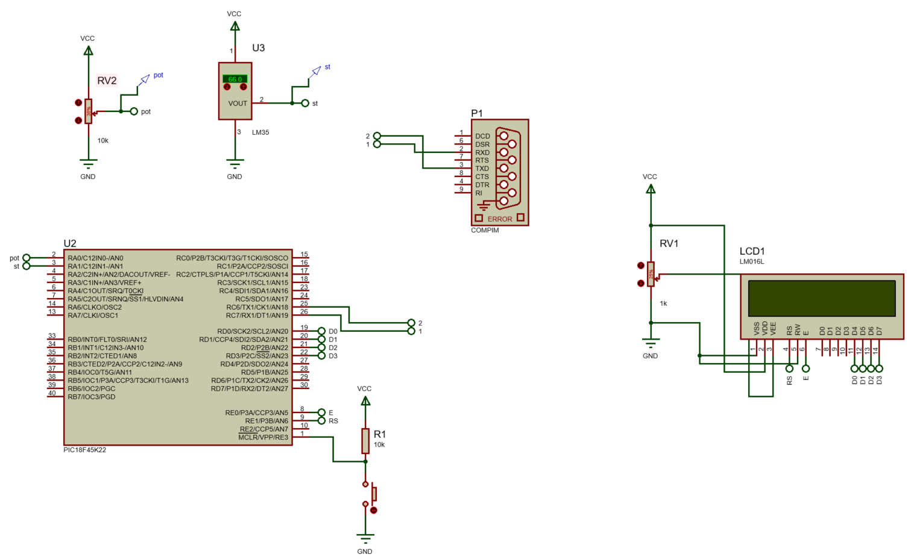

<h1>Aula 14</h1>

En esta clase se crean nodos publisher y subscriber.

Antes de crear cualquier nodo, se debe tener el espacio de trabajo y el paquete ya creado en el PC. Posteriormente, dirigirse a la ruta de dicho paquete con los comandos unix a través del terminal de Ubuntu.

<h2>Crear un Workspace</h2>

Ingresar en una terminal a la carpeta donde se quiere guardar el workspace y posteriormente ejecutar la siguiente línea de comando:

```
mkdir -p ~/aula13_ws/src

cd ~/aula13_ws

catkin_make
```
<h2>Crear un package</h2>

Ingresar a la carpeta src del workspace previamente creado, posteriormente ejecutar el siguiente comando, teniendo en cuenta como recomendación que el nombre del paquete debe comenzar en minúscula.

```
catkin_create_pkg ejemplos std_msgs rospy roscpp
```

Desde el terminal, retornar a la carpeta del workspace y compilarlo, a través de la siguiente línea de comando, el cual se debe ejecutar cuando se cree un nuevo paquete.

```
catkin_make
```

<h2>Crear un nodo publisher</h2>

1. Crear una nueva carpeta con el nombre scripts dentro del package a utilizar
2. Ingresar a dicha carpeta
3. Crear un archivo Nodo_Saludo_Conteo.py
4. Abrir el archivo con un editor de texto a través del comando subl o gedit, el comando nano también abre el archivo para editarlo pero desde la terminal. Para instalar sublime text se debe ejecutar el siguiente comando:

```
snap install sublime-text --classic
```

```
#!/usr/bin/env python3

import rospy #Crear nodos con ROS
from std_msgs.msg import String

def Nodo_Saludo_Conteo():
    rospy.init_node('Nodo_Saludo_Conteo')  #Inicializa el nodo con el nombre Nodo_conteo

    pub = rospy.Publisher('conversacion', String, queue_size=1) #Declara el nodo como publisher con los parámetros  del nombre del topic, el tipo de dato del mensaje y 

    rate = rospy.Rate(10) #Iniciaiza la frecuencia en Hertz de ejecución del nodo

    cont = 0

    while not rospy.is_shutdown(): #Mientras el nodo no esté apagado, es decir, mientras esté encendido

        mensaje = "Buen dia %d" %cont
        #rospy.loginfo(mensaje)
        pub.publish(mensaje)
        cont+=1
        rate.sleep() #Delay de 0.1s

if __name__ == '__main__':
    try:
        Nodo_Saludo_Conteo()
    except rospy.ROSInterruptException:
        pass
```

Posteriormente, en la terminal ubicada en la ruta del nodo, convertirlo en ejecutable a través de la siguiente línea de comando:

```
sudo chmod u+x Nodo_Saludo_Conteo.py
```

En la misma terminal, ir a la carpeta del workspace y cargar el nodo nuevo (actualizar el package) ejecutando la siguiente línea de comando:

```
source devel/setup.bash
```
Salir de la ubicación del espacio de trabajo y correr el nodo en el paquete específico
```
rosrun ejemplos Nodo_Saludo_Conteo.py
```


<h2>Crear un nodo subscriber</h2>

1. Ingresar a la carpeta scripts dentro del package a utilizar
2. Crear un archivo Nodo_Recibir_Saludo.py
3. Abrir el archivo con un editor de texto a través del comando subl o gedit, el comando nano también abre el archivo para editarlo pero desde la terminal

```
#!/usr/bin/env python3

import rospy #Crear nodos con ROS
from std_msgs.msg import String


def callback(mensaje):
    print(mensaje.data)

def Nodo_Recibir_Saludo():
    rospy.init_node('Nodo_Recibir_Saludo')

    sub = rospy.Subscriber('conversacion', String, callback)

    rospy.spin()

if __name__ == '__main__':
    try:
        Nodo_Recibir_Saludo()
    except rospy.ROSInterruptException:
        pass

```
Posteriormente, en la terminal ubicada en la ruta del nodo, convertirlo en ejecutable a través de la siguiente línea de comando:

```
sudo chmod u+x Nodo_Recibir_Saludo.py
```
En la misma terminal, ir a la carpeta del workspace y cargar el nodo nuevo (actualizar el package) ejecutando la siguiente línea de comando:

```
source devel/setup.bash
```
Salir de la ubicación del espacio de trabajo y correr el nodo en el paquete específico
```
rosrun ejemplos Nodo_Recibir_Saludo.py
```

<h3>Ejemplo 1</h3>

Abrir un puerto serial desde Ubuntu

--------------monitor serial--------------
apt-get install minicom
minicom -s
minicom -b 9600 -o -D /dev/ttyS2

- Listar todos los dispositivos conectados
```
ls /dev
```
- Lista los dispositivos COM conectados
```
dmesg | grep tty
```
- Muestra las configuraciones de los dispositivos COM
```
stty -F /dev/ttyS0 -a
setserial -a /dev/ttyS*
```
- Configura los baudios a 9600, 8 bits, 1 bit de stop y no bit de paridad (8N1)
```
stty -F /dev/ttyS1 9600 cs8 -cstopb -parenb
```
- Lee datos del puerto serial
```
cat /dev/ttyS1
```



Nodo publisher para adquisición de datos seriales enviados desde una terminal, de un potenciómetro y un LM35

```
#!/usr/bin/env python3

import rospy #Crear nodos con ROS
from std_msgs.msg import Float64
import serial

def Nodo_Adquisicion_Datos():
    rospy.init_node('Nodo_Adquisicion_Datos')  #Inicializa el nodo con el nombre Nodo_conteo

    pub1 = rospy.Publisher('potenciometro', Float64, queue_size=10) #Declara el nodo como publisher con los parámetros  del nombre del topic, el tipo de dato del mensaje y 
    pub2 = rospy.Publisher('LM35', Float64, queue_size=10)

    rate = rospy.Rate(10) #Iniciaiza la frecuencia en Hertz de ejecución del nodo

    s = serial.Serial('/dev/ttyS1', 9600, 8, 'N', 1) #9600 8N1

    while not rospy.is_shutdown(): #Mientras el nodo no esté apagado, es decir, mientras esté encendido
        
        rec = s.readline() #byte
        print(rec)
        rec = rec.decode() #utf-8
        print(rec)
        print(type(rec))
        rec = rec.split(",") #list
        print(rec)
        print(type(rec))
        pub1.publish(float(rec[0][:]))
        pub2.publish(float(rec[1][:]))
        #rospy.loginfo(mensaje)
        rate.sleep() #Delay de 0.1s

if __name__ == '__main__':
    try:
        Nodo_Adquisicion_Datos()
    except rospy.ROSInterruptException:
        pass

```

Nodo subscriber para graficar de datos de un potenciómetro

```
#!/usr/bin/env python3

import rospy #Crear nodos con ROS
from std_msgs.msg import Float64
import matplotlib.pyplot as plt
import threading
import time

n = []

def grafica():
    fig, ax = plt.subplots()
    ax.set_title('potenciometro')
    ax.set_xlabel('muestra')
    ax.set_ylabel('voltaje')
    while len(n)<20:
        #print(len(n))  
        ax.clear()
        ax.plot(n[:],'.b')
        plt.pause(0.01)
    plt.show()

def callback(mensaje):
    
    print(mensaje.data)
    n.append(mensaje.data)
    #if len(n) == 3: 
    

def Nodo_Plot_Potenciometro():

    rospy.init_node('Nodo_Plot_Potenciometro')

    sub = rospy.Subscriber('potenciometro', Float64, callback)

    rospy.spin()


if __name__ == '__main__':
    
    hilo2 = threading.Thread(target=grafica)
    hilo2.start()
    Nodo_Plot_Potenciometro()
```

Nodo subscriber para graficar de datos de un LM35