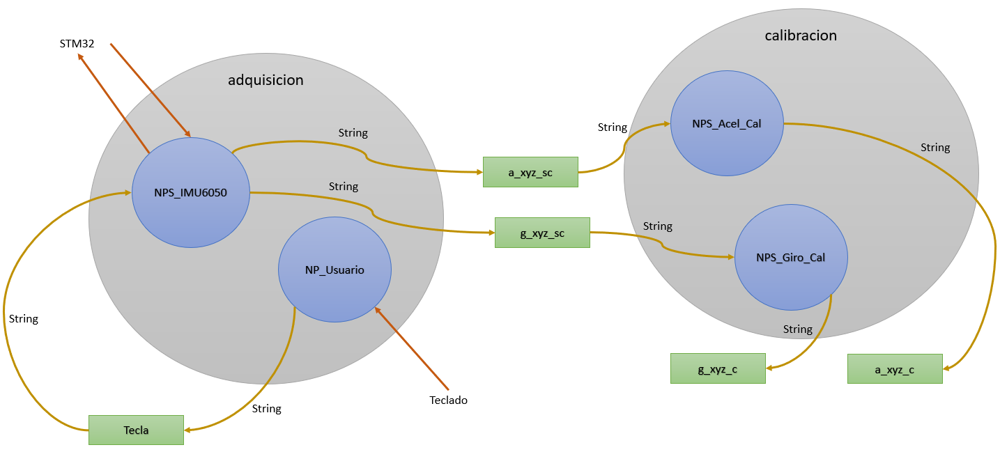

<h1>Aula 15</h1>

Esta clase consiste en adquirir y graficar los datos de la IMU6050 en diferentes nodos con ROS

<h2>Conexiones de nodos</h2>

<div align="center">

<br>
<figcaption>Fuente: Autor</figcaption>
</div>


Nodo usuario 

```python
#!/usr/bin/env python2
#coding=utf-8

import rospy #Crear nodos con ROS
from std_msgs.msg import String

def NP_Usuario():

    rospy.init_node('NP_Usuario')  #Inicializa el nodo con el nombre Nodo_conteo

    pub = rospy.Publisher('tecla', String, queue_size=10) #Declara el nodo como publisher con lo$

    rate = rospy.Rate(10) #Inicializa la frecuencia en Hertz de ejecución del nodo

    while not rospy.is_shutdown(): #Mientras el nodo no esté apagado, es decir, mientras esté en$
        value = raw_input("Quiere adquirir un dato? S/N")
        print(value)
        pub.publish(str(value))


if __name__ == '__main__':
    try:
        NP_Usuario()
    except rospy.ROSInterruptException:
        pass
```

Nodo adquisición de datos IMU6050

```python
#!/usr/bin/env python2
#coding=utf-8

import rospy #Crear nodos con ROS
from std_msgs.msg import Float64, String
import serial
import numpy

def callback(mensaje):
    global pub1, pub2, rate, s, datos

    value = mensaje.data
    if value == 'S' or value == 's':
        print("\nCapturando datos \n")
        s.write(b'H')
        for i in range(300):
            rec = s.readline() #byte
            #print(rec)
            rec = rec.decode("utf-8") #utf-8
            #print(rec)
            rec = rec.split() #list
            #print(rec)
            datos[i][:]=rec
            pub1.publish(str(datos[i,0])+","+str(datos[i,2])+","+str(datos[i,3])+","+str(datos[i,4]))
            pub2.publish(str(datos[i,0])+","+str(datos[i,5])+","+str(datos[i,6])+","+str(datos[i,7]))
            #rospy.loginfo(mensaje)
            #rate.sleep() #Delay de 0.1s
        print("\nTermina \n")

def NPS_IMU6050():
    global pub1, pub2, rate, s, datos

    datos=numpy.zeros((300,8)) #no calibrados

    rospy.init_node('NPS_IMU6050')  #Inicializa el nodo con el nombre Nodo_conteo

    pub1 = rospy.Publisher('a_xyz_sc', String, queue_size=10) #Declara el nodo como publisher con los parámetros  del nombre del topic, el tipo de dato del mensaje y 
    pub2 = rospy.Publisher('g_xyz_sc', String, queue_size=10)
    sub1 = rospy.Subscriber('tecla', String, callback)

    rate = rospy.Rate(10) #Inicializa la frecuencia en Hertz de ejecución del nodo

    s = serial.Serial('/dev/ttyACM0', 9600, 8, 'N', 1) #9600 8N1

    rospy.spin()

if __name__ == '__main__':
    try:
        NPS_IMU6050()
    except rospy.ROSInterruptException:
        pass
```

Nodo gráficas acelerometro

```python
#!/usr/bin/env python2
#coding=utf-8

import rospy #Crear nodos con ROS
from std_msgs.msg import Float64, String
import matplotlib.pyplot as plt
import threading
import time
import numpy
from copy import copy, deepcopy

SENSITIVITY_ACCEL = 2.0/32768.0
offsets = [472.92, -150.92, 177.6800000000003]

datos = numpy.zeros((300,4))

def grafica():
    global j, datos

    fig, ax = plt.subplots()
    ax.set_title(u'Acelerometros XYZ')
    ax.set_xlabel(u'muestra')
    ax.set_ylabel(u'aceleración (m/s2)')
    print(len(datos))
    while j<300:
        print(j)
        ax.clear()
        ax.plot(datos[:,1],'.b')
        plt.pause(0.01)
    plt.show()

def callback(mensaje):

    global pub, j, datos

    temp = mensaje.data.split(",")
    datos[j][:] = temp
    datos1 = deepcopy(datos)
    for i in range(0,3):
        datos1[j][i+1] = ((datos1[j,i+1])-offsets[i])*SENSITIVITY_ACCEL
    pub.publish(str(datos1[j,0])+","+str(datos1[i,1])+","+str(datos1[i,2])+","+str(datos1[i,3]))
    j+=1

def NPS_Acel_Cal():

    global pub, j

    j = 0

    rospy.init_node('NPS_Acel_Cal')

    pub = rospy.Publisher('a_xyz_c', String, queue_size=10)
    sub = rospy.Subscriber('a_xyz_sc', String, callback)

    rospy.spin()
```