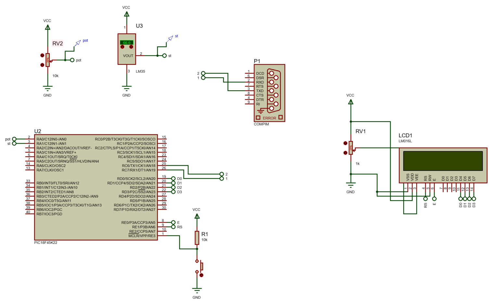

<h1>Aula 15</h1>

Esta clase consiste en crear un nodo de adquisición de datos (publisher) y dos nodos para graficar los datos de manera independiente (subscriber).

<h2>ROS (UART)</h2>

Abrir un puerto serial desde Ubuntu

--------------monitor serial--------------
apt-get install minicom
minicom -s
minicom -b 9600 -o -D /dev/ttyS2

- Listar todos los dispositivos conectados
```
ls /dev
```
- Lista los dispositivos COM conectados
```
dmesg | grep tty
```
- Muestra las configuraciones de los dispositivos COM
```
stty -F /dev/ttyS0 -a
setserial -a /dev/ttyS*
```
- Configura los baudios a 9600, 8 bits, 1 bit de stop y no bit de paridad (8N1)
```
stty -F /dev/ttyS1 9600 cs8 -cstopb -parenb
```
- Lee datos del puerto serial
```
cat /dev/ttyS1
```



```c
/*
 * File:   main.c
 * Author: LENOVO
 *
 * Created on 17 de Julho de 2024, 23:14
 */

#include <xc.h>
#include <stdio.h>
#include <string.h>

#pragma config FOSC = INTIO67
#pragma config WDTEN = OFF
#pragma config LVP = OFF

#define _XTAL_FREQ 16000000
#define time 10
//LCD
#define CD 0x01 //Clear Display
#define RH 0x02 //(0x03) Return Home
#define EMS 0x06 //Entry Mode Set
#define DC 0x0F //(0x0E) Display Control
#define DSr 0x1C //Display Shift Rigth
#define DSl 0x18 //Display Shift Left
#define FS 0x28 //(0x3C) Function Set
#define RAW1 0x80 //DDRAM display
#define RAW2 0xC0 //DDRAM display
#define RS LATE1 //Register Selection
#define E LATE0 //Enable

void settings(void);
void start(void);
//LCD
void SettingsLCD(unsigned char word);
void WriteLCD(unsigned char word);
void LCD(unsigned char data);

int digital1, digital2;
float conversion1, conversion2, temperature;
unsigned char i, flag = 0;
char text[20];

void main(void) {
    settings();
    while (1) {
        start();
    }
}

void settings(void) {
    OSCCON = 0x72;
    ANSELA = 0x03;
    ANSELC = 0x00;
    ANSELD = 0x00;
    ANSELE = 0x00;
    TRISA = 0x03;
    TRISD = 0;
    TRISE = 0;
    LATD = 0;
    LATE = 0;
    //LCD
    SettingsLCD(0x02); //Iniciar la LCD con el método nibble (4 MSB y 4 LSB)
    SettingsLCD(EMS);
    SettingsLCD(DC);
    SettingsLCD(FS);
    SettingsLCD(CD);
    //ADC
    ADCON0 = 0x01;
    ADCON1 = 0x00;
    ADCON2 = 0x95;
    //Serial UART
    TRISCbits.TRISC6 = 0;
    TRISCbits.TRISC7 = 1;
    SPBRG = 0x19;
    RCSTA = 0x90;
    TXSTA = 0x20;
}

void start(void) {
    ADCON0 = 0x01;
    __delay_ms(time);
    GO = 1;
    while (GO == 1);
    digital1 = ADRESH << 8 | ADRESL;
    conversion1 = (float) digital1 * (5.0 / 1023.0);
    ADCON0 = 0x05;
    __delay_ms(time);
    GO = 1;
    while (GO == 1);
    digital2 = ADRESH << 8 | ADRESL;
    conversion2 = (float) digital2 * (5.0 / 1023.0);
    temperature = conversion2 / 0.01;
    SettingsLCD(RAW2);
    sprintf(text, "%.4f,%.4f\n", conversion1, temperature);
    for (i = 0; i < strlen(text); i++) {
        while (TX1IF == 0);
        TXREG = text[i];
        WriteLCD(text[i]);
    }
    //while(TXIF == 0);
    //TXREG = 0x0A;//Salto de línea
    while (TXIF == 0);
    TXREG = 0x0D; //Retorno de carro
}

void SettingsLCD(unsigned char word) {
    RS = 0;
    LCD(word >> 4); // 4 MSB
    LCD(word & 0x0F); // 4 LSB
}

void WriteLCD(unsigned char word) {
    RS = 1;
    LCD(word >> 4);
    LCD(word & 0x0F);
}

void LCD(unsigned char data) { //Opción bits
    E = 1;
    __delay_us(time * 5);
    LATDbits.LATD0 = (data & 0x01);
    __delay_us(time * 5);
    LATDbits.LATD1 = (data & 0x02) >> 1;
    __delay_us(time * 5);
    LATDbits.LATD2 = (data & 0x04) >> 2;
    __delay_us(time * 5);
    LATDbits.LATD3 = (data & 0x08) >> 3;
    __delay_us(time * 5);
    E = 0;
    __delay_us(time * 5);
}
```

Nodo publisher para adquisición de datos seriales enviados desde una terminal, de un potenciómetro y un LM35

```python
#!/usr/bin/env python3

import rospy #Crear nodos con ROS
from std_msgs.msg import Float64
import serial
import threading
import time


def Nodo_Proteus():

    rospy.init_node('Nodo_Proteus')  #Inicializa el nodo con el nombre Nodo_conteo

    pub1 = rospy.Publisher('potenciometro', Float64, queue_size=10) #Declara el nodo como publisher con los parámetros  del nombre del topic, el tipo de dato del mensaje y 
    pub2 = rospy.Publisher('LM35', Float64, queue_size=10)

    rate = rospy.Rate(10) #Iniciaiza la frecuencia en Hertz de ejecución del nodo

    s = serial.Serial('/dev/ttyS1', 9600, 8, 'N', 1) #9600 8N1

    while not rospy.is_shutdown(): #Mientras el nodo no esté apagado, es decir, mientras esté encendido
        value = input("Quiere adquirir un dato? S/N")
        if value == 'S' or value == 's':  
            s.write(b'H')      
            #time.sleep(0.001)
            rec = s.readline() #byte
            print(rec)
            rec = rec.decode() #utf-8
            print(rec)
            print(type(rec))
            rec = rec.split(",") #list
            print(rec)
            print(type(rec))
            pub1.publish(float(rec[0]))
            pub2.publish(float(rec[1]))
            #rospy.loginfo(mensaje)
            rate.sleep() #Delay de 0.1s

if __name__ == '__main__':
    try:
        Nodo_Proteus()
    except rospy.ROSInterruptException:
        pass

```

Nodo subscriber para graficar de datos de un potenciómetro

```python
#!/usr/bin/env python3

import rospy #Crear nodos con ROS
from std_msgs.msg import Float64
import matplotlib.pyplot as plt
import threading
import time

n = []

def grafica():
    fig, ax = plt.subplots()
    ax.set_title('potenciometro')
    ax.set_xlabel('muestra')
    ax.set_ylabel('voltaje')
    while len(n)<20:
        #print(len(n))  
        ax.clear()
        ax.plot(n[:],'.b')
        plt.pause(0.01)
    plt.show()

def callback(mensaje):
    
    global pub

    print(mensaje.data)
    n.append(mensaje.data)
    angulo = mensaje.data*(180.0/5.0)
    pub.publish(angulo)
    

def Nodo_Grafica_Pot():

    global pub

    rospy.init_node('Nodo_Grafica_Pot')

    pub = rospy.Publisher('servo', Float64, queue_size=10)

    sub = rospy.Subscriber('potenciometro', Float64, callback)

    rospy.spin()


if __name__ == '__main__':

    hilo2 = threading.Thread(target=grafica)
    hilo2.start()
    Nodo_Grafica_Pot()    
```

Nodo subscriber para graficar de datos de un LM35