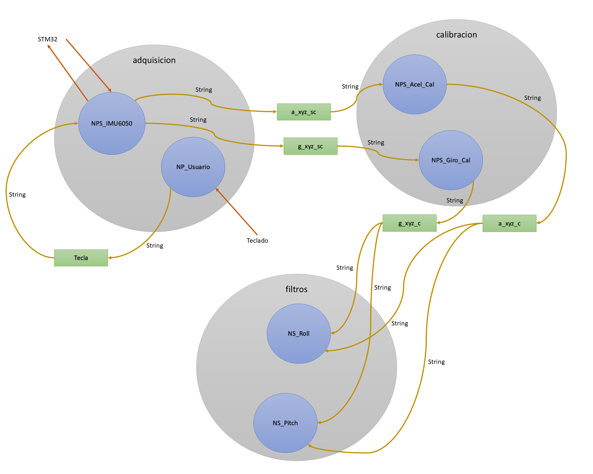
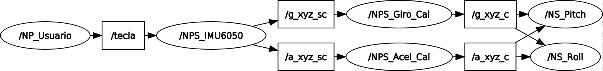

<h1>Aula 17</h1>

Esta clase consiste en estimar Roll y Pitch a través del filtro complementario con la IMU6050 en diferentes nodos con ROS

<h2>Ejemplo</h2>

<div align="center">

<br>
<figcaption>Fuente: Autor</figcaption>
</div>

Con la herramienta de ROS "rqtgraph"

<div align="center">

<br>
<figcaption>Fuente: Autor</figcaption>
</div>

```c++
//----------------------------------------------------------------------------
//                                BIBLIOTECAS
//----------------------------------------------------------------------------
#include "mbed.h"

// Enderecos dos escravos
#define    MPU6500_address            0xD0 // 7 bit I2C Endereço da MPU6500 (giroscópio e acelerômetro)

// Escalas do girôscopio
#define    GYRO_FULL_SCALE_250_DPS    0x00 // SCALE_250 (°/s) = 0 (0x00 = 000|00|000)
#define    GYRO_FULL_SCALE_500_DPS    0x08 // SCALE_500 (°/s) = 1 (0x08 = 000|01|000)
#define    GYRO_FULL_SCALE_1000_DPS   0x10 // SCALE_1000 (°/s) = 2 (0x10 = 000|10|000)
#define    GYRO_FULL_SCALE_2000_DPS   0x18 // SCALE_2000 (°/s) = 3 (0x18 = 000|11|000)

// Escalas do acelerômetro
#define    ACC_FULL_SCALE_2_G        0x00 // SCALE_2_G (g) = 0 (0x00 = 000|00|000)
#define    ACC_FULL_SCALE_4_G        0x08 // SCALE_4_G (g) = 1 (0x08 = 000|01|000)
#define    ACC_FULL_SCALE_8_G        0x10 // SCALE_8_G (g) = 2 (0x10 = 000|10|000)
#define    ACC_FULL_SCALE_16_G       0x18 // SCALE_16_G (g) = 3 (0x18 = 000|11|000)

// Escalas de conversao (As taxas de conversão são especificadas na documentação)
#define SENSITIVITY_ACCEL     2.0/32768.0             // Valor de conversão do Acelerômetro (g/LSB) para 2g e 16 bits de comprimento da palavra
#define SENSITIVITY_GYRO      250.0/32768.0           // Valor de conversão do Girôscopio ((°/s)/LSB) para 250 °/s e 16 bits de comprimento da palavra
#define SENSITIVITY_TEMP      333.87                  // Valor de sensitividade do Termometro (Datasheet: MPU-9250 Product Specification, pag. 12)
#define TEMP_OFFSET           21                      // Valor de offset do Termometro (Datasheet: MPU-9250 Product Specification, pag. 12)
#define SENSITIVITY_MAGN      (10.0*4800.0)/32768.0   // Valor de conversão do Magnetômetro (mG/LSB) para 4800uT, 16 bits de comprimento da palavra e conversao a Gauss (10mG = 1uT)

//----------------------------------------------------------------------------
//                           DECLARACAO DE VARIAVEIS
//----------------------------------------------------------------------------
// Offsets de calibração (AQUI DEVEM IR OS VALORES DETERMINADOS EN LA CALIBRACAO PREVIA COM O CÓDIGO "calibracao.ino")
//double offset_accelx = 334.0, offset_accely = -948.0, offset_accelz = 16252.0;
//double offset_gyrox = 111.0, offset_gyroy = 25.0, offset_gyroz = -49.0;

// Valores "RAW" de tipo inteiro
int16_t raw_accelx, raw_accely, raw_accelz;
int16_t raw_gyrox, raw_gyroy, raw_gyroz;
int16_t raw_temp;

// Valores "RAW" de tipo double 
   
// Saídas calibradas
float accelx, accely, accelz;
float gyrox, gyroy, gyroz;
float temp;

// Bytes
char cmd[2];
char data[1];
char GirAcel[14];

float buffer[500][8];
int i;
Timer t; //Cria-se o objeto do temporizador
float timer=0;
//.....................................................................
//                        Inicializacao I2C
//..................................................................... 
Serial pc(SERIAL_TX, SERIAL_RX);
I2C i2c(PB_7, PB_6 );//SDA,SCL

//DigitalOut myled(LED1);

int main(){
    // Desativa modo de hibernação do MPU6050
    cmd[0] = 0x6B;
    cmd[1] = 0x00;
    i2c.write(MPU6500_address, cmd, 2);
    
    pc.printf("TESTE DE CONEXAO PARA O GIROSCOPIO E O ACELEROMETRO \n\r");
    //.....................................................................
    //        Quem sou eu para a MPU6050 (giroscópio e acelerômetro)
    //.....................................................................
    pc.printf("1. Teste de conexao da MPU6050... \n\r"); // Verifica a conexao
    cmd[0] = 0x75;
    i2c.write(MPU6500_address, cmd, 1);
    i2c.read(MPU6500_address, data, 1);
    if (data[0] != 0x68) { // DEFAULT_REGISTER_WHO_AM_I_MPU6050 0x68
      pc.printf("Erro de conexao com a MPU6050 \n\r");
      pc.printf("Opaaa. Eu nao sou a MPU6050, Quem sou eu? :S. I am: %#x \n\r",data[0]);
      pc.printf("\n\r");
      while (1);
    }else{
      pc.printf("Conexao bem sucedida com a MPU6050 \n\r");
      pc.printf("Oi, tudo joia?... Eu sou a MPU6050 XD \n\r");
      pc.printf("\n\r");
    }
    wait(0.1);  
    // Configura o Girôscopio (Full Scale Gyro Range  = 250 deg/s)
    cmd[0] = 0x1B; //GYRO_CONFIG 0x1B //Registrador de configuracao do Girôscopio
    cmd[1] = 0x00;
    i2c.write(MPU6500_address, cmd, 2);                //gyro full scale 250 DPS
    // Configura o Acelerômetro (Full Scale Accelerometer Range  = 2g)
    cmd[0] = 0x1C; // ACCEL_CONFIG 0x1C //Registrador de configuracao do Acelerômetro
    cmd[1] = 0x00;
    i2c.write(MPU6500_address, cmd, 2);                //ACC full scale 2g
    wait(0.01);
    while(1) {
        //.................Construcción de la medición de los valores .................. 
        if(pc.getc() == 'H'){
            for(i=0; i<300; i++){
                t.reset();
                t.start();
                cmd[0]=0x3B;
                i2c.write(MPU6500_address, cmd, 1);            //Escritura del registro de inicio
                i2c.read(MPU6500_address, GirAcel, 14);    //Lectura en rafaga de los valores de la MPU
                //Dados crus
                raw_accelx = GirAcel[0]<<8 | GirAcel[1];    
                raw_accely = GirAcel[2]<<8 | GirAcel[3];
                raw_accelz = GirAcel[4]<<8 | GirAcel[5];
                raw_temp = GirAcel[6]<<8 | GirAcel[7];
                raw_gyrox = GirAcel[8]<<8 | GirAcel[9];
                raw_gyroy = GirAcel[10]<<8 | GirAcel[11];
                raw_gyroz = GirAcel[12]<<8 | GirAcel[13];
                wait_us(8380);
                t.stop();
                timer = t.read();
                pc.printf("%d %.2f %.2f %.2f %.2f %.2f %.2f %.2f \n\r", i, timer, (float)raw_accelx, (float)raw_accely, (float)raw_accelz, (float)raw_gyrox, (float)raw_gyroy, (float)raw_gyroz);
            }
        }
    }
}
```

Nodo usuario

```python
#!/usr/bin/env python2
#coding=utf-8

import rospy #Crear nodos con ROS
from std_msgs.msg import String

def NP_Usuario():

    rospy.init_node('NP_Usuario')  #Inicializa el nodo con el nombre Nodo_conteo

    pub = rospy.Publisher('tecla', String, queue_size=10) #Declara el nodo como publisher con lo$

    rate = rospy.Rate(10) #Inicializa la frecuencia en Hertz de ejecución del nodo

    while not rospy.is_shutdown(): #Mientras el nodo no esté apagado, es decir, mientras esté encendido
        value = raw_input("Quiere adquirir un dato? S/N")
        print(value)
        pub.publish(str(value))


if __name__ == '__main__':
    try:
        NP_Usuario()
    except rospy.ROSInterruptException:
        pass
```

Nodo adquisición de datos IMU6050

```python
#!/usr/bin/env python2
#coding=utf-8

import rospy #Crear nodos con ROS
from std_msgs.msg import Float64, String
import serial
import numpy

def callback(mensaje):
    global pub1, pub2, rate, s, datos

    value = mensaje.data
    if value == 'S' or value == 's':
        print("\nCapturando datos \n")
        s.write(b'H')
        for i in range(300):
            rec = s.readline() #byte
            #print(rec)
            rec = rec.decode("utf-8") #utf-8
            #print(rec)
            rec = rec.split() #list
            #print(rec)
            datos[i][:]=rec
            pub1.publish(str(datos[i,0])+","+str(datos[i,2])+","+str(datos[i,3])+","+str(datos[i,4]))
            pub2.publish(str(datos[i,0])+","+str(datos[i,5])+","+str(datos[i,6])+","+str(datos[i,7]))
            #rospy.loginfo(mensaje)
            #rate.sleep() #Delay de 0.1s
        print("\nTermina \n")

def NPS_IMU6050():
    global pub1, pub2, rate, s, datos

    datos=numpy.zeros((300,8)) #no calibrados

    rospy.init_node('NPS_IMU6050')  #Inicializa el nodo con el nombre Nodo_conteo

    pub1 = rospy.Publisher('a_xyz_sc', String, queue_size=10) #Declara el nodo como publisher con los pa$
    pub2 = rospy.Publisher('g_xyz_sc', String, queue_size=10)
    sub1 = rospy.Subscriber('tecla', String, callback)

    rate = rospy.Rate(10) #Inicializa la frecuencia en Hertz de ejecución del nodo

    s = serial.Serial('/dev/ttyACM0', 9600, 8, 'N', 1) #9600 8N1

    rospy.spin()

if __name__ == '__main__':
    try:
        NPS_IMU6050()
    except rospy.ROSInterruptException:
        pass
```

Nodo gráficas acelerómetros X, Y y Z

```python
#!/usr/bin/env python2
#coding=utf-8

import rospy #Crear nodos con ROS
from std_msgs.msg import Float64, String
import matplotlib.pyplot as plt
import threading
import time
import numpy
from copy import copy, deepcopy

SENSITIVITY_ACCEL = 2.0/32768.0
offsets = [472.92, -150.92, 177.6800000000003]

datos = numpy.zeros((300,4))
datos1 = numpy.zeros((300,4))


def grafica():
    global j, datos1

    fig, ax = plt.subplots()
    while j<300:
        print(j)
        ax.clear()
        ax.set_title(u'Acelerometros calibrados XYZ')
        ax.set_xlabel(u'muestra')
        ax.set_ylabel(u'aceleración (m/s2)')
        ax.plot(datos1[:,1],'.b', label='ax')
        ax.plot(datos1[:,2],'.g', label='ay')
        ax.plot(datos1[:,3],'.r', label='az')
        ax.legend(loc='best')
        plt.pause(0.01)
    print(datos1[:,:])
    print(j)
    plt.show()
    j = 0
    print(j)

def callback(mensaje):

    global pub, j, datos1

    temp = mensaje.data.split(",")
    datos[j][:] = temp
    datos1[j][0] = datos[j,0]
    for i in range(0,3):
        datos1[j][i+1] = ((datos[j,i+1])-offsets[i])*SENSITIVITY_ACCEL
    pub.publish(str(datos1[j,0])+","+str(datos1[j,1])+","+str(datos1[j,2])+","+str(datos1[j,3]))
    j+=1

def NPS_Acel_Cal():

    global pub, j

    j = 0

    rospy.init_node('NPS_Acel_Cal')

    pub = rospy.Publisher('a_xyz_c', String, queue_size=10)
    sub = rospy.Subscriber('a_xyz_sc', String, callback)

    rospy.spin()


if __name__ == '__main__':

    try:
        hilo2 = threading.Thread(target=grafica)
        hilo2.start()
        NPS_Acel_Cal()
    except rospy.ROSInterruptException:
        pass
```

Nodo gráficas giroscopios X, Y y Z

```python
#!/usr/bin/env python2
#coding=utf-8

import rospy #Crear nodos con ROS
from std_msgs.msg import Float64, String
import matplotlib.pyplot as plt
import threading
import time
import numpy
from copy import copy, deepcopy

SENSITIVITY_GYRO = 250.0/32768.0
offsets = [176.29666666666665, -34.836666666666666, -18.206666666666667]

datos = numpy.zeros((300,4))
datos1 = numpy.zeros((300,4))


def grafica():
    global j, datos1

    fig, ax = plt.subplots()
    while j<300:
        print(j)
        ax.clear()
        ax.set_title(u'Giroscopios calibrados XYZ')
        ax.set_xlabel(u'muestra')
        ax.set_ylabel(u'velocidad angular (°/s)')
        ax.plot(datos1[:,1],'-b', label='gx')
        ax.plot(datos1[:,2],'-g', label='gy')
        ax.plot(datos1[:,3],'-r', label='gz')
        ax.legend(loc='best')
        plt.pause(0.01)
    print(datos1[:,:])
    print(j)
    plt.show()
    j = 0
    print(j)

def callback(mensaje):

    global pub, j, datos1

    temp = mensaje.data.split(",")
    datos[j][:] = temp
    datos1[j][0] = datos[j,0]
    for i in range(0,3):
        datos1[j][i+1] = ((datos[j,i+1])-offsets[i])*SENSITIVITY_GYRO
    pub.publish(str(datos1[j,0])+","+str(datos1[j,1])+","+str(datos1[j,2])+","+str(datos1[j,3]))
    j+=1

def NPS_Giro_Cal():

    global pub, j

    j = 0

    rospy.init_node('NPS_Giro_Cal')

    pub = rospy.Publisher('g_xyz_c', String, queue_size=10)
    sub = rospy.Subscriber('g_xyz_sc', String, callback)

    rospy.spin()


if __name__ == '__main__':

    try:
       hilo2 = threading.Thread(target=grafica)
       hilo2.start()
       NPS_Giro_Cal()
    except rospy.ROSInterruptException:
        pass
```

Nodo de ángulo Roll

```python
#!/usr/bin/env python2
#coding=utf-8

import rospy #Crear nodos con ROS
from std_msgs.msg import Float64, String
import matplotlib.pyplot as plt
import threading
import time
import numpy
from copy import copy, deepcopy
import math

flag1 = 0
flag2 = 0

A = 0.6
B = 0.4
dt = 0.01
rad2deg = 180/3.141592

raw = 300

datos1 = numpy.zeros((raw,4))
datos2 = numpy.zeros((raw,4))
datos3 = numpy.zeros((raw,7))
Roll=numpy.zeros(((raw+1),4))
Roll[raw][0] = raw

def grafica():
    global j, Roll

    fig, ax = plt.subplots()
    while j<raw:
        print(j)
        ax.clear()
        ax.set_title(u'Ángulo Roll')
        ax.set_xlabel(u'muestra')
        ax.set_ylabel(u'grados (°)')
        ax.plot(Roll[:,1],'-b', label='RA')
        ax.plot(Roll[:,2],'-g', label='RG')
        ax.plot(Roll[:,3],'-r', label='RFC')
        ax.legend(loc='best')
        plt.pause(0.01)
    print(Roll[:,:])
    print(j)
    plt.show()
    j = 0
    print(j)

def callback1(mensaje):

    global j, datos1, flag1

    temp = mensaje.data.split(",")
    datos1[j,:] = temp
    #print(datos1[j,:])
    j += 1
    flag1 = 1

def callback2(mensaje):

    global k, datos2, flag2

    temp2 = mensaje.data.split(",")
    datos2[k,:] = temp2
    k += 1
    flag2 = 1

def NS_Roll():

    global j, k, datos1, datos2, flag1, flag2, datos3, Roll

    j = 0
    k = 0

    rospy.init_node('NS_Roll')

    sub1 = rospy.Subscriber('a_xyz_c', String, callback1)
    sub2 = rospy.Subscriber('g_xyz_c', String, callback2)

    #rospy.spin()

    while not rospy.is_shutdown(): #Mientras el nodo no esté apagado, es decir, mientras esté encendido

        if j == k:
            if flag1 == 1 and flag2 == 1:
                flag1 = flag2 = 0
                datos3[j-1][0:4] = datos1[j-1,0:4]
                datos3[k-1][4:7] = datos2[k-1,1:4]
                #print(datos3[j-1,:])
                #print("j = %d y k = %d" %(j-1,k-1))
                Roll[j-1][0] = k-1
                #Acelerómetro
                Roll[j][1] = (math.atan2(datos3[j-1,2],datos3[j-1,3]))*rad2deg
                #Giroscopio
                Roll[k][2] = Roll[k-1][3]+((datos3[k-1,4]*dt)*rad2deg)
                #Filtro complementario
                Roll[j][3] = (A*Roll[k][2])+(B*Roll[j][1])
#       rospy.sleep(0.01)

if __name__ == '__main__':

    try:
        hilo2 = threading.Thread(target=grafica)
        hilo2.start()
        NS_Roll()
    except rospy.ROSInterruptException:
        pass
```

Nodo de ángulo Pitch

```python
#!/usr/bin/env python2
#coding=utf-8

import rospy #Crear nodos con ROS
from std_msgs.msg import Float64, String
import matplotlib.pyplot as plt
import threading
import time
import numpy
from copy import copy, deepcopy
import math

flag1 = 0
flag2 = 0

A = 0.6
B = 0.4
dt = 0.01
rad2deg = 180/3.141592

raw = 300

datos1 = numpy.zeros((raw,4))
datos2 = numpy.zeros((raw,4))
datos3 = numpy.zeros((raw,7))
Pitch=numpy.zeros(((raw+1),4))
Pitch[raw][0] = raw

def grafica():
    global j, Pitch

    fig, ax = plt.subplots()
    while j<raw:
        print(j)
        ax.clear()
        ax.set_title(u'Ángulo Pitch')
        ax.set_xlabel(u'muestra')
        ax.set_ylabel(u'grados (°)')
        ax.plot(Pitch[:,1],'-b', label='PA')
        ax.plot(Pitch[:,2],'-g', label='PG')
        ax.plot(Pitch[:,3],'-r', label='PFC')
        ax.legend(loc='best')
        plt.pause(0.01)
    print(Pitch[:,:])
    print(j)
    plt.show()
    j = 0
    print(j)

def callback1(mensaje):

    global j, datos1, flag1

    temp = mensaje.data.split(",")
    datos1[j,:] = temp
    #print(datos1[j,:])
    j += 1
    flag1 = 1

def callback2(mensaje):

    global k, datos2, flag2

    temp2 = mensaje.data.split(",")
    datos2[k,:] = temp2
    k += 1
    flag2 = 1

def NS_Pitch():

    global j, k, datos1, datos2, flag1, flag2, datos3, Roll

    j = 0
    k = 0

    rospy.init_node('NS_Pitch')

    sub1 = rospy.Subscriber('a_xyz_c', String, callback1)
    sub2 = rospy.Subscriber('g_xyz_c', String, callback2)

    #rospy.spin()

    while not rospy.is_shutdown(): #Mientras el nodo no esté apagado, es decir, mientras esté encendido

        if j == k:
            if flag1 == 1 and flag2 == 1:
                flag1 = flag2 = 0
                datos3[j-1][0:4] = datos1[j-1,0:4]
                datos3[k-1][4:7] = datos2[k-1,1:4]
                #print(datos3[j-1,:])
                #print("j = %d y k = %d" %(j-1,k-1))
                Pitch[j-1][0] = k-1
                #Acelerómetro
                Pitch[j][1] = (math.atan2(-datos3[j-1,1],math.sqrt((datos3[j-1,2]*datos3[j-1,2])+(datos3$
                #Giroscopio
                Pitch[k][2] = Pitch[k-1][3]+((datos3[k-1,5]*dt)*rad2deg)
                #Filtro complementario
                Pitch[j][3] = (A*Pitch[k][2])+(B*Pitch[j][1])
#       rospy.sleep(0.01)

if __name__ == '__main__':

    try:
        hilo2 = threading.Thread(target=grafica)
        hilo2.start()
        NS_Pitch()
    except rospy.ROSInterruptException:
        pass
```