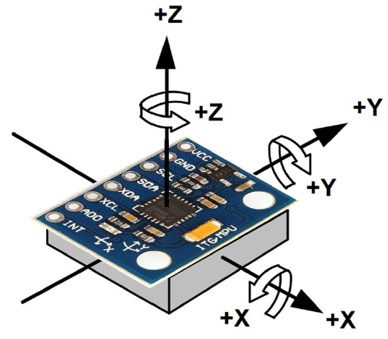
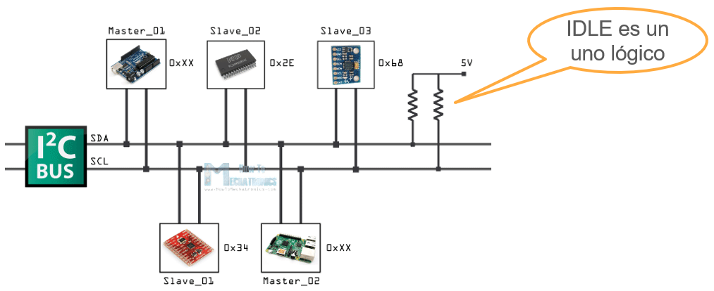
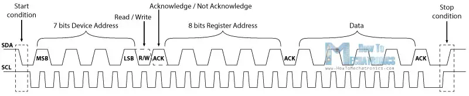
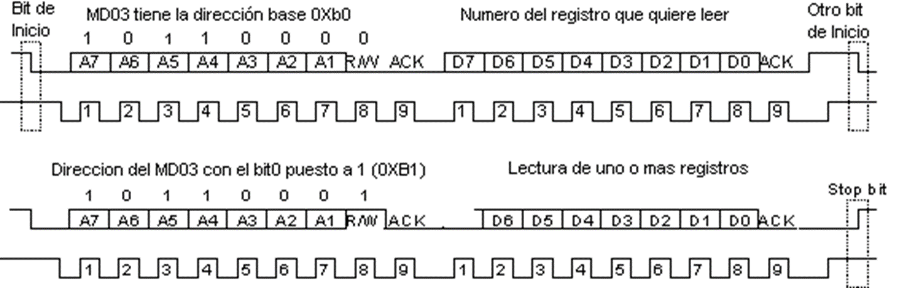
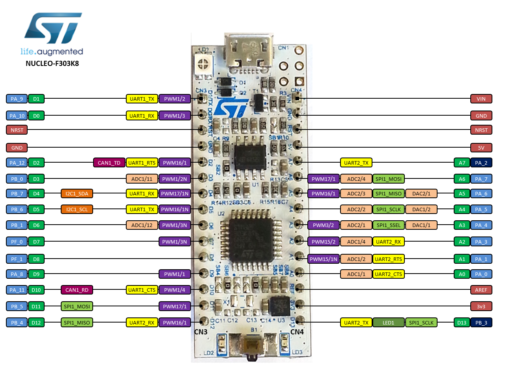

<h1>Aula 2</h1>

Esta clase consiste en comprender la IMU de 6 GDL y adquirir la información que proporciona el acelerómetro y el giroscopio.

<h2>IMU</h2>

Las Unidades de Medición Inercial (IMUs) son dispositivos electrónicos que proporcionan mediciones de velocidad angular y fuerza gravitacional en diferentes ejes. Algunas IMUs pueden medir campo magnético, temperatura, presión atmosférica, entre otras variables físicas.


<br>

Una IMU detecta las variaciones de fuerza gravitacional (g) y velocidad angular  (°/s), además del campo magnético terrestre (T o G), a través de los acelerómetros, giroscopios y magnetómetros. Los ángulos de Euler pueden ser estimados por fusión sensorial.


<figcaption>Fuente: </figcaption>

<h3>Giroscopio</h3>


<h3>Acelerómetro</h3>


<h3>Magnetómetro</h3>


<h3>MPU6050</h3>

La MPU6050 es un dispositivo de 6 GDL que integra acelerómetro y giroscopio y cuenta con comunicación SPI e I2C.


<figcaption>Fuente: Datasheet MPU6050 y MPU9250</figcaption>


<h3>I2C</h3>

I2C (Inter Integrated Circuits) es una comunicación tipo ‘half duplex’ que puede ser realizada entre uno o más maestros y uno o más esclavos, a partir de una señal de reloj (SCL) y una señal de datos (SDA). El direccionamiento de los datos se realiza a través de la dirección de esclavo de 7 bits.


<figcaption>Fuente: https://howtomechatronics.com/tutorials/arduino/how-i2c-communication-works-and-how-to-use-it-with-arduino/
</figcaption>
<br>

<h4>Escribir I2C</h4>


<figcaption>Fuente: https://howtomechatronics.com/tutorials/arduino/how-i2c-communication-works-and-how-to-use-it-with-arduino/
</figcaption>
<br>

<h4>Leer I2C</h4>


<br>

<h3>STM32F303K8</h3>

La información de apoyo puede ser consultada en los manuales de la tarjeta, sin embargo, <a href="https://os.mbed.com/platforms/ST-Nucleo-F303K8/">aquí</a> también se puede encontrar alguna información desde la página de Mbed.


<figcaption>Fuente: https://os.mbed.com/platforms/ST-Nucleo-F303K8/</figcaption>
<br>

Para la versiones de Mbed 5 y 6, hay algunas APIs <a href="https://os.mbed.com/docs/mbed-os/v6.16/apis/index.html">aquí</a> 

<h3>Ejercicio 1</h3>

Adquirir los datos del acelerómetro y giroscopio de la IMU (MPU6050) con la STM32 con Mbed 2 y graficarlos con Matlab.

```cpp
//----------------------------------------------------------------------------
//                                BIBLIOTECAS
//----------------------------------------------------------------------------
#include "mbed.h"

// Enderecos dos escravos
#define    MPU6500_address            0xD0 // 7 bit I2C Endereço da MPU6500 (giroscópio e acelerômetro)

// Escalas do girôscopio
#define    GYRO_FULL_SCALE_250_DPS    0x00 // SCALE_250 (°/s) = 0 (0x00 = 000|00|000)
#define    GYRO_FULL_SCALE_500_DPS    0x08 // SCALE_500 (°/s) = 1 (0x08 = 000|01|000)
#define    GYRO_FULL_SCALE_1000_DPS   0x10 // SCALE_1000 (°/s) = 2 (0x10 = 000|10|000)
#define    GYRO_FULL_SCALE_2000_DPS   0x18 // SCALE_2000 (°/s) = 3 (0x18 = 000|11|000)

// Escalas do acelerômetro
#define    ACC_FULL_SCALE_2_G        0x00 // SCALE_2_G (g) = 0 (0x00 = 000|00|000)
#define    ACC_FULL_SCALE_4_G        0x08 // SCALE_4_G (g) = 1 (0x08 = 000|01|000)
#define    ACC_FULL_SCALE_8_G        0x10 // SCALE_8_G (g) = 2 (0x10 = 000|10|000)
#define    ACC_FULL_SCALE_16_G       0x18 // SCALE_16_G (g) = 3 (0x18 = 000|11|000)

// Escalas de conversao (As taxas de conversão são especificadas na documentação)
#define SENSITIVITY_ACCEL     2.0/32768.0             // Valor de conversão do Acelerômetro (g/LSB) para 2g e 16 bits de comprimento da palavra
#define SENSITIVITY_GYRO      250.0/32768.0           // Valor de conversão do Girôscopio ((°/s)/LSB) para 250 °/s e 16 bits de comprimento da palavra
#define SENSITIVITY_TEMP      333.87                  // Valor de sensitividade do Termometro (Datasheet: MPU-9250 Product Specification, pag. 12)
#define TEMP_OFFSET           21                      // Valor de offset do Termometro (Datasheet: MPU-9250 Product Specification, pag. 12)
#define SENSITIVITY_MAGN      (10.0*4800.0)/32768.0   // Valor de conversão do Magnetômetro (mG/LSB) para 4800uT, 16 bits de comprimento da palavra e conversao a Gauss (10mG = 1uT)

//----------------------------------------------------------------------------
//                           DECLARACAO DE VARIAVEIS
//----------------------------------------------------------------------------
// Offsets de calibração (AQUI DEVEM IR OS VALORES DETERMINADOS EN LA CALIBRACAO PREVIA COM O CÓDIGO "calibracao.ino")
//double offset_accelx = 334.0, offset_accely = -948.0, offset_accelz = 16252.0;
//double offset_gyrox = 111.0, offset_gyroy = 25.0, offset_gyroz = -49.0;

// Valores "RAW" de tipo inteiro
int16_t raw_accelx, raw_accely, raw_accelz;
int16_t raw_gyrox, raw_gyroy, raw_gyroz;
int16_t raw_temp;

// Valores "RAW" de tipo double 
   
// Saídas calibradas
float accelx, accely, accelz;
float gyrox, gyroy, gyroz;
float temp;

// Bytes
char cmd[2];
char data[1];
char GirAcel[14];

float buffer[500][8];
int i;
Timer t; //Cria-se o objeto do temporizador
float timer=0;
//.....................................................................
//                        Inicializacao I2C
//..................................................................... 
Serial pc(SERIAL_TX, SERIAL_RX);
I2C i2c(PB_7, PB_6 );//SDA,SCL

//DigitalOut myled(LED1);

int main(){
    // Desativa modo de hibernação do MPU6050
    cmd[0] = 0x6B;
    cmd[1] = 0x00;
    i2c.write(MPU6500_address, cmd, 2);
    
    pc.printf("TESTE DE CONEXAO PARA O GIROSCOPIO E O ACELEROMETRO \n\r");
    //.....................................................................
    //        Quem sou eu para a MPU6050 (giroscópio e acelerômetro)
    //.....................................................................
    pc.printf("1. Teste de conexao da MPU6050... \n\r"); // Verifica a conexao
    cmd[0] = 0x75;
    i2c.write(MPU6500_address, cmd, 1);
    i2c.read(MPU6500_address, data, 1);
    if (data[0] != 0x68) { // DEFAULT_REGISTER_WHO_AM_I_MPU6050 0x68
      pc.printf("Erro de conexao com a MPU6050 \n\r");
      pc.printf("Opaaa. Eu nao sou a MPU6050, Quem sou eu? :S. I am: %#x \n\r",data[0]);
      pc.printf("\n\r");
      while (1);
    }else{
      pc.printf("Conexao bem sucedida com a MPU6050 \n\r");
      pc.printf("Oi, tudo joia?... Eu sou a MPU6050 XD \n\r");
      pc.printf("\n\r");
    }
    wait(0.1);  
    // Configura o Girôscopio (Full Scale Gyro Range  = 250 deg/s)
    cmd[0] = 0x1B; //GYRO_CONFIG 0x1B //Registrador de configuracao do Girôscopio
    cmd[1] = 0x00;
    i2c.write(MPU6500_address, cmd, 2);                //gyro full scale 250 DPS
    // Configura o Acelerômetro (Full Scale Accelerometer Range  = 2g)
    cmd[0] = 0x1C; // ACCEL_CONFIG 0x1C //Registrador de configuracao do Acelerômetro
    cmd[1] = 0x00;
    i2c.write(MPU6500_address, cmd, 2);                //ACC fullsclae 2G
    wait(0.01);
    while(1) {
        //.................Construcción de la medición de los valores .................. 
        if(pc.getc() == 'H'){
            for(i=0; i<299; i++){
                t.reset();
                t.start();
                cmd[0]=0x3B;
                i2c.write(MPU6500_address, cmd, 1);            //Escritura del registro de inicio
                i2c.read(MPU6500_address, GirAcel, 14);    //Lectura en rafaga de los valores de la MPU
                //Dados crus
                raw_accelx = GirAcel[0]<<8 | GirAcel[1];    
                raw_accely = GirAcel[2]<<8 | GirAcel[3];
                raw_accelz = GirAcel[4]<<8 | GirAcel[5];
                raw_temp = GirAcel[6]<<8 | GirAcel[7];
                raw_gyrox = GirAcel[8]<<8 | GirAcel[9];
                raw_gyroy = GirAcel[10]<<8 | GirAcel[11];
                raw_gyroz = GirAcel[12]<<8 | GirAcel[13];
                //Dados escalados
                // accelx = raw_accelx*SENSITIVITY_ACCEL;
                // accely = raw_accely*SENSITIVITY_ACCEL;
                // accelz = raw_accelz*SENSITIVITY_ACCEL;
                // gyrox = raw_gyrox*SENSITIVITY_GYRO;
                // gyroy = raw_gyroy*SENSITIVITY_GYRO;
                // gyroz = raw_gyroz*SENSITIVITY_GYRO;
                // temp = (raw_temp/SENSITIVITY_TEMP)+21;
                // wait_us(8363);
                t.stop();
                timer = t.read();
                pc.printf("El tiempo es %f segundos \r", timer);
                pc.printf("%d \t %d \t %d \t %d \t %d \t %d \t %d \t %d \n\r",i+1,raw_accelx, raw_accely, raw_accelz, raw_gyrox, raw_gyroy, raw_gyroz, raw_temp);
                //pc.printf("%d \t %.2f \t %.2f \t %.2f \t %.2f \t %.2f \t %.2f \t %.2f \n\r",i+1,accelx, accely, accelz, gyrox, gyroy, gyroz, temp);
            }
        }
    }
}
```