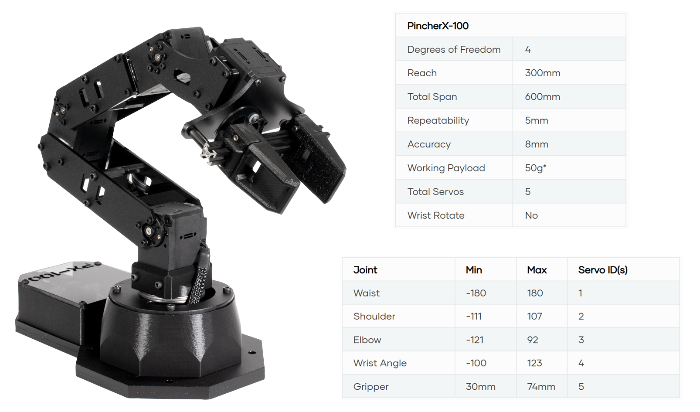
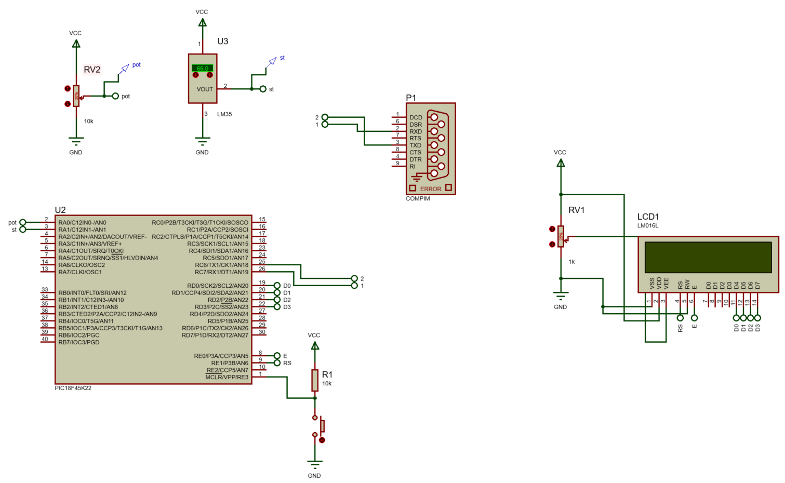

<h1>Aula 21</h1>

Esta clase consiste en realizar una introducción del LoCoBot PX100 y de Ubuntu 20.04, que es desde donde se ejecutan los comandos para el Locobot.

<h2>Instalación de Ubuntu 20.04</h2>

Descargar ubuntu 20.04 y Virtual Box y crear la máquina virtual con Ubuntu 20.04 de formato .iso en el Virtual Box

<h3>ROS en Ubuntu 20.04 :electron:</h3>

La instalación de ROS Noetic en Ubuntu 20.04 se encuentra <a href="https://wiki.ros.org/noetic/Installation/Ubuntu">aquí</a>

Abrir una terminal en Ubuntu y conceder permisos de super usuario (administrador)

```
su root
```

Posteriormente, en el terminal anterior (usuario de administrador) ejecutar los siguientes comandos uno a uno:

```
sudo sh -c 'echo "deb http://packages.ros.org/ros/ubuntu $(lsb_release -sc) main" > /etc/apt/sources.list.d/ros-latest.list'

sudo apt install curl

curl -s https://raw.githubusercontent.com/ros/rosdistro/master/ros.asc | sudo apt-key add -

sudo apt update

sudo apt install ros-noetic-desktop-full

source /opt/ros/noetic/setup.bash

echo "source /opt/ros/noetic/setup.bash" >> ~/.bashrc

source ~/.bashrc

sudo apt install python3-rosdep python3-rosinstall python3-rosinstall-generator python3-wstool build-essential

sudo apt install python3-rosdep

sudo rosdep init

rosdep update
```

<h2>LoCoBot PX100</h2>

Es un robot híbrido ya que integra una plataforma diferencial (Create® 3) y un brazo manipulador de 4 GDL (Pincher), además cuenta con una cámara de profundidad (Intel®) y controlado por Ubuntu en un NUC (Intel®). Toda la documentación del LoCoBot PX100 se encuentra <a href="https://docs.trossenrobotics.com/interbotix_xslocobots_docs/#:~:text=Interbotix%20X-Series%20LoCoBots.%20The%20Low%20Cost%20Robot%20(LoCoBot)%20is%20a">aquí</a>.

<div align="center">

<br>
<figcaption>Fuente: https://docs.trossenrobotics.com/interbotix_xslocobots_docs/specifications/locobot_px100.html</figcaption>
</div>

<div align="center">

<br>
<figcaption>Fuente: https://docs.trossenrobotics.com/interbotix_xslocobots_docs/specifications/locobot_px100.html</figcaption>
</div>

Es importante tener en cuenta que el 'codename' del LoCoBot PX100 que se utilizará para la programación de dicho robot es: 

```
locobot_px100
```

<h3>Componentes</h3>

Las especificaciones de cada componente que integra el LoCoBot PX100 están <a href="https://docs.trossenrobotics.com/interbotix_xslocobots_docs/specifications.html">aquí</a>

<h4>PincherX-100</h4>

El PincherX-100 es un brazo manipulador de 4 GDL de tipo antropomórfico o angular que cuenta con servomotores DYNAMIXEL XL430-W250 que ofrecen una alta resolución de 4096 posiciones y los parámetros PID definibles por el usuario, el monitoreo de temperatura, la retroalimentación de posición, así como los niveles de voltaje, entre otras características (límites de las articulaciones, configuraciones de los servos, planos, entre otras) más detalladas y los archivos STEP y STL del brazo manipulador se encuentran <a href="https://docs.trossenrobotics.com/interbotix_xsarms_docs/specifications/px100.html">aquí</a>

<div align="center">

<br>
<figcaption>Fuente: https://docs.trossenrobotics.com/interbotix_xsarms_docs/specifications/px100.html</figcaption>
</div>

<h4>Create® 3</h4>

La plataforma robótica móvil Create 3 integra diferentes sensores (proximidad, odometro) y actuadores (motores DC). El software de esta plataforma está basado en ROS para el uso de dichos sensores y actuadores; además, el robot también proporciona algunos comportamientos autónomos listos para usar, como el acoplamiento con la base de carga, el seguimiento de la pared y las reacciones a los obstáculos. Es posible configurar esta plataforma móvil a través de un red.

<div align="center">

<br>
<figcaption>Fuente: https://docs.trossenrobotics.com/interbotix_xslocobots_docs/specifications.html</figcaption>
</div>

Más información de esta plataforma Create 3 se puede encontrar <a href="https://iroboteducation.github.io/create3_docs/">aquí</a>

<h4>NUC (PC)</h4>

El NUC es un computador de Intel con procesador Dual-Core i3 de 8va generación, 8 GB de RAM DDR4, unidad de estado sólido (SSD) de 240 GB, Intel Iris Plus Graphics 655, Wifi, Bluetooth 5.0, Gigabit Ethernet, compatibilidad con 4k, lector de tarjetas, compatible con dos monitores, HDMI, USB, Thunderbolt 3, Ubuntu 20.04.

<div align="center">

<br>
<figcaption>Fuente: https://docs.trossenrobotics.com/interbotix_xslocobots_docs/specifications.html</figcaption>
</div>

<h4>Cámara de profundidad</h4>

La cámara de Intel RealSense Depth Camera D435 realiza detección de profundidad para aplicaciones de visión inteligente.

<div align="center">

<br>
<figcaption>Fuente: https://docs.trossenrobotics.com/interbotix_xslocobots_docs/specifications.html</figcaption>
</div>

<h4>Servo de la cámara</h4>

El DYNAMIXEL 2XL puede controlar dos ejes con un solo módulo, que sirve para variar el paneo e inclinación para la cámara del LoCoBot y así realizar la detección de objetos, ya sea que la plataforma esté en movimiento o estacionaria. Esta gama de servomotores 2XL adopta nuevas características que permiten un modo de control de 360 grados con su codificador magnético sin contacto y su estructura de ensamblaje de carcasa trasera hueca y engranaje metálico (pulvimetalurgia) que se utiliza para una alta durabilidad.

<div align="center">

<br>
<figcaption>Fuente: https://docs.trossenrobotics.com/interbotix_xslocobots_docs/specifications.html</figcaption>
</div>

<h4>Power bank</h4>

El banco de energía MAXOAK K2 está diseñado para alimentar computadoras portátiles durante períodos prolongados. Este banco de energía de 50 kAh (50000 Ah) puede mantener el NUC y todos los periféricos funcionando durante 4 horas con un uso moderado. Tiene múltiples salidas, incluidos conectores de barril de 20V 5A y 12V 2.5 A, dos puertos USB-A de 5V y 2.1 A y dos puertos USB-A de 5V 1A.

<div align="center">

<br>
<figcaption>Fuente: https://docs.trossenrobotics.com/interbotix_xslocobots_docs/specifications.html</figcaption>
</div>

Más información de esta power bank se puede encontrar <a href="https://maxoak.net/products/maxoak-k2-185wh-50000mah-power-bank">aquí</a>

<h4>Control PS4</h4>

El control PS4 es utilizado para manipular todas las funciones del LoCoBot PX100 de manera manual e inalámbrica.

<div align="center">

<br>
<figcaption>Fuente: https://docs.trossenrobotics.com/interbotix_xslocobots_docs/getting_started/pairing_controller.html</figcaption>
</div>

<h3>Uso básico del LoCoBot PX100</h3>

El uso básico del LoCoBot PX100 consiste en aprender a cargarlo, encenderlo, programarlo remotamente desde un computador personal y apagarlo. La información se puede encontrar <a href="https://docs.trossenrobotics.com/interbotix_xslocobots_docs/getting_started/user_guide.html">aquí</a>

<h4>Cargar el LoCoBot PX100</h4>


<h4>Encender el LoCoBot PX100</h4>


<h4>Configuración de conexión</h4>

Hay dos formas de programar el LoCoBot PX100 de manera remota o directamente desde el NUC. Por tanto, se debe tener en cuenta que hay dos nomenclaturas para esto:

1. 'Remote' que consiste en programar el LoCoBot PX100 a través de comunicación SSH desde un computador personal.
2. 'Robot' o 'LoCoBot' que consiste en programar el LoCoBot PX100 desde el computador NUC de dicho robot.

<h5>Conexión NUC</h5>


<h5>Conexión remota</h5>

Comunicación SSH

<h4>Apagar el LoCoBot PX100</h4>


<h3>ROS 1 en el LoCoBot PX100</h3>

https://docs.trossenrobotics.com/interbotix_xslocobots_docs/ros_interface/ros1.html

<h4>Configuración</h4>


<h4>Guía de inicio</h4>


<h2>Ejemplo ROS Ubuntu</h2>

Lista todos los puertos ejecutar el siguiente comando:

```
ls /dev
```

Muestra información sobre los dispositivos seriales (ttyS#) conectados ejecutar el siguiente comando:

```
dmesg | grep tty
```

<!--
Lista todas los puertos USB conectados ejecutar el siguiente comando:

```
ls /dev/ttyS*
```
-->

Muestra las configuraciones de los dispositivos seriales (ttyS#) ejecutar el siguiente comando:

```
stty -F /dev/ttyS1 -a
```

Configura los baudios a 9600, 8 bits, 1 bit de stop y no bit de paridad (8N1) ejecutar el siguiente comando:

```
stty -F /dev/ttyS1 9600 cs8 -cstopb -parenb
```

Lee datos del puerto serial en un primer terminal ejecutar el siguiente comando:

```
cat < /dev/ttyS1
```

Escribe datos en el puerto serial en un segundo terminal ejecutar el siguiente comando:

```
echo 'H' > /dev/ttyS1
```

En sistemas operativos basados en linux (Raspian, Ubuntu, etc.) existen algunos monitores seriales como minicom o screen.

Para instalar minicom ejecutar el siguiente comando:

```
sudo apt-get install minicom
```

Para abrir minicom ejecutar el siguiente comando:

```
minicom -s
```



```c
/*
 * File:   main.c
 * Author: LENOVO
 *
 * Created on 25 de Agosto de 2024, 14:56
 */

#include <xc.h>
#include <stdio.h>
#include <string.h>

#pragma config FOSC = INTIO67
#pragma config WDTEN = OFF
#pragma config LVP = OFF

#define _XTAL_FREQ 16000000
#define time 10
//LCD
#define CD 0x01 //Clear Display
#define RH 0x02 //(0x03) Return Home
#define EMS 0x06 //Entry Mode Set
#define DC 0x0F //(0x0E) Display Control
#define DSr 0x1C //Display Shift Rigth
#define DSl 0x18 //Display Shift Left
#define FS 0x28 //(0x3C) Function Set
#define RAW1 0x80 //DDRAM display
#define RAW2 0xC0 //DDRAM display
#define RS LATE1 //Register Selection
#define E LATE0 //Enable

void settings(void);
void start(void);
//LCD
void SettingsLCD(unsigned char word);
void WriteLCD(unsigned char word);
void LCD(unsigned char data);
//Interrupción
void __interrupt() RECEIVE(void);

int digital1, digital2;
float conversion1, conversion2, temperature;
unsigned char i, flag = 0, d;
char text[20];

void main(void) {
    settings();
    while (1) {
        if (flag == 1) {
            flag = 0;
            start();
        }
    }
}

void settings(void) {
    OSCCON = 0x72;
    ANSELA = 0x03;
    ANSELC = 0x00;
    ANSELD = 0x00;
    ANSELE = 0x00;
    TRISA = 0x03;
    TRISD = 0;
    TRISE = 0;
    LATD = 0;
    LATE = 0;
    //LCD
    SettingsLCD(0x02); //Iniciar la LCD con el método nibble (4 MSB y 4 LSB)
    SettingsLCD(EMS);
    SettingsLCD(DC);
    SettingsLCD(FS);
    SettingsLCD(CD);
    //ADC
    ADCON0 = 0x01;
    ADCON1 = 0x00;
    ADCON2 = 0x95;
    //Serial UART
    TRISCbits.TRISC6 = 0;
    TRISCbits.TRISC7 = 1;
    SPBRG = 0x19;
    RCSTA = 0x90;
    TXSTA = 0x20;
    //Interrupción
    GIE = 1;
    PEIE = 1;
    RCIE = 1;
    RCIF = 0;
}

void start(void) {
    ADCON0 = 0x01;
    __delay_ms(time);
    GO = 1;
    while (GO == 1);
    digital1 = ADRESH << 8 | ADRESL;
    conversion1 = (float) digital1 * (5.0 / 1023.0);
    ADCON0 = 0x05;
    __delay_ms(time);
    GO = 1;
    while (GO == 1);
    digital2 = ADRESH << 8 | ADRESL;
    conversion2 = (float) digital2 * (5.0 / 1023.0);
    temperature = conversion2 / 0.01;
    SettingsLCD(RAW2);
    sprintf(text, "%.4f,%.4f\n\r", conversion1, temperature);
    for (i = 0; i < strlen(text); i++) {
        while (TX1IF == 0);
        TXREG = text[i];
        WriteLCD(text[i]);
    }
    //while(TXIF == 0);
    //TXREG = 0x0A;//Salto de línea
    //while (TXIF == 0);
    //TXREG = 0x0D; //Retorno de carro
}

void SettingsLCD(unsigned char word) {
    RS = 0;
    LCD(word >> 4); // 4 MSB
    LCD(word & 0x0F); // 4 LSB
}

void WriteLCD(unsigned char word) {
    RS = 1;
    LCD(word >> 4);
    LCD(word & 0x0F);
}

void LCD(unsigned char data) { //Opción bits
    E = 1;
    __delay_us(time * 5);
    LATDbits.LATD0 = (data & 0x01);
    __delay_us(time * 5);
    LATDbits.LATD1 = (data & 0x02) >> 1;
    __delay_us(time * 5);
    LATDbits.LATD2 = (data & 0x04) >> 2;
    __delay_us(time * 5);
    LATDbits.LATD3 = (data & 0x08) >> 3;
    __delay_us(time * 5);
    E = 0;
    __delay_us(time * 5);
}

void __interrupt() RECEIVE(void) {
    if (RCIF == 1) {
        d = RCREG;
        if (d == 'H') {
            flag = 1;
        }
    }
}
```

Nodo publisher para adquisición de datos seriales enviados desde una terminal, de un potenciómetro y un LM35

```python
#!/usr/bin/env python3

import rospy #Crear nodos con ROS
from std_msgs.msg import Float64, String
import serial
import threading
import time

def callback(mensaje):
    print(f'Mensaje servo: {mensaje.data}')

def callback2(mensaje):
    global pub1, pub2, s

    print(f'Serial: {s}')
    print(f'Mensaje usuario: {mensaje.data}')
    value = mensaje.data
    if value == 'S' or value == 's':  
        s.write(b'H')      
        print(f'H enviada')
        #time.sleep(0.001)
        rec = s.readline() #byte
        print(rec)
        rec = rec.decode() #utf-8
        print(rec)
        print(type(rec))
        rec = rec.split(",") #list
        print(rec[0])
        print(rec[1])
        pub1.publish(float(rec[0]))
        pub2.publish(float(rec[1]))
        #rospy.loginfo(mensaje)
        #rate.sleep() #Delay de 0.1s

def Nodo_Proteus():
    global pub1, pub2, s

    rospy.init_node('Nodo_Proteus')  #Inicializa el nodo con el nombre Nodo_conteo

    pub1 = rospy.Publisher('potenciometro', Float64, queue_size=10) #Declara el nodo como publisher con los parámetros  del nombre del topic, el tipo de dato del mensaje y 
    pub2 = rospy.Publisher('LM35', Float64, queue_size=10)
    sub1 = rospy.Subscriber('servo', Float64, callback)
    sub2 = rospy.Subscriber('teclado', String, callback2)

    rate = rospy.Rate(10) #Inicializa la frecuencia en Hertz de ejecución del nodo

    s = serial.Serial('/dev/ttyS1', 9600, 8, 'N', 1) #9600 8N1

    rospy.spin()

if __name__ == '__main__':
    try:
        Nodo_Proteus()
    except rospy.ROSInterruptException:
        pass
```

Nodo subscriber para graficar de datos de un potenciómetro

```python
#!/usr/bin/env python3

import rospy #Crear nodos con ROS
from std_msgs.msg import Float64
import matplotlib.pyplot as plt
import threading
import time

n = []

def grafica():
    fig, ax = plt.subplots()
    ax.set_title('potenciometro')
    ax.set_xlabel('muestra')
    ax.set_ylabel('voltaje')
    while len(n)<20:
        #print(len(n))  
        ax.clear()
        ax.plot(n[:],'.b')
        plt.pause(0.01)
    plt.show()

def callback(mensaje):
    
    global pub

    print(mensaje.data)
    n.append(mensaje.data)
    angulo = mensaje.data*(180.0/5.0)
    pub.publish(angulo)
    

def Nodo_Grafica_Pot():

    global pub

    rospy.init_node('Nodo_Grafica_Pot')

    pub = rospy.Publisher('servo', Float64, queue_size=10)

    sub = rospy.Subscriber('potenciometro', Float64, callback)

    rospy.spin()


if __name__ == '__main__':

    hilo2 = threading.Thread(target=grafica)
    hilo2.start()
    Nodo_Grafica_Pot()    
```

Nodo de Usuario

```python
#!/usr/bin/env python3

import rospy #Crear nodos con ROS
from std_msgs.msg import String
import serial

def Nodo_Usuario():

    rospy.init_node('Nodo_Usuario')  #Inicializa el nodo con el nombre Nodo_conteo

    pub = rospy.Publisher('teclado', String, queue_size=10) #Declara el nodo como publisher con los parámetros  del nombre del topic, el tipo de dato del mensaje y 

    rate = rospy.Rate(10) #Inicializa la frecuencia en Hertz de ejecución del nodo

    while not rospy.is_shutdown(): #Mientras el nodo no esté apagado, es decir, mientras esté encendido
        value = input("Quiere adquirir un dato? S/N")

        pub.publish(str(value))


if __name__ == '__main__':
    try:
        Nodo_Usuario()
    except rospy.ROSInterruptException:
        pass
```


Nodo subscriber para graficar de datos de un LM35