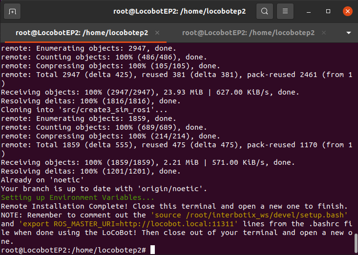

<h1>Aula 22</h1>

Esta clase consiste en utilizar el LoCoBot con el control del PS4 a través de los paquetes de ROS1 para este robot

<h2>Instalación remota paquetes en ROS1 del LoCoBot PX100</h2>

Para ejecutar los paquetes de ROS1 del LoCoBot se debe tener instalado Ubuntu 20.04; la configuración de dichos paquetes está <a href="https://docs.trossenrobotics.com/interbotix_xslocobots_docs/ros_interface/ros1.html">aquí</a>.

Es importante tener en cuenta que el 'codename' del LoCoBot PX100 que se utilizará para la programación de dicho robot es: 

```
locobot_px100
```

Si se desea simular el LoCoBot desde el computador personal sin tener el LoCoBot físico, se deben ejecutar los siguientes comandos; sin embargo, se debe tener en cuenta que ROS, RViz y rosdep ya deben estar instalados en la máquina local (Ubuntu 20.04 virtual) para que la instalación remota de los paquetes del LoCoBot se realice correctamente.

```
sudo apt install curl

curl 'https://raw.githubusercontent.com/Interbotix/interbotix_ros_rovers/main/interbotix_ros_xslocobots/install/xslocobot_remote_install.sh' > xslocobot_remote_install.sh

chmod +x xslocobot_remote_install.sh

./xslocobot_remote_install.sh -d noetic -b create3
```

* El script pedirá que ingrese el nombre de <i>host</i> de la computadora robot (NO del control remoto), por tanto, se debe ingresar: `locobot` y posteriormente, pedirá confirmación de los paquetes a instalar, por tanto, se debe ingresar: `yes`. Finalmente, se debe mostrar el siguiente mensaje para la confirmación de la instalación.

<div align="center">

<br>
<figcaption>Fuente: Autor</figcaption>
</div>

Posteriormente a la anterior instalación, se debe comentar la línea `ROS_MASTER_URI = http://<hostname>.local:11311` que se encuentra en el archivo "~/.bashrc"

<h2>Conexión con la Create 3</h2>

Si se desea validar la conexión entre el NUC y la plataforma Create 3 se debe realizar desde el NUC ping a la IP 192.168.186.2, a través del siguiente comando:

```
ping -c 2 192.168.186.2
```

<h2>Conexión con la cámara</h2>

Si se desea validar la conexión entre el NUC y la cámara se debe ejecutar el siguiente comando:

```
roslaunch realsense2_camera rs_camera.launch
```

<h3>Ejemplo de control PS4 con el LoCoBot</h3>

1. Conectarse al locobot a través del terminal por SSH

2. En otro terminal conectado al LoCoBot iniciar el nodo de Joystick, a través del siguiente comando:

```
roslaunch interbotix_xslocobot_joy xslocobot_joy.launch robot_model:=locobot_px100 use_base:=true use_camera:=true
```
