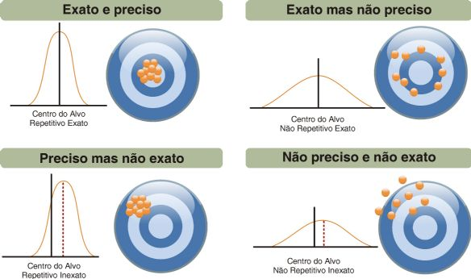

<h1>Aula 3</h1>

Esta clase consiste en calibrar los sensores (acelerómetro y giroscopio) de la MPU6050.

<h3>Precisión y Exactitud</h3>

La precisión hace referencia a una baja dispersión de los datos (desviación estándar) y la exactitud corresponde a que la distribución de dichos datos están sobre el punto exacto y real.

<div align="center">

<br>
<figcaption>Fuente: https://www.biovera.com.br/noticias/10-dicas-para-uma-melhor-pipetagem/</figcaption>
</div>

<h3>Error</h3>

El error en los instrumentos de medición es la diferencia entre el valor medido y el valor real. El error aleatorio son datos que a veces son incorrectos y no son predecibles, los cuales pueden ser ocasionados por el observador, por el instrumento de medición o por el fenómeno que se está midiendo. El error sistemático son datos incorrectos que se repiten durante el proceso de medición, debido a mala calibración, mal ajuste del factor de escala o mal funcionamiento del instrumento de medición.

<div align="center">

<br>
<figcaption>Fuente: https://www.lifeder.com/error-aleatorio/</figcaption>
</div>

<h3>Calibración</h3>

La calibración de un sensor o instrumento de medición consiste en ajustar los valores medidos a los valores precisos y exactos a partir de un instrumento padrón.

<h3>Adquisición de datos de la MPU6050 en la SMT32F767ZI</h3>

```c++
//Ejemplo I2C
//Fabián Barrera Prieto
//Universidad ECCI
//STM32F767ZIT6U
//operation 'or' (|) for set bit and operation 'and' (&) for clear bit

#include <stdio.h>
#include "stm32f7xx.h"
#include <string.h>

//MPU6050
#define MPU6500_address 0x68 // Endereço da MPU6500 (giroscópio e acelerômetro)

// Escalas do girôscopio
#define    GYRO_FULL_SCALE_250_DPS    0x00 // SCALE_250 (°/s) = 0 (0x00 = 000|00|000)
#define    GYRO_FULL_SCALE_500_DPS    0x08 // SCALE_500 (°/s) = 1 (0x08 = 000|01|000)
#define    GYRO_FULL_SCALE_1000_DPS   0x10 // SCALE_1000 (°/s) = 2 (0x10 = 000|10|000)
#define    GYRO_FULL_SCALE_2000_DPS   0x18 // SCALE_2000 (°/s) = 3 (0x18 = 000|11|000)

// Escalas do acelerômetro
#define    ACC_FULL_SCALE_2_G        0x00 // SCALE_2_G (g) = 0 (0x00 = 000|00|000)
#define    ACC_FULL_SCALE_4_G        0x08 // SCALE_4_G (g) = 1 (0x08 = 000|01|000)
#define    ACC_FULL_SCALE_8_G        0x10 // SCALE_8_G (g) = 2 (0x10 = 000|10|000)
#define    ACC_FULL_SCALE_16_G       0x18 // SCALE_16_G (g) = 3 (0x18 = 000|11|000)

// Escalas de conversao (As taxas de conversão são especificadas na documentação)
#define SENSITIVITY_ACCEL     2.0/32768.0             // Valor de conversão do Acelerômetro (g/LSB) para 2g e 16 bits de comprimento da palavra
#define SENSITIVITY_GYRO      250.0/32768.0           // Valor de conversão do Girôscopio ((°/s)/LSB) para 250 °/s e 16 bits de comprimento da palavra
#define SENSITIVITY_TEMP      333.87                  // Valor de sensitividade do Termometro (Datasheet: MPU-9250 Product Specification, pag. 12)
#define TEMP_OFFSET           21                      // Valor de offset do Termometro (Datasheet: MPU-6050 Product Specification, pag. 12)

// Offsets de calibração (AQUI DEVEM IR OS VALORES DETERMINADOS EN LA CALIBRACAO PREVIA COM O CÓDIGO "calibracao.ino")
//double offset_accelx = 334.0, offset_accely = -948.0, offset_accelz = 16252.0;
//double offset_gyrox = 111.0, offset_gyroy = 25.0, offset_gyroz = -49.0;

// Valores "RAW" de tipo inteiro
int16_t raw_accelx, raw_accely, raw_accelz;
int16_t raw_gyrox, raw_gyroy, raw_gyroz;
int16_t raw_temp;

// Saídas calibradas
float accelx, accely, accelz;
float gyrox, gyroy, gyroz;
float temp;

uint8_t data[1];
uint8_t GirAcel[14];

uint8_t flag = 0, j, cont = 0;
int i;
unsigned char d;
char text[100], text1[60]={"TESTE DE CONEXAO PARA O GIROSCOPIO E O ACELEROMETRO \n\r"}; 
char text2[35]={"Erro de conexao com a MPU6050 \n\r"};
char text3[55]={"Opaaa. Eu nao sou a MPU6050, Quem sou eu? :S. I am:"};
char text4[40]={"Conexao bem sucedida com a MPU6050 \n\r"};
char text5[45]={"Oi, tudo joia?... Eu sou a MPU6050 XD \n\r"};
unsigned char cmd[1];

float timer = 0.0, t_fin = 10.0, cont_timer = 0.0;
char text6[40];
char text7[3]={"A\n"};

//I2C
void ReadI2C1(uint8_t Address, uint8_t Register, uint8_t *Data, uint8_t bytes);
void WriteI2C1(uint8_t Address, uint8_t Register, uint8_t *Data, uint8_t bytes);

void Print(char *data, int n);

void SysTick_Wait(uint32_t n){
    SysTick->LOAD = n - 1; //15999
    SysTick->VAL = 0; //Clean the value of Systick counter
    while (((SysTick->CTRL & 0x00010000) >> 16) == 0); //Check the count flag until it's 1 
}

void SysTick_ms(uint32_t x){
    for (uint32_t i = 0; i < x; i++){//x ms
        SysTick_Wait(16000); //1ms
    }
}

extern "C"{
    void EXTI15_10_IRQHandler(void){
        EXTI->PR |= 1; //Down flag
        if(((GPIOC->IDR & (1<<13)) >> 13) == 1){
            flag = 1;
        }
    }

    void USART3_IRQHandler(void){ //Receive interrupt
        if(((USART3->ISR & 0x20) >> 5) == 1){//Received data is ready to be read (flag RXNE = 1)
            d = USART3->RDR;//Read the USART receive Data 
            if(d == 'H'){
                flag = 1;
            }
        }
    }
}

int main(){
    //----------------------------------------------------------------------------
    //                        					GPIOs
    //----------------------------------------------------------------------------
    RCC->AHB1ENR |= ((1<<1)|(1<<2)); 

    GPIOB->MODER &= ~((0b11<<0)|(0b11<<14));
    GPIOB->MODER |= ((1<<0)|(1<<14)); 
    GPIOC->MODER &= ~(0b11<<26);

    GPIOB->OTYPER &= ~((1<<0)|(1<<7));
    GPIOB->OSPEEDR |= (((1<<1)|(1<<0)|(1<<15)|(1<<14)));
    GPIOC->OSPEEDR |= ((1<<27)|(1<<26));
    GPIOB->PUPDR &= ~((0b11<<0)|(0b11<<14));
    GPIOC->PUPDR &= ~(0b11<<26);
    GPIOC->PUPDR |= (1<<27);

    //----------------------------------------------------------------------------
    //                        				Systick
    //----------------------------------------------------------------------------
    SysTick->LOAD = 0x00FFFFFF; 
    SysTick->CTRL |= (0b101);

    //----------------------------------------------------------------------------
    //                        				Interrupt
    //----------------------------------------------------------------------------
    RCC->APB2ENR |= (1<<14); 
    SYSCFG->EXTICR[3] &= ~(0b1111<<4); 
    SYSCFG->EXTICR[3] |= (1<<5); 
    EXTI->IMR |= (1<<13); 
    EXTI->RTSR |= (1<<13);
    NVIC_EnableIRQ(EXTI15_10_IRQn); 
        
    //----------------------------------------------------------------------------
    //                        					UART
    //----------------------------------------------------------------------------
    RCC->AHB1ENR |= (1<<3); 
    GPIOD->MODER |= (1<<19)|(1<<17); 
    GPIOD->AFR[1] |= (0b111<<4)|(0b111<<0); 
    RCC->APB1ENR |= (1<<18); 
    USART3->BRR = 0x683; 
    USART3->CR1 |= ((1<<5)|(0b11<<2)); 
    NVIC_EnableIRQ(USART3_IRQn);

    //----------------------------------------------------------------------------
    //                        					I2C
    //----------------------------------------------------------------------------
    RCC->AHB1ENR |= (1<<1); //Enable GPIOB clock (PB9=I2C1_SDA and PB8=I2C1_SCL)
    GPIOB->MODER |= (1<<19)|(1<<17); //Set (10) pins PB9 (bits 19:18) and PB8 (bits 17:16) as alternant function
    GPIOB->OTYPER |= (1<<9)|(1<<8); //Set (1) pin PB9 (bit 9) and pin PB8 (bit 8) as output open drain (HIGH or LOW)
    GPIOB->OSPEEDR |= (0b11<<18)|(0b11<<16); //Set (11) pin PB9 (bits 19:18) and pin PB8 (bits 17:16) as Very High Speed
    GPIOB->PUPDR|= (1<<18)|(1<<16); //Set (01) pin PB9 (bits 19:18) and pin PB8 (bits 17:16) as pull up
    GPIOB->AFR[1] |= (1<<6)|(1<<2); //Set the I2C1 (AF4) alternant function for pins PB9=I2C1_SDA (bits 7:4) and PB8=I2C1_SCL (bits 3:0)
    RCC->APB1ENR |= (1<<21); //Enable I2C1 clock
    RCC->DCKCFGR2 |= (1<<17); //Set (10) bits 17:16 as HSI clock is selected as source I2C1 clock
    I2C1->CR1 &= ~(1<<0);// Clear the enable I2C1
    I2C1->TIMINGR |= 0x30420F13;// Table 207 of reference manual
    I2C1->CR1 |= (1<<0);// Enable I2C1
		
		//----------------------------------------------------------------------------
    //                        					TIMER
    //----------------------------------------------------------------------------
		//TIMER
    RCC->APB1ENR |= (1<<1); //Enable the TIMER3 clock 
    TIM3->PSC = 24; // Prescale factor 25 for 100ms of time
    TIM3->ARR = 63999; // Maximum count value
		
		RCC->APB1ENR |= (1<<3); //Enable the TIMER5 clock 
    TIM5->PSC = 24; // Prescale factor 25 for 100ms of time
    TIM5->ARR = 63999; // Maximum count value
    

    USART3->CR1 |= (1<<0);
    
    SysTick_ms(1000);

    //----------------------------------------------------------------------------
    //                        				MPU6050
    //----------------------------------------------------------------------------
    cmd[0] = 0x00;	
    WriteI2C1(MPU6500_address, 0x6B, cmd, 1); // Desativa modo de hibernação do MPU6050
    Print(text1, strlen(text1));
    //.....................................................................
    //        Quem sou eu para a MPU6050 (giroscópio e acelerômetro)
    //.....................................................................
    ReadI2C1(MPU6500_address, 0x75, data, 14);
    if (data[0] != 0x68) { // DEFAULT_REGISTER_WHO_AM_I_MPU6050 0x68
    Print(text2, strlen(text2));
    sprintf(text3,"%s %#x \n\r",data[0]);
    Print(text3, strlen(text3));
    while (1);
    }else{
        Print(text4, strlen(text4));
        Print(text5, strlen(text5));
    }
    SysTick_ms(100);
    //.....................................................................
    //        Configuracao dos sensores giroscópio e acelerômetro
    //.....................................................................
    cmd[0] = 0x00;
    WriteI2C1(MPU6500_address, 0x1B, cmd, 1);	
    WriteI2C1(MPU6500_address, 0x1C, cmd, 1);	
    SysTick_ms(10);
    
    while(1){
        if(flag == 1){
            flag = 0;
            for(i=0; i<=299; i++){
								TIM3->CNT = 0;
								TIM3->CR1 |= (1<<0); // Enable Counting										
                ReadI2C1(MPU6500_address, 0x3B, GirAcel, 14);
                raw_accelx = GirAcel[0]<<8 | GirAcel[1];    
                raw_accely = GirAcel[2]<<8 | GirAcel[3];
                raw_accelz = GirAcel[4]<<8 | GirAcel[5];
                raw_temp = GirAcel[6]<<8 | GirAcel[7];
                raw_gyrox = GirAcel[8]<<8 | GirAcel[9];
                raw_gyroy = GirAcel[10]<<8 | GirAcel[11];
                raw_gyroz = GirAcel[12]<<8 | GirAcel[13];
                //SysTick_ms(1);	
                TIM5->CNT = 0;
                TIM5->CR1 |= (1<<0); // Enable Counting
                //while(TIM5->CNT < 16000); //1ms	
                while(TIM5->CNT < 8000); //0.5ms
                //while(TIM5->CNT < 128000); //8.51ms=8150us
                TIM5->CR1 &= ~(1<<0); // Disable Counting	
                //Dados escalados
                //accelx = raw_accelx*SENSITIVITY_ACCEL;
                //accely = raw_accely*SENSITIVITY_ACCEL;
                //accelz = raw_accelz*SENSITIVITY_ACCEL;
                //gyrox = raw_gyrox*SENSITIVITY_GYRO;
                //gyroy = raw_gyroy*SENSITIVITY_GYRO;
                //gyroz = raw_gyroz*SENSITIVITY_GYRO;
                //temp = (raw_temp/SENSITIVITY_TEMP)+21;
                TIM3->CR1 &= ~(1<<0); // Disable Counting			
                timer = TIM3->CNT*0.0000000625;
                cont_timer += timer;
                //sprintf(text6,"El tiempo es %f segundos \n", timer);
//Print(text6, strlen(text6));
                sprintf(text,"%d \t %.4f \t %.4f \t %d \t %d \t %d \t %d \t %d \t %d \t %d \n",i+1, timer, cont_timer, raw_accelx, raw_accely, raw_accelz, raw_gyrox, raw_gyroy, raw_gyroz, raw_temp);
                //sprintf(text,"%d \t %.2f \t %.2f \t %.2f \t %.2f \t %.2f \t %.2f \t %.2f \n\r",i+1,accelx, accely, accelz, gyrox, gyroy, gyroz, temp);
                Print(text, strlen(text));
                    if(cont_timer >= t_fin){
                    cont_timer = 0;
                    Print(text7, strlen(text7));
                    break;
                }
								
            }
        }
    }
}

void WriteI2C1(uint8_t Address, uint8_t Register, uint8_t *Data, uint8_t bytes){
    uint8_t n; // Count for data read
    
    I2C1->CR2 &= ~(0x3FF<<0);// Clear the slave address
    I2C1->CR2 |= (Address<<1);// Set the 7-bit slave address to be sent

    // i2c modo escritura
    I2C1->CR2 &= ~(1<<10);// Master requests a write transfer
    I2C1->CR2 &= ~(0xFF<<16);// Clear the number of bytes to be transmitted
    I2C1->CR2 |= ((bytes+1)<<16);// Set the number of bytes to be transmitted
    I2C1->CR2 |= (1<<25);// Set automatic end mode

    I2C1->CR2 |= (1<<13);// Generate START

    while (((I2C1->ISR) & (1<<1)) != (0b10)){}// Wait the (TXIS) Transmit interrupt status

    I2C1->TXDR = Register;// Transmit the register

    n = bytes;
    while(n>0){
        while (((I2C1->ISR) & (1<<1)) != (0b10)){}// Wait the (TXIS) Transmit interrupt status
        I2C1->TXDR = *Data;// Data to be sent
        Data++;
        n--;
    }
    while (((I2C1->ISR) & (1<<5)) != (0b100000)){}// Wait the STOPF detection flag
}

void ReadI2C1(uint8_t Address, uint8_t Register, uint8_t *Data, uint8_t bytes ) {
    
    uint8_t n; // Contador para la lectura de los bytes

    // Dirección del dispositivo
    I2C1->CR2 &= ~(0x3FF<<0);// Clear the slave address
    I2C1->CR2 |= (Address<<1);// Set the 7-bit slave address to be sent

// i2c modo escritura
    I2C1->CR2 &= ~(1<<10);// Master requests a write transfer
    I2C1->CR2 &= ~(0xFF<<16);// Clear the number of bytes to be transmitted
    I2C1->CR2 |= (1<<16);// Set the number of bytes to be transmitted
    I2C1->CR2 &= ~(1<<25);// Set software end mode

    I2C1->CR2 |= (1<<13);// Generate START
    
    while (((I2C1->ISR) & (1<<1)) != (0b10)){}// Wait the (TXIS) Transmit interrupt status

    I2C1->TXDR = Register;// Transmit the register

    while (((I2C1->ISR) & (1<<6)) != (0b1000000)){}// Wait a (TC) Transfer complete

    // i2c en modo lectura
    I2C1->CR2 |= (1<<10);// Master requests a read transfer
    I2C1->CR2 &= ~(0xFF<<16);// Clear the number of bytes to be transmitted
    I2C1->CR2 |= (bytes<<16);// Set the number of bytes to be received
    I2C1->CR2 &= ~(1<<25);// Set software end mode

    I2C1->CR2 |= (1<<13);// Generate RE-START

    n = bytes;
    while (n>0){
        while (((I2C1->ISR) & (1<<2)) != (0b100)){}// Wait (RXNE) that the received data is copied into the I2C_RXDR register
        *Data = I2C1->RXDR;// Receive the register
        Data++;
        n--;
    }

    I2C1->CR2 |= (1<<14);// I2C stop

    while (((I2C1->ISR) & (1<<5)) != (0b100000)){}// Wait the STOPF detection flag
}

void Print(char *data, int n){
    for(j=0; j<n; j++){
        USART3->TDR = *data; 
        data++;
        while(((USART3->ISR & 0x80) >> 7) == 0){} 
    }
    //USART3->TDR = 0x0A; 
    //while((USART3->ISR & 0x80)==0){};
    USART3->TDR = 0x0D; 
    while(((USART3->ISR & 0x80) >> 7) == 0){}
}
```

<h3>Adquisición de datos de la MPU6050 en la STM32F303K8</h3>

```c++
//----------------------------------------------------------------------------
//                                BIBLIOTECAS
//----------------------------------------------------------------------------
#include "mbed.h"

// Enderecos dos escravos
#define    MPU6500_address            0xD0 // 7 bit I2C Endereço da MPU6500 (giroscópio e acelerômetro)

// Escalas do girôscopio
#define    GYRO_FULL_SCALE_250_DPS    0x00 // SCALE_250 (°/s) = 0 (0x00 = 000|00|000)
#define    GYRO_FULL_SCALE_500_DPS    0x08 // SCALE_500 (°/s) = 1 (0x08 = 000|01|000)
#define    GYRO_FULL_SCALE_1000_DPS   0x10 // SCALE_1000 (°/s) = 2 (0x10 = 000|10|000)
#define    GYRO_FULL_SCALE_2000_DPS   0x18 // SCALE_2000 (°/s) = 3 (0x18 = 000|11|000)

// Escalas do acelerômetro
#define    ACC_FULL_SCALE_2_G        0x00 // SCALE_2_G (g) = 0 (0x00 = 000|00|000)
#define    ACC_FULL_SCALE_4_G        0x08 // SCALE_4_G (g) = 1 (0x08 = 000|01|000)
#define    ACC_FULL_SCALE_8_G        0x10 // SCALE_8_G (g) = 2 (0x10 = 000|10|000)
#define    ACC_FULL_SCALE_16_G       0x18 // SCALE_16_G (g) = 3 (0x18 = 000|11|000)

// Escalas de conversao (As taxas de conversão são especificadas na documentação)
#define SENSITIVITY_ACCEL     2.0/32768.0             // Valor de conversão do Acelerômetro (g/LSB) para 2g e 16 bits de comprimento da palavra
#define SENSITIVITY_GYRO      250.0/32768.0           // Valor de conversão do Girôscopio ((°/s)/LSB) para 250 °/s e 16 bits de comprimento da palavra
#define SENSITIVITY_TEMP      333.87                  // Valor de sensitividade do Termometro (Datasheet: MPU-9250 Product Specification, pag. 12)
#define TEMP_OFFSET           21                      // Valor de offset do Termometro (Datasheet: MPU-9250 Product Specification, pag. 12)
#define SENSITIVITY_MAGN      (10.0*4800.0)/32768.0   // Valor de conversão do Magnetômetro (mG/LSB) para 4800uT, 16 bits de comprimento da palavra e conversao a Gauss (10mG = 1uT)

//----------------------------------------------------------------------------
//                           DECLARACAO DE VARIAVEIS
//----------------------------------------------------------------------------
// Offsets de calibração (AQUI DEVEM IR OS VALORES DETERMINADOS EN LA CALIBRACAO PREVIA COM O CÓDIGO "calibracao.ino")
//double offset_accelx = 334.0, offset_accely = -948.0, offset_accelz = 16252.0;
//double offset_gyrox = 111.0, offset_gyroy = 25.0, offset_gyroz = -49.0;

// Valores "RAW" de tipo inteiro
int16_t raw_accelx, raw_accely, raw_accelz;
int16_t raw_gyrox, raw_gyroy, raw_gyroz;
int16_t raw_temp; 

// Saídas escaladas
float accelx, accely, accelz;
float gyrox, gyroy, gyroz;
float temp;

// Bytes
char cmd[2];
char data[1];
char GirAcel[14];

float buffer[500][8];
int i;
Timer t; //Cria-se o objeto do temporizador
float timer=0.0, t_fin=10.0, cont_timer=0.0;
//.....................................................................
//                        Inicializacao I2C
//..................................................................... 
Serial pc(SERIAL_TX, SERIAL_RX);
I2C i2c(PB_7, PB_6 );//SDA,SCL

//DigitalOut myled(LED1);

int main(){
    // Desativa modo de hibernação do MPU6050
    cmd[0] = 0x6B;
    cmd[1] = 0x00;
    i2c.write(MPU6500_address, cmd, 2);
    
    pc.printf("TESTE DE CONEXAO PARA O GIROSCOPIO E O ACELEROMETRO \n\r");
    //.....................................................................
    //        Quem sou eu para a MPU6050 (giroscópio e acelerômetro)
    //.....................................................................
    pc.printf("1. Teste de conexao da MPU6050... \n\r"); // Verifica a conexao
    cmd[0] = 0x75;
    i2c.write(MPU6500_address, cmd, 1);
    i2c.read(MPU6500_address, data, 1);
    if (data[0] != 0x68) { // DEFAULT_REGISTER_WHO_AM_I_MPU6050 0x68
      pc.printf("Erro de conexao com a MPU6050 \n\r");
      pc.printf("Opaaa. Eu nao sou a MPU6050, Quem sou eu? :S. I am: %#x \n\r",data[0]);
      pc.printf("\n\r");
      while (1);
    }else{
      pc.printf("Conexao bem sucedida com a MPU6050 \n\r");
      pc.printf("Oi, tudo joia?... Eu sou a MPU6050 XD \n\r");
      pc.printf("\n\r");
    }
    wait(0.1);  
    // Configura o Girôscopio (Full Scale Gyro Range  = 250 deg/s)
    cmd[0] = 0x1B; //GYRO_CONFIG 0x1B //Registrador de configuracao do Girôscopio
    cmd[1] = 0x00;
    i2c.write(MPU6500_address, cmd, 2);                //gyro full scale 250 DPS
    // Configura o Acelerômetro (Full Scale Accelerometer Range  = 2g)
    cmd[0] = 0x1C; // ACCEL_CONFIG 0x1C //Registrador de configuracao do Acelerômetro
    cmd[1] = 0x00;
    i2c.write(MPU6500_address, cmd, 2);                //ACC fullsclae 2G
    wait(0.01);
    while(1) {
        //.................Construcción de la medición de los valores .................. 
        if(pc.getc() == 'H'){
            i = 1;
            while(1){
                t.reset();
                t.start();
                cmd[0]=0x3B;
                i2c.write(MPU6500_address, cmd, 1);            //Escritura del registro de inicio
                i2c.read(MPU6500_address, GirAcel, 14);    //Lectura en rafaga de los valores de la MPU
                //Dados crus
                raw_accelx = GirAcel[0]<<8 | GirAcel[1];    
                raw_accely = GirAcel[2]<<8 | GirAcel[3];
                raw_accelz = GirAcel[4]<<8 | GirAcel[5];
                raw_temp = GirAcel[6]<<8 | GirAcel[7];
                raw_gyrox = GirAcel[8]<<8 | GirAcel[9];
                raw_gyroy = GirAcel[10]<<8 | GirAcel[11];
                raw_gyroz = GirAcel[12]<<8 | GirAcel[13];
                //Dados escalados
                // accelx = raw_accelx*SENSITIVITY_ACCEL;
                // accely = raw_accely*SENSITIVITY_ACCEL;
                // accelz = raw_accelz*SENSITIVITY_ACCEL;
                // gyrox = raw_gyrox*SENSITIVITY_GYRO;
                // gyroy = raw_gyroy*SENSITIVITY_GYRO;
                // gyroz = raw_gyroz*SENSITIVITY_GYRO;
                // temp = (raw_temp/SENSITIVITY_TEMP)+21;
                wait_us(8380);
                t.stop();
                timer = t.read();
                cont_timer += timer;
                //pc.printf("El tiempo es %f segundos \r", timer);
                pc.printf("%d \t %.4f \t %.2f \t %d \t %d \t %d \t %d \t %d \t %d \t %d \n\r",i++, timer, cont_timer, raw_accelx, raw_accely, raw_accelz, raw_gyrox, raw_gyroy, raw_gyroz, raw_temp);
                //pc.printf("%d \t %.2f \t %.2f \t %.2f \t %.2f \t %.2f \t %.2f \t %.2f \n\r",i+1,accelx, accely, accelz, gyrox, gyroy, gyroz, temp);
                if(cont_timer >= t_fin){
                    cont_timer = 0;
                    pc.printf("A\n");
                    break;
                }
            }
        }
    }
}
```

<h3>Calibración de datos de la MPU6050 en la STM32F767ZI</h3>

```c++
//Ejemplo I2C
//Fabián Barrera Prieto
//Universidad ECCI
//STM32F767ZIT6U
//operation 'or' (|) for set bit and operation 'and' (&) for clear bit

#include <stdio.h>
#include "stm32f7xx.h"
#include <string.h>

//MPU6050
#define MPU6500_address 0x68 // Endereço da MPU6500 (giroscópio e acelerômetro)

// Escalas do girôscopio
#define    GYRO_FULL_SCALE_250_DPS    0x00 // SCALE_250 (°/s) = 0 (0x00 = 000|00|000)
#define    GYRO_FULL_SCALE_500_DPS    0x08 // SCALE_500 (°/s) = 1 (0x08 = 000|01|000)
#define    GYRO_FULL_SCALE_1000_DPS   0x10 // SCALE_1000 (°/s) = 2 (0x10 = 000|10|000)
#define    GYRO_FULL_SCALE_2000_DPS   0x18 // SCALE_2000 (°/s) = 3 (0x18 = 000|11|000)

// Escalas do acelerômetro
#define    ACC_FULL_SCALE_2_G        0x00 // SCALE_2_G (g) = 0 (0x00 = 000|00|000)
#define    ACC_FULL_SCALE_4_G        0x08 // SCALE_4_G (g) = 1 (0x08 = 000|01|000)
#define    ACC_FULL_SCALE_8_G        0x10 // SCALE_8_G (g) = 2 (0x10 = 000|10|000)
#define    ACC_FULL_SCALE_16_G       0x18 // SCALE_16_G (g) = 3 (0x18 = 000|11|000)

// Escalas de conversao (As taxas de conversão são especificadas na documentação)
#define SENSITIVITY_ACCEL     2.0/32768.0             // Valor de conversão do Acelerômetro (g/LSB) para 2g e 16 bits de comprimento da palavra
#define SENSITIVITY_GYRO      250.0/32768.0           // Valor de conversão do Girôscopio ((°/s)/LSB) para 250 °/s e 16 bits de comprimento da palavra
#define SENSITIVITY_TEMP      333.87                  // Valor de sensitividade do Termometro (Datasheet: MPU-9250 Product Specification, pag. 12)
#define TEMP_OFFSET           21                      // Valor de offset do Termometro (Datasheet: MPU-6050 Product Specification, pag. 12)
#define SENSITIVITY_MAGN      (10.0*4800.0)/32768.0   // Valor de conversão do Magnetômetro (mG/LSB) para 4800uT, 16 bits de comprimento da palavra e conversao a Gauss (10mG = 1uT)

// Valores "RAW" de tipo inteiro
int16_t raw_accelx, raw_accely, raw_accelz;
int16_t raw_gyrox, raw_gyroy, raw_gyroz;
int16_t raw_temp;

// Valores de "offsets" de tipo float 
float offset_accelx = 0.0, offset_accely = 0.0, offset_accelz = 0.0;
float offset_gyrox = 0.0, offset_gyroy = 0.0, offset_gyroz = 0.0;

// Máximos e mínimos para os offsets
float max_accelx = -32768.0, min_accelx = 32767.0, max_accely = -32768.0, min_accely = 32767.0, max_accelz = -32768.0, min_accelz = 32767.0;
float max_gyrox = -32768.0, min_gyrox = 32767.0, max_gyroy = -32768.0, min_gyroy = 32767.0, max_gyroz = -32768.0, min_gyroz = 32767.0;


// Saídas calibradas
float accelx, accely, accelz;
float gyrox, gyroy, gyroz;
float temp;

uint8_t data[1];
uint8_t GirAcel[14];

uint8_t flag = 0, j, cont = 0;
int i, offset_samples = 100;
unsigned char d;
char text[50], text1[60]={"TESTE DE CONEXAO PARA O GIROSCOPIO E O ACELEROMETRO \n\r"}; 
char text2[35]={"Erro de conexao com a MPU6050 \n\r"};
char text3[55]={"Opaaa. Eu nao sou a MPU6050, Quem sou eu? :S. I am:"};
char text4[40]={"Conexao bem sucedida com a MPU6050 \n\r"};
char text5[45]={"Oi, tudo joia?... Eu sou a MPU6050 XD \n\r"};
char text7[]={"CALIBRACAO DO GIROSCOPIO E DO ACELEROMETRO \n\r"};
char text8[]={"Nao mexa neles ate que voce leia a mensagem 'calibracao finalizada' \n\r"};
char text9[]={"Coloque a IMU em posicao horizontal com as letras viradas para cima \n\r"};
char text10[]={"Lendo os sensores pela primeira vez... \n\r"};
char text11[]={"Lendo os sensores e calculando os offsets... \n\r"};
char text12[]={"Calibracao finalizada do acelerometro e do giroscopio \n\r"};
char text13[150];
char text14[]={"CALIBRACAO ENCERRADA \n\r"};
unsigned char cmd[1];

float timer = 0.0;
char text6[40];

//I2C
void ReadI2C1(uint8_t Address, uint8_t Register, uint8_t *Data, uint8_t bytes);
void WriteI2C1(uint8_t Address, uint8_t Register, uint8_t *Data, uint8_t bytes);

void Print(char *data, int n);

void SysTick_Wait(uint32_t n){
    SysTick->LOAD = n - 1; //15999
    SysTick->VAL = 0; //Clean the value of Systick counter
    while (((SysTick->CTRL & 0x00010000) >> 16) == 0); //Check the count flag until it's 1 
}

void SysTick_ms(uint32_t x){
    for (uint32_t i = 0; i < x; i++){//x ms
        SysTick_Wait(16000); //1ms
    }
}

extern "C"{
    void EXTI15_10_IRQHandler(void){
        EXTI->PR |= 1; //Down flag
        if(((GPIOC->IDR & (1<<13)) >> 13) == 1){
            flag = 1;
        }
    }

    void USART3_IRQHandler(void){ //Receive interrupt
        if(((USART3->ISR & 0x20) >> 5) == 1){//Received data is ready to be read (flag RXNE = 1)
            d = USART3->RDR;//Read the USART receive Data 
            if(d == 'H'){
                flag = 1;
            }
        }
    }
}

int main(){
    //----------------------------------------------------------------------------
    //                        					GPIOs
    //----------------------------------------------------------------------------
    RCC->AHB1ENR |= ((1<<1)|(1<<2)); 

    GPIOB->MODER &= ~((0b11<<0)|(0b11<<14));
    GPIOB->MODER |= ((1<<0)|(1<<14)); 
    GPIOC->MODER &= ~(0b11<<26);

    GPIOB->OTYPER &= ~((1<<0)|(1<<7));
    GPIOB->OSPEEDR |= (((1<<1)|(1<<0)|(1<<15)|(1<<14)));
    GPIOC->OSPEEDR |= ((1<<27)|(1<<26));
    GPIOB->PUPDR &= ~((0b11<<0)|(0b11<<14));
    GPIOC->PUPDR &= ~(0b11<<26);
    GPIOC->PUPDR |= (1<<27);

    //----------------------------------------------------------------------------
    //                        				Systick
    //----------------------------------------------------------------------------
    SysTick->LOAD = 0x00FFFFFF; 
    SysTick->CTRL |= (0b101);

    //----------------------------------------------------------------------------
    //                        				Interrupt
    //----------------------------------------------------------------------------
    RCC->APB2ENR |= (1<<14); 
    SYSCFG->EXTICR[3] &= ~(0b1111<<4); 
    SYSCFG->EXTICR[3] |= (1<<5); 
    EXTI->IMR |= (1<<13); 
    EXTI->RTSR |= (1<<13);
    NVIC_EnableIRQ(EXTI15_10_IRQn); 
        
    //----------------------------------------------------------------------------
    //                        					UART
    //----------------------------------------------------------------------------
    RCC->AHB1ENR |= (1<<3); 
    GPIOD->MODER |= (1<<19)|(1<<17); 
    GPIOD->AFR[1] |= (0b111<<4)|(0b111<<0); 
    RCC->APB1ENR |= (1<<18); 
    USART3->BRR = 0x683; 
    USART3->CR1 |= ((1<<5)|(0b11<<2)); 
    NVIC_EnableIRQ(USART3_IRQn);

    //----------------------------------------------------------------------------
    //                        					I2C
    //----------------------------------------------------------------------------
    RCC->AHB1ENR |= (1<<1); //Enable GPIOB clock (PB9=I2C1_SDA and PB8=I2C1_SCL)
    GPIOB->MODER |= (1<<19)|(1<<17); //Set (10) pins PB9 (bits 19:18) and PB8 (bits 17:16) as alternant function
    GPIOB->OTYPER |= (1<<9)|(1<<8); //Set (1) pin PB9 (bit 9) and pin PB8 (bit 8) as output open drain (HIGH or LOW)
    GPIOB->OSPEEDR |= (0b11<<18)|(0b11<<16); //Set (11) pin PB9 (bits 19:18) and pin PB8 (bits 17:16) as Very High Speed
    GPIOB->PUPDR|= (1<<18)|(1<<16); //Set (01) pin PB9 (bits 19:18) and pin PB8 (bits 17:16) as pull up
    GPIOB->AFR[1] |= (1<<6)|(1<<2); //Set the I2C1 (AF4) alternant function for pins PB9=I2C1_SDA (bits 7:4) and PB8=I2C1_SCL (bits 3:0)
    RCC->APB1ENR |= (1<<21); //Enable I2C1 clock
    RCC->DCKCFGR2 |= (1<<17); //Set (10) bits 17:16 as HSI clock is selected as source I2C1 clock
    I2C1->CR1 &= ~(1<<0);// Clear the enable I2C1
    I2C1->TIMINGR |= 0x30420F13;// Table 207 of reference manual
    I2C1->CR1 |= (1<<0);// Enable I2C1
		
		//----------------------------------------------------------------------------
    //                        					TIMER
    //----------------------------------------------------------------------------
		//TIMER
    RCC->APB1ENR |= (1<<1); //Enable the TIMER3 clock 
    TIM3->PSC = 24; // Prescale factor 25 for 100ms of time
    TIM3->ARR = 63999; // Maximum count value
		
    RCC->APB1ENR |= (1<<3); //Enable the TIMER5 clock 
    TIM5->PSC = 24; // Prescale factor 25 for 100ms of time
    TIM5->ARR = 63999; // Maximum count value
    

    USART3->CR1 |= (1<<0);
    
    SysTick_ms(1000);

    //----------------------------------------------------------------------------
    //                        				MPU6050
    //----------------------------------------------------------------------------
    cmd[0] = 0x00;	
    WriteI2C1(MPU6500_address, 0x6B, cmd, 1); // Desativa modo de hibernação do MPU6050
    Print(text1, strlen(text1));
    //.....................................................................
    //        Quem sou eu para a MPU6050 (giroscópio e acelerômetro)
    //.....................................................................
    ReadI2C1(MPU6500_address, 0x75, data, 14);
    if (data[0] != 0x68) { // DEFAULT_REGISTER_WHO_AM_I_MPU6050 0x68
    Print(text2, strlen(text2));
    sprintf(text3,"%s %#x \n\r",data[0]);
    Print(text3, strlen(text3));
    while (1);
    }else{
        Print(text4, strlen(text4));
        Print(text5, strlen(text5));
    }
    SysTick_ms(100);
    //.....................................................................
    //        Configuracao dos sensores giroscópio e acelerômetro
    //.....................................................................
    cmd[0] = 0x00;
    WriteI2C1(MPU6500_address, 0x1B, cmd, 1);	
    WriteI2C1(MPU6500_address, 0x1C, cmd, 1);	
    SysTick_ms(10);
    
    while(1){
			Print(text7, strlen(text7));
			Print(text8, strlen(text8));
			SysTick_ms(2000);
			Print(text9, strlen(text9));
			SysTick_ms(2000);
			Print(text10, strlen(text10));		
			for(i=0; i<=offset_samples; i++){									
				ReadI2C1(MPU6500_address, 0x3B, GirAcel, 14);
				raw_accelx = GirAcel[0]<<8 | GirAcel[1];    
				raw_accely = GirAcel[2]<<8 | GirAcel[3];
				raw_accelz = GirAcel[4]<<8 | GirAcel[5];
				raw_temp = GirAcel[6]<<8 | GirAcel[7];
				raw_gyrox = GirAcel[8]<<8 | GirAcel[9];
				raw_gyroy = GirAcel[10]<<8 | GirAcel[11];
				raw_gyroz = GirAcel[12]<<8 | GirAcel[13];
				SysTick_ms(10);
			}
      Print(text11, strlen(text11));	
			for(i=0; i<=299; i++){										
				ReadI2C1(MPU6500_address, 0x3B, GirAcel, 14);
				raw_accelx = GirAcel[0]<<8 | GirAcel[1];    
				raw_accely = GirAcel[2]<<8 | GirAcel[3];
				raw_accelz = GirAcel[4]<<8 | GirAcel[5];
				raw_temp = GirAcel[6]<<8 | GirAcel[7];
				raw_gyrox = GirAcel[8]<<8 | GirAcel[9];
				raw_gyroy = GirAcel[10]<<8 | GirAcel[11];
				raw_gyroz = GirAcel[12]<<8 | GirAcel[13];
				// Máximos e mínimos para o acelerômetro em cada um dos seus eixos (X,Y e Z)
				//Eixo X
				if (raw_accelx >= max_accelx){
						max_accelx = raw_accelx;
				}
				if (raw_accelx <= min_accelx){
						min_accelx = raw_accelx;
				}
				//Eixo Y
				if (raw_accely >= max_accely){
						max_accely = raw_accely;
				}
				if (raw_accely <= min_accely){
						min_accely = raw_accely;
				}
				//Eixo Z
				if (raw_accelz >= max_accelz){
						max_accelz = raw_accelz;
				}
				if (raw_accelz <= min_accelz){
						min_accelz = raw_accelz;
				}
								
				//Maximos e minimos para o Giroscopio em cada um dos seus eixos (X,Y e Z)
				//Eixo X
				if (raw_gyrox >= max_gyrox){
						max_gyrox = raw_gyrox;
				}
				if (raw_gyrox <= min_gyrox){
						min_gyrox = raw_gyrox;
				}
				//Eixo Y
				if (raw_gyroy >= max_gyroy){
						max_gyroy = raw_gyroy;
				}
				if (raw_gyroy <= min_gyroy){
						min_gyroy = raw_gyroy;
				}
				//Eixo Z
				if (raw_gyroz >= max_gyroz){
						max_gyroz = raw_gyroz;
				}
				if (raw_gyroz <= min_gyroz){
						min_gyroz = raw_gyroz;
				}
				SysTick_ms(10);
			}
			//Calculando offset (bias) de calibração
			//Acelerômetro
			offset_accelx = (max_accelx + min_accelx) / 2;
			offset_accely = (max_accely + min_accely) / 2;
			offset_accelz = (max_accelz + min_accelz) / 2;
			//Giroscópio
			offset_gyrox = (max_gyrox + min_gyrox) / 2;
			offset_gyroy = (max_gyroy + min_gyroy) / 2;
			offset_gyroz = (max_gyroz + min_gyroz) / 2;
			Print(text12, strlen(text12));	
			sprintf(text13,"offset_accelx = %.2f, offset_accely = %.2f, offset_accelz = %.2f, offset_gyrox = %.2f, offset_gyroy = %.2f, offset_gyroz = %.2f \n\r",offset_accelx, offset_accely, offset_accelz, offset_gyrox, offset_gyroy, offset_gyroz);
			Print(text13, strlen(text13));	
			Print(text14, strlen(text14));	
			while(1);					
		}
}

void WriteI2C1(uint8_t Address, uint8_t Register, uint8_t *Data, uint8_t bytes){
    uint8_t n; // Count for data read
    
    I2C1->CR2 &= ~(0x3FF<<0);// Clear the slave address
    I2C1->CR2 |= (Address<<1);// Set the 7-bit slave address to be sent

    // i2c modo escritura
    I2C1->CR2 &= ~(1<<10);// Master requests a write transfer
    I2C1->CR2 &= ~(0xFF<<16);// Clear the number of bytes to be transmitted
    I2C1->CR2 |= ((bytes+1)<<16);// Set the number of bytes to be transmitted
    I2C1->CR2 |= (1<<25);// Set automatic end mode

    I2C1->CR2 |= (1<<13);// Generate START

    while (((I2C1->ISR) & (1<<1)) != (0b10)){}// Wait the (TXIS) Transmit interrupt status

    I2C1->TXDR = Register;// Transmit the register

    n = bytes;
    while(n>0){
        while (((I2C1->ISR) & (1<<1)) != (0b10)){}// Wait the (TXIS) Transmit interrupt status
        I2C1->TXDR = *Data;// Data to be sent
        Data++;
        n--;
    }
    while (((I2C1->ISR) & (1<<5)) != (0b100000)){}// Wait the STOPF detection flag
}

void ReadI2C1(uint8_t Address, uint8_t Register, uint8_t *Data, uint8_t bytes ) {
    
    uint8_t n; // Contador para la lectura de los bytes

    // Dirección del dispositivo
    I2C1->CR2 &= ~(0x3FF<<0);// Clear the slave address
    I2C1->CR2 |= (Address<<1);// Set the 7-bit slave address to be sent

// i2c modo escritura
    I2C1->CR2 &= ~(1<<10);// Master requests a write transfer
    I2C1->CR2 &= ~(0xFF<<16);// Clear the number of bytes to be transmitted
    I2C1->CR2 |= (1<<16);// Set the number of bytes to be transmitted
    I2C1->CR2 &= ~(1<<25);// Set software end mode

    I2C1->CR2 |= (1<<13);// Generate START
    
    while (((I2C1->ISR) & (1<<1)) != (0b10)){}// Wait the (TXIS) Transmit interrupt status

    I2C1->TXDR = Register;// Transmit the register

    while (((I2C1->ISR) & (1<<6)) != (0b1000000)){}// Wait a (TC) Transfer complete

    // i2c en modo lectura
    I2C1->CR2 |= (1<<10);// Master requests a read transfer
    I2C1->CR2 &= ~(0xFF<<16);// Clear the number of bytes to be transmitted
    I2C1->CR2 |= (bytes<<16);// Set the number of bytes to be received
    I2C1->CR2 &= ~(1<<25);// Set software end mode

    I2C1->CR2 |= (1<<13);// Generate RE-START

    n = bytes;
    while (n>0){
        while (((I2C1->ISR) & (1<<2)) != (0b100)){}// Wait (RXNE) that the received data is copied into the I2C_RXDR register
        *Data = I2C1->RXDR;// Receive the register
        Data++;
        n--;
    }

    I2C1->CR2 |= (1<<14);// I2C stop

    while (((I2C1->ISR) & (1<<5)) != (0b100000)){}// Wait the STOPF detection flag
}

void Print(char *data, int n){
    for(j=0; j<n; j++){
        USART3->TDR = *data; 
        data++;
        while(((USART3->ISR & 0x80) >> 7) == 0){} 
    }
    //USART3->TDR = 0x0A; 
    //while((USART3->ISR & 0x80)==0){};
    USART3->TDR = 0x0D; 
    while(((USART3->ISR & 0x80) >> 7) == 0){}
}
```

<h3>Calibración de datos de la MPU6050 en la STM32F303K8</h3>

```c++
//.............................................................................................................................................................................................
//                                                                      PROGRAMA DE LEITURA DE DADOS DA IMU6050
//.............................................................................................................................................................................................
// Autor: Fabián Barrera Prieto
// Curso: Mestrado em Sistemas Mecatrônicos
// Instituicao: Universidade de Brasília
// Data: 17/04/2017
//.............................................................................................................................................................................................

//----------------------------------------------------------------------------
//                                BIBLIOTECAS
//----------------------------------------------------------------------------
#include "mbed.h"

// Enderecos dos escravos
#define    MPU6500_address            0xD0 // 7 bit I2C Endereço da MPU6500 (giroscópio e acelerômetro)

// Escalas do girôscopio
#define    GYRO_FULL_SCALE_250_DPS    0x00 // SCALE_250 (°/s) = 0 (0x00 = 000|00|000)
#define    GYRO_FULL_SCALE_500_DPS    0x08 // SCALE_500 (°/s) = 1 (0x08 = 000|01|000)
#define    GYRO_FULL_SCALE_1000_DPS   0x10 // SCALE_1000 (°/s) = 2 (0x10 = 000|10|000)
#define    GYRO_FULL_SCALE_2000_DPS   0x18 // SCALE_2000 (°/s) = 3 (0x18 = 000|11|000)

// Escalas do acelerômetro
#define    ACC_FULL_SCALE_2_G        0x00 // SCALE_2_G (g) = 0 (0x00 = 000|00|000)
#define    ACC_FULL_SCALE_4_G        0x08 // SCALE_4_G (g) = 1 (0x08 = 000|01|000)
#define    ACC_FULL_SCALE_8_G        0x10 // SCALE_8_G (g) = 2 (0x10 = 000|10|000)
#define    ACC_FULL_SCALE_16_G       0x18 // SCALE_16_G (g) = 3 (0x18 = 000|11|000)

// Escalas de conversao (As taxas de conversão são especificadas na documentação)
#define SENSITIVITY_ACCEL     2.0/32768.0             // Valor de conversão do Acelerômetro (g/LSB) para 2g e 16 bits de comprimento da palavra
#define SENSITIVITY_GYRO      250.0/32768.0           // Valor de conversão do Girôscopio ((°/s)/LSB) para 250 °/s e 16 bits de comprimento da palavra
#define SENSITIVITY_TEMP      333.87                  // Valor de sensitividade do Termometro (Datasheet: MPU-9250 Product Specification, pag. 12)
#define TEMP_OFFSET           21                      // Valor de offset do Termometro (Datasheet: MPU-9250 Product Specification, pag. 12)
#define SENSITIVITY_MAGN      (10.0*4800.0)/32768.0   // Valor de conversão do Magnetômetro (mG/LSB) para 4800uT, 16 bits de comprimento da palavra e conversao a Gauss (10mG = 1uT)

//----------------------------------------------------------------------------
//                           DECLARACAO DE VARIAVEIS
//----------------------------------------------------------------------------
// Offsets de calibração (AQUI DEVEM IR OS VALORES DETERMINADOS EN LA CALIBRACAO PREVIA COM O CÓDIGO "calibracao.ino")
//double offset_accelx = 334.0, offset_accely = -948.0, offset_accelz = 16252.0;
//double offset_gyrox = 111.0, offset_gyroy = 25.0, offset_gyroz = -49.0;

// Valores "RAW" de tipo inteiro
int16_t raw_accelx, raw_accely, raw_accelz;
int16_t raw_gyrox, raw_gyroy, raw_gyroz;
int16_t raw_temp;

// Valores de "offsets" de tipo float 
float offset_accelx = 0.0, offset_accely = 0.0, offset_accelz = 0.0;
float offset_gyrox = 0.0, offset_gyroy = 0.0, offset_gyroz = 0.0;

// Máximos e mínimos para os offsets
float max_accelx = -32768.0, min_accelx = 32767.0, max_accely = -32768.0, min_accely = 32767.0, max_accelz = -32768.0, min_accelz = 32767.0;
float max_gyrox = -32768.0, min_gyrox = 32767.0, max_gyroy = -32768.0, min_gyroy = 32767.0, max_gyroz = -32768.0, min_gyroz = 32767.0;

// Saídas calibradas
float accelx, accely, accelz;
float gyrox, gyroy, gyroz;
float temp;

// Bytes
char cmd[2];
char data[1];
char GirAcel[14];

float buffer[500][8];
int i,offset_samples = 100;
Timer t; //Cria-se o objeto do temporizador
float timer=0;
//.....................................................................
//                        Inicializacao I2C
//..................................................................... 
Serial pc(SERIAL_TX, SERIAL_RX);
I2C i2c(PB_7, PB_6 );

//DigitalOut myled(LED1);

int main(){
    // Desativa modo de hibernação do MPU6050
    cmd[0] = 0x6B;
    cmd[1] = 0x00;
    i2c.write(MPU6500_address, cmd, 2);
    
    pc.printf("TESTE DE CONEXAO PARA O GIROSCOPIO E O ACELEROMETRO \n\r");
    //.....................................................................
    //        Quem sou eu para a MPU6050 (giroscópio e acelerômetro)
    //.....................................................................
    pc.printf("1. Teste de conexao da MPU6050... \n\r"); // Verifica a conexao
    cmd[0] = 0x75;
    i2c.write(MPU6500_address, cmd, 1);
    i2c.read(MPU6500_address, data, 1);
    if (data[0] != 0x68) { // DEFAULT_REGISTER_WHO_AM_I_MPU6050 0x68
      pc.printf("Erro de conexao com a MPU6050 \n\r");
      pc.printf("Opaaa. Eu nao sou a MPU6050, Quem sou eu? :S. I am: %#x \n\r",data[0]);
      pc.printf("\n\r");
      while (1);
    }else{
      pc.printf("Conexao bem sucedida com a MPU6050 \n\r");
      pc.printf("Oi, tudo joia?... Eu sou a MPU6050 XD \n\r");
      pc.printf("\n\r");
    }
    wait(0.1);  
    // Configura o Girôscopio (Full Scale Gyro Range  = 250 deg/s)
    cmd[0] = 0x1B; //GYRO_CONFIG 0x1B //Registrador de configuracao do Girôscopio
    cmd[1] = 0x00;
    i2c.write(MPU6500_address, cmd, 2);                //gyro full scale 250 DPS
    // Configura o Acelerômetro (Full Scale Accelerometer Range  = 2g)
    cmd[0] = 0x1C; // ACCEL_CONFIG 0x1C //Registrador de configuracao do Acelerômetro
    cmd[1] = 0x00;
    i2c.write(MPU6500_address, cmd, 2);                //ACC fullsclae 2G
    wait(0.01);
    while(1) {
        //  .....................................................................
        //                 Calibração do Giroscopio e do Acelerometro
        //  .....................................................................
        pc.printf("CALIBRACAO DO GIROSCOPIO E DO ACELEROMETRO \n\r");
        pc.printf("Nao mexa neles ate que voce leia a mensagem 'calibracao finalizada' \n\r");
        wait(2);
        pc.printf("Coloque a IMU em posicao horizontal com as letras viradas para cima \n\r");
        wait(2);
        pc.printf("Lendo os sensores pela primeira vez... \n\r"); //Leitura de dados (primeiras 100 amostras dos sensores descartadas)
        for(i=0; i<offset_samples; i++){
            cmd[0]=0x3B;
            i2c.write(MPU6500_address, cmd, 1);            //Escritura del registro de inicio
            i2c.read(MPU6500_address, GirAcel, 14);    //Lectura en rafaga de los valores de la MPU
            raw_accelx = GirAcel[0]<<8 | GirAcel[1];    
            raw_accely = GirAcel[2]<<8 | GirAcel[3];
            raw_accelz = GirAcel[4]<<8 | GirAcel[5];
            raw_temp = GirAcel[6]<<8 | GirAcel[7];
            raw_gyrox = GirAcel[8]<<8 | GirAcel[9];
            raw_gyroy = GirAcel[10]<<8 | GirAcel[11];
            raw_gyroz = GirAcel[12]<<8 | GirAcel[13];
            wait(0.01);
        }
        pc.printf("Lendo os sensores e calculando os offsets... \n\r"); 
        for(i=0; i<offset_samples; i++){
            cmd[0]=0x3B;
            i2c.write(MPU6500_address, cmd, 1);            //Escritura del registro de inicio
            i2c.read(MPU6500_address, GirAcel, 14);    //Lectura en rafaga de los valores de la MPU
            raw_accelx = GirAcel[0]<<8 | GirAcel[1];    
            raw_accely = GirAcel[2]<<8 | GirAcel[3];
            raw_accelz = GirAcel[4]<<8 | GirAcel[5];
            raw_temp = GirAcel[6]<<8 | GirAcel[7];
            raw_gyrox = GirAcel[8]<<8 | GirAcel[9];
            raw_gyroy = GirAcel[10]<<8 | GirAcel[11];
            raw_gyroz = GirAcel[12]<<8 | GirAcel[13];
            // Máximos e mínimos para o acelerômetro em cada um dos seus eixos (X,Y e Z)
            //Eixo X
            if (raw_accelx >= max_accelx){
                max_accelx = raw_accelx;
            }
            if (raw_accelx <= min_accelx){
                min_accelx = raw_accelx;
            }
            //Eixo Y
            if (raw_accely >= max_accely){
                max_accely = raw_accely;
            }
            if (raw_accely <= min_accely){
                min_accely = raw_accely;
            }
            //Eixo Z
            if (raw_accelz >= max_accelz){
                max_accelz = raw_accelz;
            }
            if (raw_accelz <= min_accelz){
                min_accelz = raw_accelz;
            }
                    
            //Maximos e minimos para o Giroscopio em cada um dos seus eixos (X,Y e Z)
            //Eixo X
            if (raw_gyrox >= max_gyrox){
                max_gyrox = raw_gyrox;
            }
            if (raw_gyrox <= min_gyrox){
                min_gyrox = raw_gyrox;
            }
            //Eixo Y
            if (raw_gyroy >= max_gyroy){
                max_gyroy = raw_gyroy;
            }
            if (raw_gyroy <= min_gyroy){
                min_gyroy = raw_gyroy;
            }
            //Eixo Z
            if (raw_gyroz >= max_gyroz){
                max_gyroz = raw_gyroz;
            }
            if (raw_gyroz <= min_gyroz){
                min_gyroz = raw_gyroz;
            }
            wait(0.01);
        }
        //Calculando offset (bias) de calibração
        //Acelerômetro
        offset_accelx = (max_accelx + min_accelx) / 2;
        offset_accely = (max_accely + min_accely) / 2;
        offset_accelz = (max_accelz + min_accelz) / 2;
        //Giroscópio
        offset_gyrox = (max_gyrox + min_gyrox) / 2;
        offset_gyroy = (max_gyroy + min_gyroy) / 2;
        offset_gyroz = (max_gyroz + min_gyroz) / 2;
        pc.printf("Calibracao finalizada do acelerometro e do giroscopio \n\r");
        pc.printf("offset_accelx = %.2f, offset_accely = %.2f, offset_accelz = %.2f, offset_gyrox = %.2f, offset_gyroy = %.2f, offset_gyroz = %.2f \n\r",offset_accelx, offset_accely, offset_accelz, offset_gyrox, offset_gyroy, offset_gyroz);
        pc.printf("CALIBRACAO ENCERRADA \n\r");
        wait(100);
        while(1);
    }
}
```

<h3>Gráficas de la MPU6050</h3>

```matlab
%------------------------------------------------------------------
% Leitura (STM32F303K8) e impressao de dados 
%------------------------------------------------------------------
% Leituras do Acelerometro e do Giroscopio 
% 
% Fabián Barrera Prieto
% Mestrado em Sistemas Mecatrônicos
% 09/03/2017
%------------------------------------------------------------------
% function [values] = DadosTest ()
    
close all;
clear all;
clc;

oldobj = instrfind;     %elimina resquicios presentes na porta serial
if not(isempty(oldobj)) 
    fclose(oldobj);     
    delete(oldobj);
end

if ~exist('s','var')
    s = serial('COM3','BaudRate',9600,'DataBits',8,'Parity','None','StopBits',1);
end
if strcmp(get(s,'status'),'closed')
    fopen(s);
end

SENSITIVITY_ACCEL = 2.0/32768.0;
SENSITIVITY_GYRO = 250.0/32768.0;

offset_accelx = -188.00;
offset_accely = -72.00;
offset_accelz = 16222.00;
offset_gyrox = 177.50;
offset_gyroy = -32.50;
offset_gyroz = -26.50;

disp('En sus marcas. Posicione el sensor en la posición inicial')
pause(); %Aguarda qualquer tecla.

disp('comienza')
fprintf(s,'H');
i = 1;
while(1) %Lee datos en un tiempo determinado en la stm32
    str{i} = fscanf(s);
    if(str{i}(2) == 'A')
        disp('termina')
        fclose(s);
        break;
    end
    i = i + 1;
end

fclose(s);
n = length(str)-1;

for i=1:n
    temp = cellfun(@str2num,strsplit(str{i},'\t')); %temp = eval(['[',str{i},'];']); %Selecciona un string para separarlo posteriormente en celdas
    if numel(temp) == 10 
        values(i,:) = temp;
    end
end
    
save EP2_Aula3 values

%-------------------------------------------------------------------------------------------------------------------------
%                                                       Figuras
%-------------------------------------------------------------------------------------------------------------------------
Nsamples = length(values);
dt = 0.01;
t = 0:dt:Nsamples*dt-dt;
%------------------------------------
% Acelerômetros RAW
%------------------------------------
figure;
plot(t, values(:,4)*SENSITIVITY_ACCEL, 'b') %ax
hold on
plot(t, values(:,5)*SENSITIVITY_ACCEL, 'r'); %ay
plot(t, values(:,6)*SENSITIVITY_ACCEL, 'g'); %az
title('Acelerômetros da MPU6050 sem calibração')
ylabel('aceleração (g)')
xlabel('Tempo (segundos)')
legend('ax', 'ay', 'az', 'Location','northeast','Orientation','horizontal')
% %------------------------------------
% % Acelerômetros calibrados
% %------------------------------------
figure;
plot(t, (values(:,4)-offset_accelx)*SENSITIVITY_ACCEL, 'b') %ax
hold on
plot(t, (values(:,5)-offset_accely)*SENSITIVITY_ACCEL, 'r'); %ay
plot(t, (values(:,6)-(offset_accelz-(32768/2)))*SENSITIVITY_ACCEL, 'g'); %az
title('Acelerômetros da MPU6050 calibrados')
ylabel('aceleração (g)')
xlabel('Tempo (segundos)')
legend('ax', 'ay', 'az', 'Location','northeast','Orientation','horizontal')

% %------------------------------------
% % Giroscópios RAW
% %------------------------------------
figure;
plot(t, values(:,7)*SENSITIVITY_GYRO, 'b') %gx
hold on
plot(t, values(:,8)*SENSITIVITY_GYRO, 'r'); %gy
plot(t, values(:,9)*SENSITIVITY_GYRO, 'g'); %gz
title('Giroscópios da MPU6050 sem calibração')
ylabel('Velocidade angular (°/s)')
xlabel('Tempo (segundos)')
legend('gx', 'gy', 'gz', 'Location','southeast','Orientation','horizontal')
% %------------------------------------
% % Giroscópios calibrados
% %------------------------------------
figure;
plot(t, (values(:,7)-offset_gyrox)*SENSITIVITY_GYRO, 'b') %gx
hold on
plot(t, (values(:,8)-offset_gyroy)*SENSITIVITY_GYRO, 'r'); %gy
plot(t, (values(:,9)-offset_gyroz)*SENSITIVITY_GYRO, 'g'); %gz
title('Giroscópios da MPU6050 calibrados')
ylabel('Velocidade angular (°/s)')
xlabel('Tempo (segundos)')
legend('gx', 'gy', 'gz', 'Location','northeast','Orientation','horizontal')
```