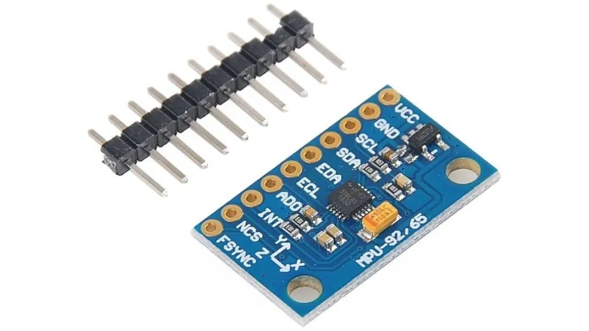
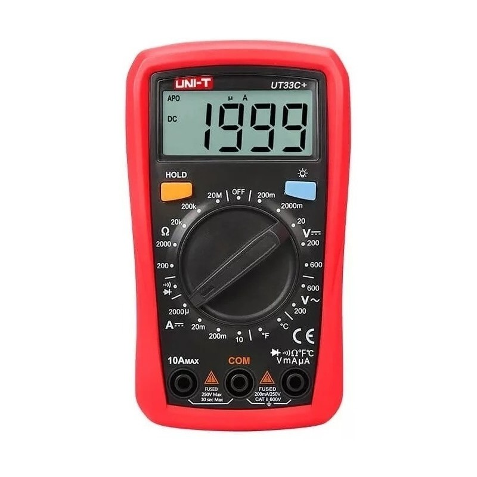

<h1 align="center">Profesor: MSc. Fabián Barrera Prieto 👨‍🏫 
Materia: Electiva de robótica 2 🦿 
Universidad: ECCI 🏫 
Año: 2026 📅</h1> 

La electiva de robótica está enfocada a la adquisición y procesamiento de datos de Unidades de Medición Inercial (IMUs) con `Python` a través de Raspberry Pi 3B, 3B+ o 4B integrando ROS.

<h1>Aula 1</h1>

En esta clase se presenta la materia, en cuanto al contenido temático, los métodos de evaluación, las observaciones, las NO EXCUSAS y los recursos para el desarrollo del curso.

<h2>Presentación de la materia 🚀</h2>

<h3>TEMAS 🤓</h3>

<h4>Primer corte 9BN</h4>

<table>
	<tr>
		<td>Fecha</td> <td>Horas</td> <td>Clase</td> <td>Semana</td> <td>Actividades</td>
	</tr>
	<tr>
		<td>04/08/2026</td> <td>2</td> <td>1</td> <td>1</td> <td>Presentación de la materia</td>
	</tr>
	<tr>
		<td>06/08/2026</td> <td>2</td> <td>2</td> <td>1</td> <td>Adquisición de datos IMU (MPU6050)</td>
	</tr>
	<tr>
		<td>11/08/2026</td> <td>2</td> <td>3</td> <td>2</td> <td>Calibración de datos IMU (MPU6050)</td>
	</tr>
	<tr>
		<td>13/08/2026</td> <td>2</td> <td>4</td> <td>2</td> <td>Conexión RPi-STM32-IMU (MPU6050)</td>
	</tr>
	<tr>
		<td>18/08/2026</td> <td>2</td> <td>5</td> <td>3</td> <td>Filtro complementario IMU (MPU6050)</td>
	</tr>
	<tr>
		<td>20/08/2026</td> <td>2</td> <td>6</td> <td>3</td> <td>Desarrollo y/o entrega de laboratorio</td>
	</tr>
	<tr>
		<td>25/08/2026</td> <td>2</td> <td>7</td> <td>4</td> <td>Desarrollo y/o entrega de laboratorio</td>
	</tr>
	<tr>
		<td>27/08/2026</td> <td>2</td> <td>8</td> <td>4</td> <td>Desarrollo y/o entrega de laboratorio</td>
	</tr><!--semana de parciales del primer corte--><!--semana de registro de notas del primer corte-->
	<tr>
		<td>01/09/2026</td> <td>2</td> <td>9</td> <td>5</td> <td>Desarrollo y/o entrega de laboratorio</td>
	</tr>
    <tr>
		<td>03/09/2026</td> <td>2</td> <td>10</td> <td>5</td> <td>Desarrollo y/o entrega de laboratorio Entrega de notas primer corte</td>
	</tr>
</table>

<h4>Segundo corte 9BN</h4>

<table>
	<tr>
		<td>Fecha</td> <td>Horas</td> <td>Clase</td> <td>Semana</td> <td>Actividades</td>
	</tr>
	<tr>
		<td>08/09/2026</td> <td>2</td> <td>11</td> <td>6</td> <td>RPi con IoT y socialización del proyecto</td>
	</tr>
	<tr>
		<td>10/09/2026</td> <td>2</td> <td>12</td> <td>6</td> <td>Introducción a ROS y "hola mundo" en ROS (depuración)</td>
	</tr>
	<tr>
		<td>15/09/2026</td> <td>2</td> <td>13</td> <td>7</td> <td>Creación de nodos (<i>publisher</i> y <i>subscriber</i>)</td>
	</tr>
	<tr>
		<td>17/09/2026</td> <td>2</td> <td>14</td> <td>7</td> <td>IMU (MPU6050) con ROS</td>
	</tr>
    <tr>
		<td>22/09/2026</td> <td>2</td> <td>15</td> <td>8</td> <td>Filtro complementario IMU (MPU6050) con ROS</td>
	</tr>
	<tr>
		<td>24/09/2026</td> <td>2</td> <td>16</td> <td>8</td> <td>Desarrollo y/o entrega de laboratorio</td>
	</tr>
	<tr>
		<td>29/09/2026</td> <td>2</td> <td>17</td> <td>9</td> <td>Desarrollo y/o entrega de laboratorio</td>
	</tr>
	<tr>
		<td>01/10/2026</td> <td>2</td> <td>18</td> <td>9</td> <td>Desarrollo y/o entrega de laboratorio</td>
	</tr>
	<tr>
		<td>06/10/2026</td> <td>2</td> <td>19</td> <td>10</td> <td>Desarrollo y/o entrega de laboratorio</td>
	</tr><!--semana de parciales del segundo corte--><!--semana de registro de notas del segundo corte-->
	<tr>
		<td>08/10/2026</td> <td>2</td> <td>20</td> <td>10</td> <td>Desarrollo y/o entrega de laboratorio Entrega de notas segundo corte</td>
	</tr>
</table>

<h4>Tercer corte 9BN</h4>

<table>
	<tr>
		<td>Fecha</td> <td>Horas</td> <td>Clase</td> <td>Semana</td> <td>Actividades</td>
	</tr>
	<tr>
		<td>13/10/2026</td> <td>2</td> <td>21</td> <td>11</td> <td>Avance de proyecto</td>
	</tr>
	<tr>
		<td>15/10/2026</td> <td>2</td> <td>22</td> <td>11</td> <td>Introducción al Locobot px-100</td>
	</tr>
	<tr>
		<td>20/10/2026</td> <td>2</td> <td>23</td> <td>12</td> <td>Locobot con Joystick</td>
	</tr>
	<tr>
		<td>22/10/2026</td> <td>2</td> <td>24</td> <td>12</td> <td>Locobot con SLAM, Rviz y paquete de Python</td>
	</tr>
    <tr>
		<td>27/10/2026</td> <td>2</td> <td>25</td> <td>13</td> <td>Desarrollo y/o entrega de laboratorio</td>
	</tr>
	<tr>
		<td>29/10/2026</td> <td>2</td> <td>26</td> <td>13</td> <td>Desarrollo y/o entrega de laboratorio</td>
	</tr>
	<tr>
		<td>03/11/2026</td> <td>2</td> <td>27</td> <td>14</td> <td>Desarrollo y/o entrega de laboratorio</td>
	</tr>
	<tr>
		<td>05/11/2026</td> <td>2</td> <td>28</td> <td>14</td> <td>Desarrollo y/o entrega de laboratorio</td>
	</tr>
	<tr>
		<td>10/11/2026</td> <td>2</td> <td>29</td> <td>15</td> <td>Desarrollo y/o entrega de proyecto</td>
	</tr>
	<tr>
		<td>12/11/2026</td> <td>2</td> <td>30</td> <td>15</td> <td>Desarrollo y/o entrega de proyecto</td>
	</tr>
	<tr>
		<td>17/11/2026</td> <td>2</td> <td>31</td> <td>16</td> <td>Desarrollo y/o entrega de proyecto</td>
	</tr><!--semana de parciales del primer corte--><!--semana de registro de notas del segundo corte-->
	<tr>
		<td>19/11/2026</td> <td>2</td> <td>32</td> <td>16</td> <td>Desarrollo y/o entrega de laboratorio Entrega de notas tercer corte</td>
	</tr>
</table>

<h3>MÉTODOS DE EVALUACIÓN ✍️</h3>

<table>
	<tr>
		<td>Corte</td> <td>Actividad</td> <td>Porcentaje 💯</td> <td>Fecha</td> <td>Metodología</td>
	</tr>
	<tr>
		<td>Primer (33%)</td> <td>Quices y/o laboratorio</td> <td>33%</td> <td>20/08/2026 25/08/2026 27/08/2026 01/09/2026 03/09/2026</td> <td rowspan="4">Presencial</td>
	</tr>
	<tr>
		<td>Segundo (33%)</td> <td>Quices y/o laboratorio</td> <td>33%</td> <td>24/09/2026 29/09/2026 01/10/2026 06/10/2026 08/10/2026</td>
	</tr>
	<tr>
		<td rowspan="3">Tercer (34%)</td> <td>Quices y/o laboratorio</td> <td>13.6%</td> <td>27/10/2026 29/10/2026 03/11/2026 05/11/2026 10/11/2026 12/11/2026 17/11/2026 19/11/2026</td>
	</tr>
    <tr>
		<td>Proyecto</td> <td>20.4%</td> <td>27/10/2026 29/10/2026 03/11/2026 05/11/2026 10/11/2026 12/11/2026 17/11/2026 19/11/2026</td>
	</tr>
</table>

Nota del curso = (0.2)*NotaCorte1 + (0.3)*NotaCorte2 + (0.5)*NotaCorte3

<h3>OBSERVACIONES ⚠️</h3>

<h4>Observaciones de clase</h4>
	<ul>
		<li> Inicio de clases: Quince (15) minutos después de la hora inicial definida de la clase y el control de asistencia se realiza a cada inicio de clase ⌚</li>
		<li> Fin de clases: Quince (15) minutos antes de la hora final definida de la clase ⏱️</li>
		<li> Respeto en clase 🤝</li>
		<li> Seguir el conducto regular (profesor, gestor, director, etc.) 📢</li>
		<li> No presto mi computador para presentar laboratorios, talleres y/o proyectos 🤦‍♂️</li>
		<li> Prohibido el uso de celular en quices, parciales y clase 📵</li>
		<li> Permitidas las salidas al baño 🚻 y a recibir llamadas 📲, en los quices y parciales se debe dejar el celular en el puesto para salir al baño</li>
		<li> Si no dejan dictar la clase, pasan al tablero a dar la clase o doy la clase por vista 😤</li>
		<li> No es permitido tomar fotos, ni videos en clase 📵. El material de clase está en el siguiente repositorio git: https://github.com/FBarreraP/ElectivaRobotica2 </li>
		<li> Los laboratorios y el proyecto consistirán únicamente de montaje y podrán ser realizados en grupos de máximo 4 estudiantes 🧍‍♀️🧍‍♂️🧍‍♀️🧍‍♂️🧍‍♀️</li>
		<li> Los montajes realizados en protoboard no son aceptados con jumpers, por tanto, deben ser realizados con cable UTP y no son compartidos, es decir, un montaje por grupo 🤷‍♂️</li>
		<li> Los talleres y proyecto se calificarán con rúbricas de 1.0 a 5.0 con intervalo de 1.0; las cuales tendrán diferentes entregables con fechas fijas de entrega y el orden de entrega de los grupos será definida por el profesor 💥</li> 
		<li> Los parciales y el examen final serán solucionados en hoja examen 📄</li> 
        <li> Uso obligatorio de bata blanca en el laboratorio 🥼</li>
		<li> Quien llegue tarde se adelanta en el tema visto hasta el momento 🏃‍♂️</li> 
	</ul>

<h4>Observaciones de reglamento estudiantil</h4>
<ul>
	<li> Revisión sobre la calificación solamente dentro de los dias (3) establecidos en el reglamento estudiantil </li>
	<li> Con el 10% de las fallas se pierde la materia</li>
	<li> Las ausencias a clases donde se saque una calificación se debe presentar la excusa familiar o laboral en la dirección del programa</li>
</ul>

<h3>NO EXCUSAS ❌</h3>

<ul>
	<li> Hace 5 minutos funcionaba (tengo un video funcionando) 😒</li>
	<li> Mi compañero tiene todo y no ha llegado 😐</li>
	<li> Mírelo ya, porque deja de funcionar 🤨</li>
	<li> Tengo más materias 🙄</li>
	<li> Trabajo y estudio 😶</li>
	<li> Se dañó en el bus 🤔</li>
	<li> No lo toque, no lo mire, ni se acerque mucho porque se daña 🤨</li>
</ul>

<h3>RECURSOS 🛠️</h3>

<ul>
	<li> Computador 💻</li>
	<li> Visual Studio Code</li>
	<li> Raspberry Pi 3B/3B+/4B con Raspbian</li>
	
	<li> IMU (MPU9250)</li>
	

		
		 
		<figcaption>Fuente: https://www.hwlibre.com/como-utilizar-el-sensor-imu-mpu9250-con-arduino/</figcaption>
	

	<li> Brazo robótico 5 GDL</li>
	
	<li> Servomotores SG90 o MG90</li>
    
    <li> Fuentes de alimentación</li>
    
    <li> Multímetro</li>
	

		
		 
		<figcaption>Fuente: https://radiomecano.com.ar/Instrumentos-de-Medicion/90-0223260_TESTER-UNI-T-UT-33C-DIGITAL-CTEMPERATURA.html</figcaption>
	

    <li> Leds, resistencias, pulsadores, cables, protoboard</li>
    
	<!--
	<li> STM-32</li>
	
	<li> IMU (MPU6050 y MPU9250)</li>
	
	-->
</ul>

<h3>Bibliografía</h3>

- Peter Corke. Robotics, Vision and Control: Fundamental Algorithms in MATLAB. 1st. Springer Publishing Company, Incorporated, 2013.
- John J. Craig. Introduction to Robotics: Mechanics and Control. 2nd. Boston, MA, USA: Addison-Wesley Longman Publishing Co., Inc., 1989.
- Antonio Barrientos Cruz. Fundamentos de robótica. 2nd. McGraw-Hill, 2007.
- Mark W. Spong. Robot Dynamics and Control. 1st. New York, NY, USA: John Wiley & Sons, Inc., 1989. Poole, H. H. (2012). Fundamentals of robotics engineering. Springer Science & Business Media.
- Siciliano, B., Sciavicco, L., Villani, L., & Oriolo, G. (2010). Robotics: modelling, planning and control. Springer Science & - Business Media. Jazar, R. N. (2010). Theory of applied robotics: kinematics, dynamics, and control. Springer Science & Business Media.
- Peter Corke. Robotics toolbox for Matlab, release 9.10. 1st. 2015.
- Martinez, A., Fernandez E., Leaning ROS for robotics programming, PackT Publishing.
- O’Kane J., A Gentle Introduction to ROS.
- http://petercorke.com/Robotics_Toolbox.html
- Kim, S., Laschi, C., & Trimmer, B. (2013). Soft robotics: a bioinspired evolution in robotics. Trends in biotechnology, 31(5), 287-294.
